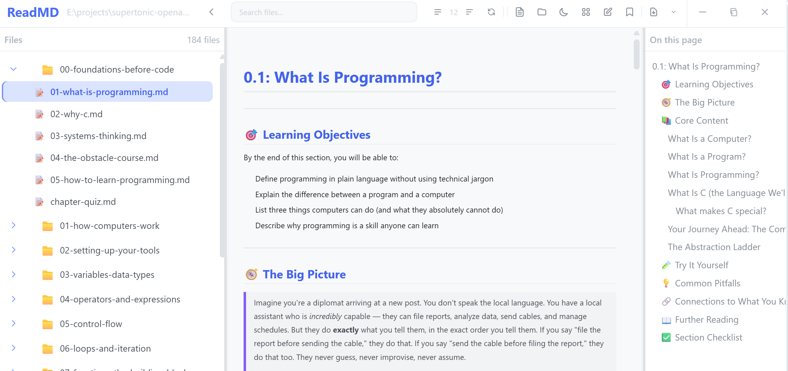
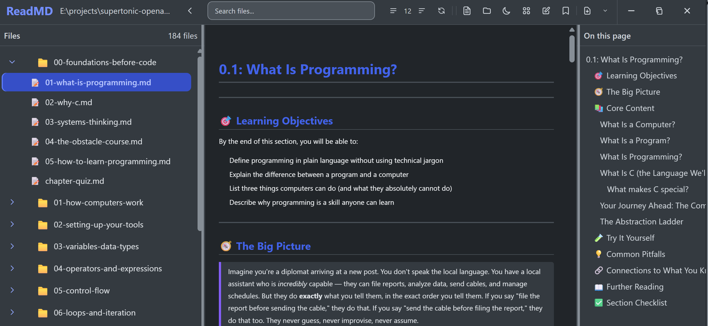
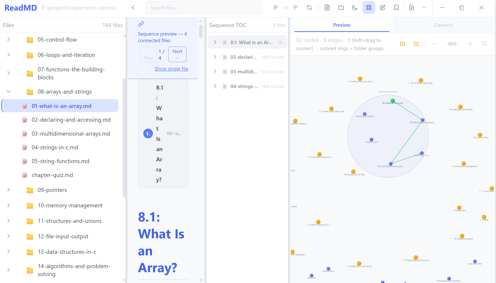
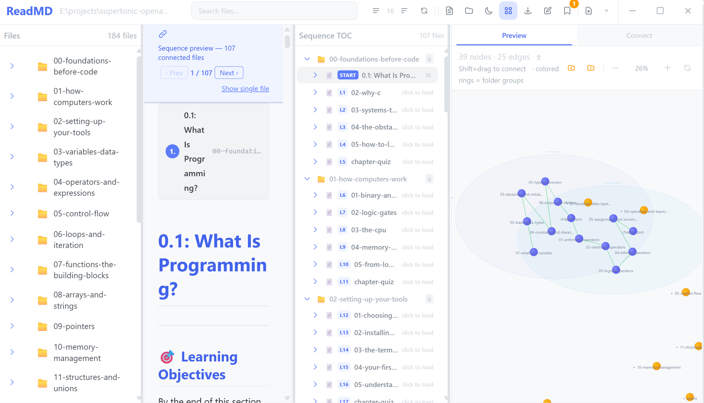
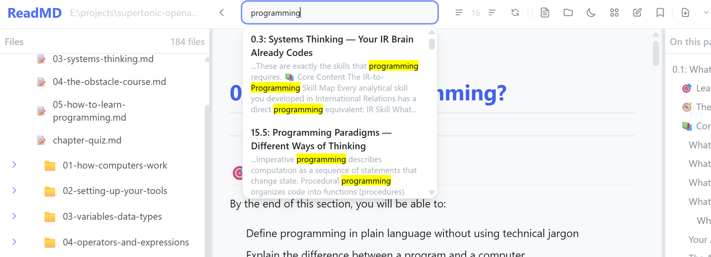
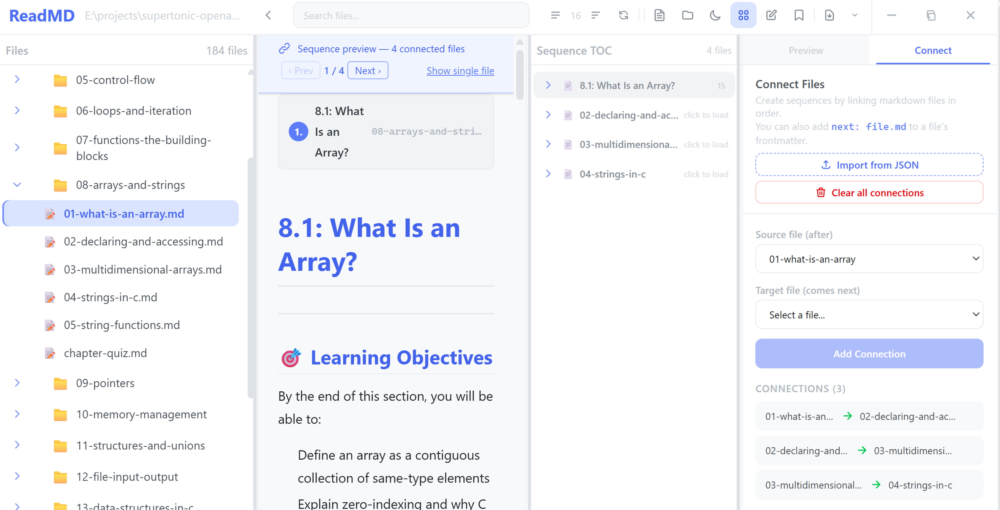
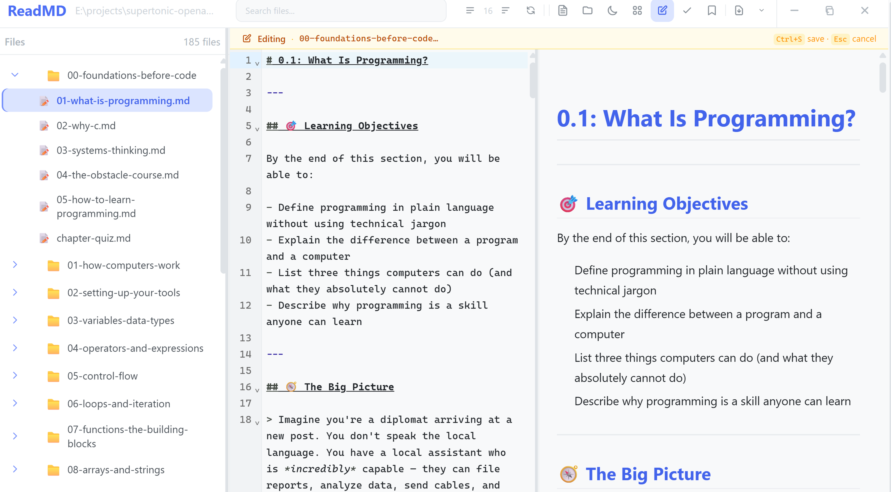

<div align="center">

# 📚 ReadMD

**The Markdown reader that knows how your documents connect.**

Read, navigate, search, and export a folder of Markdown files as a connected knowledge package — with a guided reading order you define once and can share anywhere.

[Features](#-features) • [Reading Flows](#-reading-flows) • [Download](#-download) • [Quick Start](#-quick-start) • [FAQ](#-faq)

</div>

---

## 🎯 Built for the Age of AI-Assisted Writing

ReadMD was designed around one idea: **knowledge should be a portable, machine-readable package.**

A folder of Markdown notes is great for *writing* — but the structure of a course, manual, or knowledge base usually lives only in file names or the author's memory. ReadMD makes that structure explicit with a **reading flow**: a small file that states, in plain text, which document comes next.

That one file is the key to everything:

- **For readers** — it turns a folder of documents into a guided, chapter-by-chapter path with next/previous navigation, numbered sections, and a table of contents. The same folder is simultaneously an explorable knowledge graph and a fully searchable library.
- **For AI tools** — the format is plain text and machine-readable, so an AI assistant can **author an entire course or knowledge base** — a folder of Markdown files plus a reading flow — and ReadMD renders it instantly. No restructuring, no manual setup, no proprietary format. A package written by an AI is indistinguishable from one written by a human, and both import the same way.

One format, readable by humans, by AI tools, and by any app that honors the contract.

---

## 🔗 Reading Flows

A reading flow is an ordered chain of `source → target` connections — a machine-readable answer to *"what comes next?"*

You can build one automatically from `[[wikilinks]]` in your notes, define it yourself by connecting documents on the graph, or import one from a `reading-flow.json` file. Here is a real example (a small slice of a course):

```json
{
  "name": "Foundations of Programming: Sequential Learning Path",
  "description": "Sequential course flow linking all chapters, sub-sections, and end-of-chapter quizzes in recommended reading order.",
  "version": "1.0",
  "connections": [
    {
      "source": "00-foundations-before-code/01-what-is-programming.md",
      "target": "00-foundations-before-code/02-why-c.md",
      "label": "Ch00 What Is Programming → Why C"
    },
    {
      "source": "00-foundations-before-code/02-why-c.md",
      "target": "00-foundations-before-code/chapter-quiz.md",
      "label": "Ch00 Why C → Ch00 Quiz"
    },
    {
      "source": "00-foundations-before-code/chapter-quiz.md",
      "target": "01-how-computers-work/01-binary-and-data.md",
      "label": "Ch00 Quiz → Ch01 Binary And Data"
    }
  ]
}
```

Each `connection` says: *after reading the `source` document, continue with the `target` document.* Import this file, and ReadMD materializes the chain as a guided reading sequence — with numbered headers, dividers, and next/previous buttons — while the same documents stay explorable as a graph.

> **Try it:** open the bundled **case-study course** folder in this repository (`case-study-course/foundations-of-programming/`), import its flow file (`connections.json`), and follow the 106-edge chain end to end.

---

## ✨ Features

### 📖 Beautiful Markdown Reading

Clean, readable typography in light and dark mode, supporting standard Markdown plus:

- **Syntax-highlighted code blocks** with a copy button
- **Math formulas** rendered inline and in blocks
- **Diagrams** — flowcharts and graphs rendered live, in both light and dark theme
- **Images** — local files, web URLs, and embedded images, all loaded lazily as you scroll
- **Tables, blockquotes, task lists, footnotes**, and document metadata
- **Auto-generated Table of Contents** with scroll tracking
- **Click-to-zoom** on any image or diagram
- **External links open in-app** — you never leave your reading window

### 🕸️ Knowledge Graph — connections made visible

ReadMD automatically builds an interactive graph of your documents and how they relate:

- **Automatic connections** discovered from `[[wikilinks]]` and document metadata
- **Manual connections** — Shift+drag between nodes, or pick source/target in the Connect panel
- **Collapsible folders** — explore from coarse structure down to individual files
- **Drag, pan, and zoom** — layout stays fast even with hundreds of nodes

Your manual connections are **session-only by design**: ReadMD never writes into your files without you asking. When you close the app or switch folders, it offers to **save them as a flow file** — or export mid-session anytime with **Save flow…**. Saved flows are re-importable later.

### 🔗 Guided Reading Sequences

Define an order for your documents and ReadMD loads it as a seamless, lazy sequence:

- Click any node in the chain to open the full path — file names appear instantly, content loads on click
- **Numbered headers and dividers** show your position in the chain
- **Prev/Next navigation** with a sticky progress bar
- **Folder-aware table of contents** — collapsible folders, level badges, live updates as connections change
- Open any single file in a chain and its chain's outline is shown, even outside sequence mode

This is what makes course material, tutorials, and chaptered documentation genuinely navigable — the reader always knows what comes next.

### 🔍 Instant Full-Text Search

Every word in your folder is indexed, giving you:

- Ranked results with **highlighted snippets**
- **Click a result to jump** straight to the exact match
- Debounced, instant results as you type
- Index rebuilt automatically when you open or scan a folder

### 📤 Word & PDF Export

Export to Word (`.docx`) or PDF with one click — **everything needed is included in the installer**, no setup required:

| Mode | What it produces |
|------|------------------|
| **Single file** | One Word / PDF document from one Markdown file |
| **Multiple files (merged)** | Several files combined into one document |
| **Multiple files (batch)** | One document per file |

Export is print-quality: diagrams are pre-rendered at high resolution, images are page-fitted, and Word documents use a clean, custom template.

### ✏️ Built-in Editor with Live Preview

Edit Markdown without leaving the app:

- Built-in editor with a **draggable live-preview split pane** (`Ctrl+E`)
- Preview updates as you type — including **live diagrams**
- **`Ctrl+S`** saves instantly
- Unsaved-change guard prompts before you lose work

### 🔖 Bookmarks — never lose your place

- One bookmark per file, storing your exact scroll position
- **Per-folder**, stored safely on your computer (never inside your files)
- Resume jumps straight back to where you left off; stale bookmarks are cleaned up automatically

### 🌙 Everything, in Dark Mode

Dark mode themes the entire app — including the diagrams, which re-render in a dark theme on toggle. Font zoom (`Ctrl+Scroll`) and split-pane resizing round out a reading experience built for long sessions.

---

## 💡 How ReadMD Compares

| Dimension | ReadMD | Ghostwriter | MarkText | VSCodium | Obsidian | LiaScript | Hyperbook |
|---|:---:|:---:|:---:|:---:|:---:|:---:|:---:|
| Local-first desktop reader | ✅ | ✅ | ✅ | ✅ | ✅ | ⚠️ <sup>a</sup> | ⚠️ <sup>b</sup> |
| Plain Markdown (no custom dialect) | ✅ | ✅ | ✅ | ✅ | ✅ | ❌ | ❌ |
| Explicit sequential reading flow | ✅ | ❌ | ❌ | ⚠️ <sup>c</sup> | ❌ | ⚠️ <sup>e</sup> | ⚠️ <sup>e</sup> |
| Built-in knowledge graph | ✅ | ❌ | ❌ | ⚠️ <sup>f</sup> | ✅ | ❌ | ❌ |
| Reading-flow import (`reading-flow.json`) | ✅ | ❌ | ❌ | ❌ | ❌ | ❌ | ❌ |
| Word / PDF export | ✅ | ✅ | ⚠️ <sup>g</sup> | ❌ | ❌ | ⚠️ <sup>h</sup> | ❌ |
| No build / no hosting / no LMS | ✅ | ✅ | ✅ | ✅ | ✅ | ✅ | ❌ |
| Free & open source | ✅ | ✅ | ✅ | ✅ | ⚠️ <sup>i</sup> | ✅ | ✅ |

<sup>a</sup> Browser interpreter · <sup>b</sup> Build step and hosting · <sup>c</sup> Via file-naming conventions or extensions · <sup>e</sup> Linear, but dialect- or pipeline-bound · <sup>f</sup> Via extensions · <sup>g</sup> HTML/PDF only · <sup>h</sup> PDF only, no Word · <sup>i</sup> Proprietary

Only ReadMD combines all of it: plain Markdown, a built-in knowledge graph, a machine-readable reading flow you can import and export, one-click Word/PDF export, zero configuration, and an open-source license.

---

## 📦 Download

| Platform | Format | How to get it |
|----------|--------|---------------|
| **Windows** | `.exe` installer | Download from [Releases](https://github.com/zeeshanhaider1007/ReadMD/releases/tag/v0.1.0) |
| **Linux** | `.deb` package or `.AppImage` (portable) | Download from [Releases](https://github.com/zeeshanhaider1007/ReadMD/releases/tag/v0.1.0) |

> **Why is the installer this size?** The installer bundles everything the app needs to work out of the box — the export tools for Word/PDF documents and the emoji font — so you never have to install anything else. Most of the size is those bundled components; the app itself is small.

**Requirements:**

- **Windows:** Windows 10 or later (64-bit)
- **Linux:** 64-bit, on a recent distribution — Ubuntu 24.04+, Debian 12+, Fedora 39+ or newer. The `.deb` works out of the box there; the `.AppImage` needs no installation — make it executable and run it.
- **Everything else is included** — emoji render correctly and Word/PDF export works with no extra installation

---

## 🚀 Quick Start

1. **Download and install** the latest release for your platform
2. **Launch ReadMD** — you'll see the sidebar, toolbar, and viewer
3. **Open a folder** — click "Open Folder" in the sidebar or toolbar
4. **Click a file** to read it in the viewer
5. **Search** — click the search icon to find content across all files
6. **Explore the graph** — click the Graph tab to see connections between your documents
7. **Connect documents** — Shift+drag on the graph, or use the Connect panel, to link related content
8. **Follow a sequence** — click any connected node to walk the full chain with Prev/Next

> **Tip:** Open a folder of linked Markdown notes (with `[[wikilinks]]`) to see the graph come to life. Import a `reading-flow.json` to materialize a guided reading sequence instantly.
>
> **On Linux with the `.AppImage`:** no installation needed — `chmod +x ReadMD_0.1.0_amd64.AppImage` and run `./ReadMD_0.1.0_amd64.AppImage`.

---

## 📸 Screenshots

### 📖 Reader — light and dark mode





### 🕸️ Knowledge graph



### 🔗 Guided reading sequence



### 🔍 Full-text search



### 🧩 Connect panel & flow import



### ✏️ Editor with live preview



---

## ❓ FAQ

**Q: Can I use ReadMD with my existing Markdown notes?**

Yes. ReadMD works with plain `.md` files. Open any folder and it scans all Markdown files recursively. No special metadata or configuration required — `[[wikilinks]]` and reading flows are optional enhancements.

**Q: Does ReadMD modify my files?**

No. ReadMD is read-only with respect to your files — it keeps its own private index on your computer, never inside your documents. The only exceptions: export creates new Word/PDF files alongside your originals, and saving a flow writes the `reading-flow.json` file you explicitly asked for.

**Q: What is a reading flow?**

A reading flow is an ordered chain of document-to-document connections — a machine-readable answer to "what comes next?" ReadMD can import one from a `reading-flow.json` file, build one from your `[[wikilinks]]`, or let you create one by connecting documents on the graph. The flow renders as a guided sequence, and it's portable: you can save it and re-import it into any tool that honors the contract.

**Q: Can I export to Word or PDF?**

Yes. Use the export dropdown to choose **Word** or **PDF**. Everything needed for export is included in the installer — no setup required. Diagrams and math render cleanly in both formats.

**Q: How does the graph handle very large folders?**

Very well. The graph is built on demand and stays responsive even with hundreds of nodes. You can zoom, pan, and collapse folders to navigate complex projects.

**Q: Are my images stored in the app?**

Only embedded images are cached by the app (so they display instantly on re-open). Local file images and web images load from their original sources each time.

**Q: Emojis show as empty boxes?**

This shouldn't happen — the emoji font is included in the installer, so emoji render correctly on any system.

**Q: Does ReadMD support Obsidian or Roam-style Markdown?**

ReadMD supports standard Markdown plus `[[wikilinks]]` and YAML document metadata with `title`, `tags`, and `next:` fields. Other extended syntaxes are not yet supported.

---

<div align="center">

**ReadMD** is released under the MIT License.

</div>
