# 0.1: What Is Programming?

---

## 🎯 Learning Objectives

By the end of this section, you will be able to:

- Define programming in plain language without using technical jargon
- Explain the difference between a program and a computer
- List three things computers can do (and what they absolutely cannot do)
- Describe why programming is a skill anyone can learn

---

## 🧭 The Big Picture

> Imagine you've just started at a new job. You have a personal assistant who is *incredibly* capable — they can file reports, analyze data, send emails, and manage schedules. But they do **exactly** what you tell them, in the exact order you tell them. If you say "file the report before sending the email," they do that. If you say "send the email before filing the report," they do that too. They never guess, never improvise, never assume.
>
> That assistant is the computer. Programming is the art of giving it instructions — precise, unambiguous, step-by-step instructions — so that it does what you need it to do.
>
> The only catch? The assistant speaks a very peculiar language. You're about to learn it.

---

## 📚 Core Content

### What Is a Computer?

A computer is not a brain. It's not intelligent. It doesn't "think" or "understand" in the way humans do.

A computer is a **very fast, very obedient calculator** that follows instructions.

Here's what a computer can do:

| Operation | Example | Speed |
|-----------|---------|-------|
| Basic arithmetic | `5 + 3 = 8` | ~3 billion/second |
| Compare values | `Is 5 > 3? → Yes` | ~3 billion/second |
| Copy data | Move this number to that location | ~3 billion/second |
| Jump to an instruction | "Now do line 47 instead of line 23" | ~3 billion/second |

That's it. That's the entire list. Every program you've ever used — web browsers, word processors, video games, TikTok — is just billions of these simple operations chained together in clever ways.

A computer cannot:
- **Think creatively** ("Write me a poem about diplomacy")
- **Understand context** ("You know what I mean")
- **Guess intentions** ("I meant the red one, obviously")
- **Learn from vague feedback** ("That's not quite right, try again")

Everything a computer does must be **explicitly, precisely, and unambiguously** spelled out in advance.

### What Is a Program?

A **program** is a sequence of instructions that tells a computer how to perform a specific task.

Think of it like a recipe:

```
Recipe: Make Tea
─────────────────────────
1. Fill kettle with water
2. Boil the water
3. Put teabag in cup
4. Pour boiling water into cup
5. Wait 3 minutes
6. Remove teabag
7. Add sugar (optional)
8. Stir
```

A program is identical in structure. It's a sequence of steps, executed in order, that accomplishes a goal.

```c
// "Program" in C: Brew Tea (hypothetical)
fill(kettle, water);
boil(kettle);
put(teabag, cup);
pour(boiling_water, cup);
wait(3);
remove(teabag, cup);
if (wants_sugar) { add(sugar, cup); }
stir(cup);
```

### What Is Programming?

**Programming** (also called "coding") is the act of writing these instructions in a language that a computer can understand and execute.

Just as a letter must be written in a format the postal system can process, a programmer writes instructions in a specific **programming language** that a computer can process.

There are many programming languages — hundreds of them. They are like human languages: they share the same basic concepts (nouns = data, verbs = actions, grammar = syntax), but they express those concepts differently.

### What Is C (the Language We'll Learn)?

C is one of the oldest and most influential programming languages still in active use. It was created in 1972 by Dennis Ritchie at Bell Labs to write the Unix operating system.

> **C is the Latin of programming languages.** Many modern languages (Python, Java, JavaScript, C++, C#) are directly or indirectly descended from C. Learning C means learning the foundations from which everything else grew.

#### What makes C special?

C is a **low-level language**. This doesn't mean it's worse — it means it's *closer to the machine*. In C:
- You work directly with **memory** — you can see where data is stored, how much space it takes, and when it's created or destroyed
- You control **exactly** what the computer does, with no hidden steps
- Nothing is "automatic" — which means nothing is hidden from you

This is why we're starting with C. If we started with Python, many things would happen "magically" behind the scenes. You'd learn to make things work without understanding *why* they work. C shows you everything.

> **The deal we're making:** C is harder to learn than Python. You will get confused. You will encounter "segmentation faults" (program crashes) that feel mysterious at first. But when you finish this course, you will understand computers at a level that most Python programmers never reach. And when you later learn Python, JavaScript, or any other language, you will understand *exactly* what's happening under the hood.

### Your Journey Ahead: The Complete Course Map

Before we go further, take a look at the full journey ahead. This diagram shows every chapter in the course, organized by phase. Don't worry about understanding it all now — it's your roadmap:



> **There are 17 chapters across 5 phases, totaling approximately 150-220 hours of learning.** At 10 hours per week, that's about 4-5 months. You'll start with foundations (no coding), then learn C from the ground up, master data structures and algorithms, understand how programming languages work, and finally build your own capstone project.

### The Abstraction Ladder

Visualize computers as a series of layers:



At the bottom: **hardware** — transistors, wires, electricity moving around.
Above that: **machine code** — binary (0s and 1s) that the hardware understands directly.
Above that: **assembly language** — a slightly more human-readable version of machine code.
Above that: **C** — where we can write code that feels somewhat like human language but still gives us direct access to the machine.
Above that: **high-level languages** — Python, JavaScript, Java — which hide most machine details.

**We are learning C because it sits in the sweet spot**: readable enough for humans, but transparent enough to see what the machine is actually doing.

---

## 🧪 Try It Yourself

> **Exercise 1:** Think of something you do regularly (making coffee, checking email, booking a flight). Write it as a step-by-step recipe — the way a computer would need to receive it. Be absurdly specific. What would happen if someone skipped a step? What would happen if a step was ambiguous?
>
> *Example: "Make coffee" is too vague. "If the carafe is dirty, wash it first. Measure 2 tablespoons of grounds per 6 ounces of water. Pour water into reservoir. Press 'Brew'." is closer to what a computer needs.*

> **Exercise 2:** Look at these instructions. What's wrong with them?
> ```
> 1. Open the document
> 2. If the document exists
> 3. Edit the document
> 4. Otherwise
> 5. Save the document
> ```
>
> **Hint:** Think about the order. Think about what's missing. Would the computer get confused?

---

## 💡 Common Pitfalls

- ❌ **"Computers are smart"** — They aren't. They're fast and obedient. Every "intelligent" thing a computer does is the result of millions of simple, dumb steps chained together. Never attribute intelligence to a computer.

- ❌ **"I need to be good at math"** — You don't. Programming requires logic, not advanced math. Basic arithmetic is enough. Many excellent programmers struggle with calculus.

- ❌ **"Programming is for geniuses"** — This is a myth. Programming is a skill, like learning a language or playing an instrument. It requires practice, patience, and good teaching — not innate genius. The belief that programming requires a "special kind of brain" is harmful and false.

- ❌ **"I'll learn a language and be done"** — Programming languages are tools, not subjects. You don't "learn C" the way you "learn French." You learn to solve problems using C. The thinking is the skill; the language is just how you express that thinking to the computer.

---

## 🔗 Connections to What You Know

> **You already think programmatically.** Every time you:
>
> - **Plan for a rainy day** ("If it looks like rain, I'll take an umbrella; otherwise I'll leave it") — that's **conditional logic**
> - **Fill out a form** ("Name goes in this box, date in that box, signature at the bottom") — that's **structured data**
> - **Follow a recipe or a routine** ("First preheat, then mix, then bake") — that's a **program**
> - **Manage a budget** ("I have X funds to allocate across Y priorities with constraints Z") — that's **resource management**
>
> *(If your background is in international relations, you'll recognize the same patterns in negotiation strategies, treaty analysis, and diplomatic protocol — those are also programs and data structures.)*
>
> Any field that deals with systems, rules, and structured processes trains you to think this way. Programming is the same skill, applied to a different domain. You're not starting from zero — you're translating existing skills into a new language.

---

## 📖 Further Reading

- *Code: The Hidden Language of Computer Hardware and Software* by Charles Petzold — A brilliant, non-technical explanation of how computers work from the ground up
- "What Is Code?" by Paul Ford (Bloomberg Businessweek, 2015) — A long-form magazine article that explains programming to non-programmers

---

## ✅ Section Checklist

- [ ] I can explain what programming is in my own words, using an analogy
- [ ] I can list what computers can and cannot do
- [ ] I understand why we're learning C specifically (transparency, control, foundation)
- [ ] I have written a step-by-step recipe for a daily task (Exercise 1)
- [ ] I identified the flaw in Exercise 2 and wrote down my reasoning
- [ ] I checked my answer — the instructions edit the document BEFORE checking if it exists
- [ ] I wrote a **journal entry** about what I learned today

---

*Next: [0.2: Why C? The Case for Starting Low-Level →](./02-why-c.md)*
