# 0.2: Why C? The Case for Starting Low-Level

---

## 🎯 Learning Objectives

By the end of this section, you will be able to:

- Explain why C reveals more about how computers work than Python does
- Describe what "abstraction" means and how different languages abstract differently
- List three things that C makes visible that higher-level languages hide
- State the difference between compiled and interpreted languages
- Argue for why learning C first produces better programmers in any language

---

## 🧭 The Big Picture

> Imagine you're learning to drive. You could take two very different approaches:
>
> **Approach A:** Get in an automatic car, press the gas, steer, and go. You never look under the hood. You never learn what an engine does, how the transmission works, or why the car needs oil. You can drive — and you're driving within an hour.
>
> **Approach B:** Start by learning how an engine works. Understand pistons, fuel injection, and the drivetrain. Learn how the clutch connects the engine to the wheels. Practice on a manual transmission. Then get in *any* car — automatic or manual — and drive it with full understanding of what's happening beneath you.
>
> This course takes Approach B.
>
> Python is Approach A. C is Approach B. Most coding courses teach Approach A because it feels faster. But Approach B builds understanding that lasts a lifetime.

---

## 📚 Core Content

### What Does "High-Level" Mean?

Programming languages are often described as **high-level** or **low-level**. These terms refer to how far the language is from the actual machine code that the CPU executes.

**High-level languages** (Python, JavaScript, Java, Ruby):
- Use English-like syntax: `print("Hello")` instead of complex machine instructions
- Handle memory automatically (you don't need to think about where data is stored)
- Include built-in features for common tasks (like sorting lists, managing web pages)
- Are easier to write and read
- **Hide how the computer actually works**

**Low-level languages** (C, Assembly):
- Use syntax that maps closely to machine instructions
- Require manual memory management (you decide where and when data is stored)
- Have minimal built-in features (the standard library is small)
- Are harder to write and read initially
- **Show how the computer actually works**

### What Does C Reveal That Python Hides?

| Concept | In C | In Python |
|---------|------|-----------|
| **Memory** | You declare variables and see exactly how many bytes they use. You allocate and free memory manually. | Memory is automatic. You don't know (or need to know) where data lives. |
| **Data Types** | Every variable has a fixed type (`int`, `char`, `float`). You must declare it. | Types are dynamic. A variable can hold a number, then a string, then a list. |
| **Pointers** | You work directly with memory addresses. You can see where data is stored and follow the references. | Pointers are hidden. You use references without knowing they exist. |
| **Compilation** | Source code → compiler → executable → run. You see each step. | Source code → interpreter runs it immediately. The translation step is invisible. |
| **Performance** | You control exactly what the CPU does. Your code runs close to full speed. | The interpreter adds overhead. Your code may run 10-100x slower. |
| **Errors** | Memory errors (segfaults) crash your program. You learn exactly what went wrong. | Memory errors are handled silently. You may never encounter them — until you write C. |

### The Transparency Principle

The core philosophy of this course is **transparency**.

When you learn programming through C, there is no "magic" layer. Everything you write has a direct, visible effect on the computer. When something goes wrong, you can trace it to the exact instruction that caused it.

Compare these two experiences:

**Learning Python first:**
```
You write: print("Hello")
You see: Hello
You think: "I just told the computer to print Hello. Works!"
What you DON'T see: The interpreter reading your code, parsing it into
an internal representation, calling the C printf() function from the
standard library, which formats the string and writes it to stdout,
which is a file descriptor 1, which the operating system routes to
your terminal emulator, which renders the pixels on your screen.
```

**Learning C first:**
```
You write: printf("Hello\n");
You see: Hello
You think: "I called the printf function from stdio.h with a string
literal as an argument. The compiler translated this into machine code
that writes bytes to file descriptor 1 (stdout), which the OS sends
to my terminal."
You KNOW what happened, because you had to:
- #include the header that declares printf
- Write a main() function (because programs need entry points)
- Use a format string with proper syntax
- End the statement with a semicolon
- Compile the code into an executable
- Run the executable
```

### The Compilation Journey

When you write a C program, it goes through a visible transformation:



1. **You write source code** in a text file (e.g., `hello.c`)
2. The **preprocessor** handles `#include` directives, macros, and conditional compilation
3. The **compiler** translates your C code into **assembly language** (human-readable machine instructions)
4. The **assembler** converts assembly into **object code** (machine code, but not yet executable)
5. The **linker** combines your object code with necessary libraries (like `printf`) to produce an **executable**
6. You run the **executable** and see the output

Each of these steps produces a visible file. You can inspect each one. There is no magic.

When you write Python:
- Step 2-5 happen invisibly inside the Python interpreter
- You never see them
- You never learn they exist
- Until something breaks and you have no mental model of how to fix it

### What About Jobs? Don't Employers Want Python/JavaScript?

This is the most common question. The answer might surprise you.

**Learning C first makes you better at every other language.** Employers know this. Here's why:

1. **Foundational understanding:** A programmer who learned C first understands memory, types, and performance in a way that someone who only knows Python never will. They write better Python because they know what Python is doing behind the scenes.

2. **Transferable skills:** Once you understand pointers in C, you understand references in Java, ownership in Rust, and assignment in Python. The concepts transfer; only the syntax changes.

3. **Troubleshooting ability:** When a Python program crashes, a C-trained programmer can think about what's happening at the memory level. A Python-only programmer can only think in Python terms — a much more limited toolkit.

4. **Systems thinking:** C is used in operating systems, embedded devices, game engines, and databases. Understanding C opens doors that Python alone cannot.

> **The reality:** Most CS degrees start with C or C++ for exactly these reasons. Harvard's CS50 — one of the most popular computer science courses in the world — starts with C. They know what they're doing.

---

## 🧪 Try It Yourself

> **Exercise 1:** Without looking at the text above, explain to yourself (or a friend) the difference between a high-level and low-level language. Use a real-world analogy — not a technical one.

> **Exercise 2:** Here's a Python program and a C program that do the same thing. Compare them. What extra information does the C program require?
>
> **Python:**
> ```python
> name = input("Enter your name: ")
> print("Hello, " + name)
> ```
>
> **C:**
> ```c
> #include <stdio.h>
>
> int main(void) {
>     char name[50];
>     printf("Enter your name: ");
>     scanf("%s", name);
>     printf("Hello, %s\n", name);
>     return 0;
> }
> ```
>
> **Questions to consider:**
> - Why does C need `#include <stdio.h>` at the top?
> - What is `int main(void)` telling us?
> - What does `char name[50]` do that Python doesn't need?
> - Why does C have `return 0;` at the end?

---

## 💡 Common Pitfalls

- ❌ **"C is obsolete"** — C is over 50 years old and still in the top 3 most-used languages. Linux, Windows, macOS, databases, and embedded systems are all written primarily in C. It's not going anywhere.

- ❌ **"I should just learn Python because it's easier"** — Easier in the short term, yes. But you won't understand *why* it works, which means you'll hit a ceiling much faster. Learning C first is an investment that pays off in every language you learn afterward.

- ❌ **"Real programmers use high-level languages"** — Real programmers use whatever is appropriate for the task. Systems programmers use C. Web developers use JavaScript. Data scientists use Python. The best programmers understand multiple levels of abstraction and choose accordingly.

---

## 🔗 Connections to What You Know

> **Think about learning a new language properly.** You could learn a few tourist phrases — enough to order coffee and ask for directions. That's the Python approach: quick results, limited depth.
>
> Or you could learn the full grammar, vocabulary, and cultural context. You'd spend more time upfront, and it would be harder. But you'd be able to hold real conversations, read books, and understand nuance. That's the C approach.
>
> This course teaches you the full language of computation. Not just enough to get by — enough to understand, create, and debug at every level.

---

## 📖 Further Reading

- *The C Programming Language* by Kernighan & Ritchie — The original C book, written by its creators. Read chapters 1-2 as you progress through this course.
- "Why C?" by various authors — Search this phrase online. You'll find passionate arguments from experienced programmers about why C should be everyone's first language.
- Comparison of [Harvard CS50 (C-first)](https://cs50.harvard.edu/x/) with other introductory CS courses

---

## ✅ Section Checklist

- [ ] I can explain the difference between high-level and low-level languages
- [ ] I can name three things C reveals that Python hides
- [ ] I understand the compilation pipeline (source → preprocessor → compiler → assembler → linker → executable)
- [ ] I can argue for why learning C first is beneficial, even if I eventually use other languages
- [ ] I completed the Python vs C comparison exercise
- [ ] I wrote a **journal entry** about what I learned today

---

*Next: [0.3: Systems Thinking: You Already Think Like a Programmer →](./03-systems-thinking.md)*
