# 0.3: Systems Thinking — You Already Think Like a Programmer

---

## 🎯 Learning Objectives

By the end of this section, you will be able to:

- Map your existing analytical skills (from any background) to equivalent programming concepts
- Explain how systems thinking translates to program design
- Identify the everyday and real-world analogies for variables, functions, modules, and state machines
- Recognize that you already think in computational patterns

---

## 🧭 The Big Picture

> This section might be the most important one in the entire course. Not because it teaches you anything about computers, but because it teaches you something about *yourself*.
>
> You already think in ways that perfectly prepare you for programming — even if you've never written a line of code. Any field that deals with **complex systems** trains you for this: understanding how parts interact, how rules govern behavior, how things change over time, and how information flows through networks. That's true whether your background is in international relations, law, business, medicine, teaching, history, or simply running a household.
>
> These are *exactly* the skills that programming requires.

---

## 📚 Core Content

### The Skill Map: What You Already Do → What Programming Needs

Every analytical skill you use in daily life or your field of study has a direct programming equivalent. The table below shows the general pattern, with an international-relations example for readers from that background:

| Skill You Already Have | Everyday Example | IR Example | Programming Equivalent |
|----------|-------------|------|----------------------|
| **Systems analysis** | Understand how parts of a kitchen, a hospital, or a company interact | Study interconnected parts (UN system, alliances, trade networks) | Design programs as systems of interacting functions and modules |
| **Following rules** | Follow a recipe, traffic laws, or workplace procedures | Follow treaties, diplomatic norms, international law | Follow syntax, APIs, and protocols for talking to computers |
| **State tracking** | Track a package, a patient, or a project's status over time | Track countries moving between states (peace → conflict, growth → recession) | Manage variables and control flow — data changes over time |
| **Data interpretation** | Read a budget, a medical chart, or sales figures | Interpret GDP figures, demographics, voting records | Work with data types and structures — giving shape to information |
| **Resource allocation** | Manage a budget or allocate your time | Allocate budgets, humanitarian aid, diplomatic attention | Manage memory, optimize performance, prioritize tasks |
| **Hierarchical reasoning** | Navigate a company org chart or a school system | Navigate UN → Security Council → Member States hierarchy | Understand scope, organizational layers, and data structures |
| **Decision trees** | Decide what to do based on "if this happens, then that" | Analyze negotiation outcomes based on different choices | Use conditionals and control flow (if/else, switch) |
| **Iteration** | Revise a draft until it's good enough | Multiple negotiation rounds, each refining the outcome | Loops and iteration — repeating until a condition is met |

Let me say this plainly: **you already understand the hard part of programming.** The hard part isn't syntax. The hard part is breaking down complex problems into logical steps, understanding how components interact, and reasoning about cause and effect. You've been doing this your whole life.

### Case Study 1: Forms Are Data Structures

Pick up any form you've ever filled out — a visa application, a medical intake form, a job application, a course registration. What is it really?

```c
struct Application {
    int age;                  // How old is the applicant?
    char name[200];           // What's their name?
    int year_applied;         // When did they apply?
    char courses[50][100];    // Which courses? (50 max, 100 chars each)
    char status[20];          // Pending, approved, rejected?
};
```

*(If your background is in international relations, the same idea applies to a treaty: article count, name, year signed, parties, status. Same structure, different example.)*

Every piece of information in a form has:
- A **type** (number? text? date?)
- A **name** (what we call it)
- A **value** (the actual data)

This is *exactly* how programming works. We group related data into **structures** (like a form), name each piece of data, and give it a type.

### Case Study 2: Everyday Decisions Are Control Flow

Every decision you make all day follows a decision tree — deciding what to eat, whether to carry an umbrella, which route to take home:

> 🗺️ *Preview: The diagram below shows a concept from Chapter 05. Don't worry if it's not fully clear yet — just notice how the decision structure mirrors everyday thinking.*


```
if (both_parties_agree) {
    submit_form();
} else if (one_party_disagrees) {
    renegotiate();
} else {
    escalate_to_arbitration();
}
```

*The example above is one of many, but the pattern is universal — the same shape as "if it's raining, take an umbrella; otherwise, leave it."*

You've internalized this logic. Every time you think "if X happens, then Y; otherwise Z," you're writing a program in your head.

### Case Study 3: A Restaurant Is Functions

A restaurant is organized into departments:

> 🗺️ *Preview: This diagram from Chapter 07 shows how functions work like restaurant departments. You'll learn the full details later.*


- **Kitchen:** Prepares dishes. Input: food order. Output: cooked meal.
- **Service Team:** Takes orders. Input: customer request. Output: served table.
- **Admin:** Manages budget and staff. Input: resource request. Output: allocated resources.

Each department:
- Has a **specific purpose** (one thing it does well)
- Takes **specific inputs** (what it needs to do its job)
- Produces **specific outputs** (what it returns)
- Can be **replaced or updated** without affecting other departments (if the interface stays the same)

This is *exactly* what functions are in programming. A function is a department within your program — a self-contained unit that takes inputs, does one thing, and returns outputs.

### Case Study 4: Rounds of Revision Are Loops

A good draft rarely comes out right in one pass. There are multiple rounds of writing, reviewing, and improving:

```
Round 1: Write the first draft
Round 2: Check for weak spots
Round 3: Revise the weak parts
Round 4: Proofread
Round 5: Final version
```

```c
while (draft_needs_work) {
    review();
    revise();
    check_progress();
}
// Draft approved!
```

This is a **loop** — a fundamental programming concept. You keep doing something (revising) while a condition is true (the draft needs work). When the condition becomes false (it's good enough), you exit the loop and move on.

### Case Study 5: Networks Are Graphs

> 🗺️ *Preview: This diagram from Chapter 13 shows data structures mapped to organizational charts. A glimpse of what's ahead!*


You live inside networks every day:
- Your friends and family (who knows whom)
- Public transit (which stops connect to which)
- The web (which pages link to which)
- Trade relationships between countries
- Alliance treaties (NATO, ASEAN, etc.)

These are **graphs** — a data structure where nodes (people, places, countries) are connected by edges (relationships). In programming, graphs model everything from social networks to transportation systems.

---

## 🧪 Try It Yourself

> **Exercise 1:** Think of any process you know well — a daily routine, a workplace procedure, a rule in a game, a law, or an international-relations concept (e.g., "deterrence theory," "collective security," "soft power"). Write a one-paragraph explanation of it, then identify:
> - What are the **inputs** (what data does this process operate on)?
> - What are the **rules** (what conditions govern behavior)?
> - What is the **output** (what result does this produce)?
> - Where is there **iteration** (something that repeats)?
> - Where is there a **decision** (a choice between paths)?
>
> You've just analyzed a system in programming terms.

> **Exercise 2:** Draw a simple "program" for a process you're familiar with. Examples: "A customer orders a coffee," "A student registers for a course," or (diplomatically) "A country applies for UN membership."
>
> ```
> Start → Customer orders coffee → Barista checks stock
> → If no beans → Order rejected
> → If beans available → Make coffee
> → If milk requested → Add milk
> → Order complete
> → End
> ```
>
> This is a program. The only thing missing is C syntax.

> **Exercise 3:** Look at the systems-thinking diagram below. Copy the table from this section into your journal. For each skill row, write a specific example from your own studies or daily life.

> 🗺️ *Preview: This diagram from Chapter 01 summarizes the everyday-to-programming mapping. You'll revisit it later with more context.*



---

## 💡 Common Pitfalls

- ❌ **"I'm not technical enough to learn programming"** — This section exists precisely to counter this myth. You already think in systems, rules, and cause-effect relationships every day. Programming is just a new language for expressing these patterns.

- ❌ **"My background is useless for programming"** — The opposite is true. Whether you've studied international relations, worked in business or healthcare, taught, or simply managed a busy household, your ability to analyze complex systems, navigate hierarchies, allocate limited resources, and reason about how things change over time gives you a massive head start.

- ❌ **"Programming is about memorizing syntax"** — Syntax is the smallest part of programming. The core skill is **problem decomposition** — breaking a big problem into small, manageable pieces. This is exactly what you do when you plan an event, analyze a policy, break down a project, or make sense of a complex situation.

---

## 🔗 Connections to What You Know

> Here's a thought experiment. Imagine you're explaining a rule you know well to someone who has never heard of it — say, how a library lending system works, how a country's legislative process passes a law, or (diplomatically) how the UN Security Council approves a resolution:
>
> "A resolution passes if it gets at least 9 votes and no permanent member vetoes it."
>
> Now imagine a computer program that models that same rule:
>
> ```
> if (resolution_gets_9_votes) {
>     if (no_permanent_member_veto) {
>         resolution_passes = true;
>     } else {
>         resolution_passes = false;
>     }
> } else {
>     resolution_passes = false;
> }
> ```
>
> You already understand the logic. You just need to learn how to write it in C. The thinking is the hard part, and you've already mastered it.

---

## 📖 Further Reading

- *Thinking in Systems* by Donella Meadows — A primer on systems thinking that applies directly to programming
- *The Art of Problem Solving* by Russell Ackoff — How to think about complex problems systematically
- The [OSSU Computer Science curriculum](https://github.com/ossu/computer-science) — A full CS degree's worth of free resources, organized around systems thinking

---

## ✅ Section Checklist

- [ ] I can explain how everyday analytical skills transfer to programming
- [ ] I can give an everyday or real-world example for at least 3 programming concepts (data types, functions, loops, etc.)
- [ ] I completed the process-analysis exercise (Exercise 1)
- [ ] I drew a simple "program" for an everyday process (Exercise 2)
- [ ] I copied the skill map into my journal
- [ ] I wrote a **journal entry** about what I learned today

---

*Next: [0.4: The Obstacle Course: Common Fears and How to Overcome Them →](./04-the-obstacle-course.md)*
