# 1.1: Binary and Data — How Computers Represent Information

---

## 🎯 Learning Objectives

By the end of this section, you will be able to:

- Explain why computers use binary (base-2) instead of decimal (base-10)
- Convert simple numbers between decimal and binary
- Define bit, nibble, byte, kilobyte, megabyte, gigabyte
- Explain how text is stored using ASCII codes
- Calculate how many values can be represented with N bits

---

## 🧭 The Big Picture

> Imagine you're on a boat at sea, sending messages using only two signal flags: **red** and **blue**. You have no words, no letters, no numbers — just two colors. Can you communicate anything meaningful?
>
> Yes — if you agree on a code in advance. Red-Blue-Red could mean "meeting at 3 PM." Blue-Blue-Red could mean "meeting at 4 PM." With enough combinations of just two flags, you can encode any message.
>
> This is exactly how computers work. Inside every computer is a mind-bogglingly large collection of microscopic switches. Each switch can be in one of **two** states: ON or OFF. That's it. Two flags.
>
> The magic isn't in the switches. The magic is in the system we've built to encode *everything* — numbers, text, images, sounds, video — using only those two states.

---

## 📚 Core Content

### What Is Binary?

**Binary** is a number system that uses only two digits: **0** and **1**.

We humans normally use **decimal** (base-10), which has ten digits: 0, 1, 2, 3, 4, 5, 6, 7, 8, 9. When we count past 9, we add a new column: 10, 11, 12...

Binary works the same way, but with only two digits:

| Decimal | Binary | Why |
|---------|--------|-----|
| 0 | 0 | Same |
| 1 | 1 | Same |
| 2 | 10 | No digit for 2! So 1 → 10 (like 9 → 10 in decimal) |
| 3 | 11 | |
| 4 | 100 | 11 → 100 (like 99 → 100 in decimal) |
| 5 | 101 | |
| 6 | 110 | |
| 7 | 111 | |
| 8 | 1000 | |

Each position in a binary number represents a power of 2:

**How to read a binary number:**

Take the binary number `1101`:
- Position 3 (leftmost): `1 × 2³ = 1 × 8 = 8`
- Position 2: `1 × 2² = 1 × 4 = 4`
- Position 1: `0 × 2¹ = 0 × 2 = 0`
- Position 0 (rightmost): `1 × 2⁰ = 1 × 1 = 1`
- Total: `8 + 4 + 0 + 1 = 13`

So `1101` in binary = **13** in decimal.

### Bits, Bytes, and Beyond

A single binary digit (0 or 1) is called a **bit** — the smallest unit of data in computing.

| Unit | Size | How Many Values? | Analogy |
|------|------|-----------------|---------|
| 1 bit | — | 2 | A single yes/no vote |
| 1 nibble | 4 bits | 16 | One hexadecimal digit |
| 1 byte | 8 bits | 256 | One character (like 'A') |
| 1 kilobyte (KB) | 1024 bytes | ~256^1024 | A short text document |
| 1 megabyte (MB) | 1024 KB | — | A photo or a short song |
| 1 gigabyte (GB) | 1024 MB | — | A full-length movie |
| 1 terabyte (TB) | 1024 GB | — | About 200,000 photos |

**Key formula:** N bits can represent **2^N** different values.
- 1 bit → 2 values (0, 1)
- 3 bits → 8 values (000, 001, 010, 011, 100, 101, 110, 111)
- 8 bits → 256 values (0 to 255)

### How Text Is Stored: ASCII

When you type the letter 'A', the computer doesn't store an 'A'. It stores a number: **65**. And it stores 65 in binary: `01000001`.

This mapping from characters to numbers is called a **character encoding**. The most fundamental one is **ASCII** (American Standard Code for Information Interchange).

**ASCII assigns a number (0–127) to each common character:**
- 'A' = 65, 'B' = 66, ..., 'Z' = 90
- 'a' = 97, 'b' = 98, ..., 'z' = 122
- '0' = 48, '1' = 49, ..., '9' = 57
- Space = 32, Period = 46, Comma = 44

> **Notice:** 'A' (65) and 'a' (97) differ by exactly 32 — just one bit changes. This was intentional, making it easy to convert between uppercase and lowercase.

**Your name, in binary:**

Take "CAT":
- C = 67 = `01000011`
- A = 65 = `01000001`
- T = 84 = `01010100`

So "CAT" in memory is: `01000011 01000001 01010100`

Everything in a computer — every letter, every number, every pixel of every photo, every second of every video — is ultimately a sequence of bits.

### How Numbers Are Stored in Memory

When you write `int age = 25;`, the computer:
1. Reserves 4 bytes (32 bits) of memory for `age`
2. Stores the binary for 25: `00000000 00000000 00000000 00011001`
3. Remembers that the address where this starts is the location of `age`

When you later write `printf("%d", age);`, the computer:
1. Looks up the address of `age`
2. Reads 4 bytes from that address
3. Interprets those bits as an integer (using the binary system)
4. Converts it to decimal and displays it

---

## 🧪 Try It Yourself

> **Exercise 1:** Convert these binary numbers to decimal:
> - `1010` = ?
> - `1111` = ?
> - `10000001` = ?
>
> *(Answers at the bottom of this section)*

> **Exercise 2:** Convert these decimal numbers to binary:
> - 6 = ?
> - 27 = ?
> - 128 = ?

> **Exercise 3:** Using the ASCII table above, decode this secret message:
> `01001000 01000101 01001100 01010000`
>
> *(Hint: Break each byte into a decimal number, then find the corresponding ASCII character.)*

> **Exercise 4:** How many different values can you represent with 10 bits? With 16 bits? Write the formula and calculate.

---

## 💡 Common Pitfalls

- ❌ **"A kilobyte is 1000 bytes"** — Technically, hard drive manufacturers use 1000 (KB = kilobyte = 1000), while memory uses 1024 (KiB = kibibyte = 1024). In programming, we almost always mean 1024. Be aware of the difference.

- ❌ **"Binary is too hard to learn"** — You don't need to be fast at binary. Even experienced programmers rarely convert binary in their heads. What matters is understanding the *concept*: that everything is encoded as bits.

- ❌ **"ASCII can represent any character"** — ASCII only covers 128 characters — enough for English but not for most other languages (Chinese, Arabic, etc.). Modern systems use Unicode (UTF-8), which extends ASCII to support all world scripts.

---

## 🔗 Connections to What You Know

> **Consider any coded system you already use.** Reference numbers for documents ("Invoice 2024-089" instead of "the bill from last Tuesday"), tracking numbers for packages, license plate formats, or diplomatic cable codes — they all convert meaningful information into a compact, unambiguous code. That's exactly what computers do with binary.
>
> **You already deal with data everywhere:** budgets, grades, inventories, census figures, GDP numbers, voting records. At the computer level, all of it is just 1s and 0s. The layers of meaning we build on top of that binary foundation are what this course is about.

---

## 📖 Further Reading

- *Code: The Hidden Language of Computer Hardware and Software* by Charles Petzold — Chapters 1-4 cover binary and how it connects to real hardware
- [Binary Number System on Khan Academy](https://www.khanacademy.org/computing/computers-and-internet/xcae6f4a7ff015e7d:digital-information) — Interactive exercises

---

## ✅ Section Checklist

- [ ] I can explain why computers use binary (two states = simple switches)
- [ ] I can convert simple numbers between decimal and binary
- [ ] I know the difference between a bit, byte, KB, MB, GB
- [ ] I understand that text is stored as numbers via ASCII
- [ ] I decoded the binary message in Exercise 3 (it spells "HELP")
- [ ] I wrote a **journal entry** about what I learned today

---

*Answers: Exercise 1: 1010=10, 1111=15, 10000001=129. Exercise 2: 6=110, 27=11011, 128=10000000. Exercise 3: 01001000=72='H', 01000101=69='E', 01001100=76='L', 01010000=80='P' → "HELP".*

*Next: [1.2: Logic Gates — The Atomic Units of Computation →](./02-logic-gates.md)*
