# 1.2: Logic Gates — The Atomic Units of Computation

---

## 🎯 Learning Objectives

By the end of this section, you will be able to:

- Explain what a logic gate is and why it matters
- Describe the behavior of AND, OR, NOT, and NAND gates
- Identify truth tables for basic logic gates
- Explain why the NAND gate is called "universal"
- Understand how gates combine to build circuits

---

## 🧭 The Big Picture

> Imagine you're designing a voting machine for a committee — a homeowners' association, a club, or a country's parliament. Each member can vote "yes" or "no." You need to design a simple machine that takes these votes and produces a result: "proposal passes" or "proposal fails."
>
> **Scenario 1: Unanimous consent.** The resolution only passes if EVERY member votes yes. That's an AND gate.
>
> **Scenario 2: Simple majority.** The resolution passes if ANY member votes yes. That's an OR gate.
>
> **Scenario 3: Veto override.** The resolution passes if the vetoing member votes NO... but we need to INVERT their vote. That's a NOT gate.
>
> These aren't just metaphors — these are literally how computers work. At the lowest level, computers are built from millions of tiny devices called **logic gates** that perform these exact operations. Every calculation, every decision, every pixel on your screen starts with combinations of AND, OR, and NOT.

---

## 📚 Core Content

### What Is a Logic Gate?

A **logic gate** is an electronic circuit that takes one or more binary inputs (0 or 1) and produces a single binary output (0 or 1) based on a specific rule.

Think of it as a simple machine: you put signals in, and by the rules of the gate, a signal comes out.

### The Three Fundamental Gates

#### AND Gate

The AND gate outputs **1 only if ALL inputs are 1**.

Think of it as a **unanimous consent** rule: everyone must agree.

| Input A | Input B | Output (A AND B) |
|---------|---------|-----------------|
| 0 | 0 | 0 |
| 0 | 1 | 0 |
| 1 | 0 | 0 |
| 1 | 1 | 1 |

**In C:** `int result = (a && b);` — `result` is 1 only if both a and b are true (non-zero).

#### OR Gate

The OR gate outputs **1 if AT LEAST ONE input is 1**.

Think of it as a **simple majority** rule: anyone can trigger it.

| Input A | Input B | Output (A OR B) |
|---------|---------|----------------|
| 0 | 0 | 0 |
| 0 | 1 | 1 |
| 1 | 0 | 1 |
| 1 | 1 | 1 |

**In C:** `int result = (a || b);` — `result` is 1 if at least one is true.

#### NOT Gate

The NOT gate **inverts** its single input. It's the veto.

Think of it: the output is always the opposite of the input.

| Input | Output (NOT A) |
|-------|----------------|
| 0 | 1 |
| 1 | 0 |

**In C:** `int result = !a;` — `result` is 1 if a is 0, and 0 if a is 1.

### The Universal Gate: NAND

There's a fourth gate that's special: **NAND** (NOT AND). It's the AND gate followed by a NOT gate.

| Input A | Input B | Output (A NAND B) |
|---------|---------|-------------------|
| 0 | 0 | 1 |
| 0 | 1 | 1 |
| 1 | 0 | 1 |
| 1 | 1 | 0 |

**NAND is called "universal"** because you can build ANY other gate — AND, OR, NOT, XOR — using ONLY NAND gates. Every modern computer starts with millions of NAND gates and builds everything else from them.

### How to Build Everything from NAND

If you have NAND gates, you can create:

**NOT from NAND:** Connect both inputs together.
- NAND(A, A) = NOT(A)

**AND from NAND:** Take NAND, then NOT the result.
- NOT(NAND(A, B)) = AND(A, B)

**OR from NAND:** Using De Morgan's law.
- NAND(NOT(A), NOT(B)) = OR(A, B)

You don't need to memorize these. The key insight: **from a single, simple building block (NAND), you can construct any logic circuit in existence.**

### From Gates to Circuits

Individual gates are simple. But combine them, and you can build:

- **Adders:** Circuits that add binary numbers (used in the ALU)
- **Multiplexers:** Circuits that select between inputs (like a switch)
- **Flip-flops:** Circuits that remember one bit of data (used in registers and memory)
- **Decoders:** Circuits that interpret binary instructions

The Von Neumann architecture shows how these pieces fit together:

Every piece of that diagram is built from logic gates. The CPU? Gates. The memory? Gates. The ALU that does arithmetic? Gates upon gates upon gates.

---

## 🧪 Try It Yourself

> **Exercise 1:** Complete these truth tables:
>
> A = 1, B = 0 → A AND B = ?
> A = 0, B = 0 → A OR B = ?
> A = 1 → NOT A = ?
> A = 1, B = 0 → NAND(A, B) = ?

> **Exercise 2:** A Security Council resolution passes if:
>    - (All 5 P5 members approve) AND (At least 4 of 10 non-permanent members approve)
>
> Write this as a logic expression. What gates did you use?

> **Exercise 3:** Look at the NAND truth table. What single input combination produces a 0 output? What does this tell you about NAND?

---

## 💡 Common Pitfalls

- ❌ **"Logic gates are just abstract math"** — They're not. They're physical circuits made of transistors. Billions of them fit on a chip the size of your fingernail. They're as real as a light switch.

- ❌ **"AND is like addition, OR is like multiplication"** — Don't confuse logic gates with arithmetic. AND is NOT multiplication (though they behave similarly with 0 and 1). Keep them separate in your mind.

- ❌ **"You need to memorize all gate types"** — You don't. AND, OR, NOT cover 99% of what you'll use in programming. NAND is mainly important to understand that computers can be built from *anything* that can function as a NAND gate (transistors, vacuum tubes, even relays or fluid valves!).

---

## 🔗 Connections to What You Know

> **Voting systems are logic circuits.** A committee rule like "the proposal passes only if the chair AND the treasurer both approve" is an AND gate. "The proposal passes if the chair approves OR the full membership votes yes" is an OR gate. A veto is a NOT gate applied to someone's vote. Every voting rule, every approval process, every decision procedure — in a club, a company, a government, or the UN Security Council — can be expressed as a logic circuit.
>
> **Everyday reasoning involves combinatorial logic:** "If the store is open AND I have cash, OR if I can use a card, then I can buy it." This is the same reasoning that computers use, applied to daily decisions instead of data.

---

## 📖 Further Reading

- *Code* by Charles Petzold — Chapters 5-9 cover building logic gates from simple switches, then building a computer from logic gates
- [Nand Game](https://nandgame.com/) — An interactive game where you build a computer from NAND gates (fun, free, highly recommended)

---

## ✅ Section Checklist

- [ ] I can explain what AND, OR, NOT, and NAND gates do
- [ ] I can read a truth table
- [ ] I understand why NAND is called "universal" (you can build anything from it)
- [ ] I completed the truth table exercise (1,1 = AND 1, 0,0 = OR 0, NOT 1 = 0, NAND(1,0) = 1)
- [ ] I wrote a **journal entry** about what I learned today

---

*Next: [1.3: The CPU — Fetch-Decode-Execute →](./03-the-cpu.md)*
