# 1.3: The CPU — Fetch-Decode-Execute

---

## 🎯 Learning Objectives

By the end of this section, you will be able to:

- Name the three main parts of a CPU (Control Unit, ALU, Registers)
- Describe the fetch-decode-execute cycle in plain language
- Explain the role of the Program Counter (PC)
- Understand why the CPU is not "thinking" — it's just following steps
- Estimate how many instructions a modern CPU executes per second

---

## 🧭 The Big Picture

> Imagine someone at a desk with a pile of task cards. They pick up the top card (fetch), read it (decode), and do what it says — stamp a document, make a call, write a note (execute). Then they pick up the next card and do it again. And again. Billions of times per second.
>
> That person is the **CPU** (Central Processing Unit). The pile of cards is the **program** stored in memory. And the cycle of pick-read-do-repeat is the fundamental rhythm of all computing.
>
> There is no intelligence here. No thinking, no understanding, no creativity. Just an incredibly fast, incredibly obedient machine that does exactly what each instruction says, in order, one at a time.

---

## 📚 Core Content

### What Is a CPU?

The **CPU** is the "brain" of the computer — but it's not a brain in the human sense. It's a highly specialized piece of silicon that executes instructions. A modern CPU has three main internal parts:

1. **Control Unit (CU):** The traffic cop. It reads instructions from memory, decodes them, and coordinates the other parts to execute them.
2. **Arithmetic Logic Unit (ALU):** The calculator. It performs arithmetic (add, subtract) and logic operations (AND, OR, compare).
3. **Registers:** The ultra-fast scratchpad. Tiny amounts of memory built directly into the CPU, used for the data currently being worked on.

The Von Neumann architecture shows how these connect:


### The Fetch-Decode-Execute Cycle

This is the heart of every computer. The CPU repeats this cycle continuously, billions of times per second:



#### 1. FETCH — Get the Instruction

The CPU looks at its **Program Counter (PC)** — a special register that holds the memory address of the *next* instruction to execute.

1. Copy the PC value to the Memory Address Register
2. Send a "read" signal to memory
3. Memory responds with the instruction at that address
4. Store the instruction in the **Instruction Register (IR)**
5. Increment the PC to point to the *next* instruction

> **Think of the Program Counter as a bookmark.** The CPU always knows where it is in the program because the PC tells it. After fetching an instruction, the PC automatically advances to bookmark the next one.

#### 2. DECODE — Interpret the Instruction

The CPU looks at the instruction it just fetched and figures out what to do:

1. The Control Unit examines the instruction's **opcode** (operation code) — e.g., "this is an ADD instruction"
2. It identifies what data is needed — e.g., "add register A and register B"
3. It prepares the necessary circuits — e.g., "route register A and B to the ALU"

#### 3. EXECUTE — Perform the Operation

The CPU carries out the instruction:

1. If it's an arithmetic operation (ADD, SUB), the ALU does the math
2. If it's a memory operation (LOAD, STORE), data moves between memory and registers
3. If it's a jump/branch (like an if-statement), the PC is changed to a different address
4. The result is written back to a register or memory

Then the cycle repeats: FETCH the next instruction.

### A Concrete Example

Let's trace through a simple program. Say we want to compute `5 + 3`.

```
Instructions in memory (simplified):

Address  | Instruction         | What it means
---------|---------------------|------------------------------
100      | LOAD R1, [200]      | Load value at address 200 into register 1
101      | LOAD R2, [201]      | Load value at address 201 into register 2
102      | ADD R3, R1, R2      | Add R1 and R2, store result in R3
103      | STORE [202], R3     | Store R3 to address 202
104      | HALT                | Stop execution

Data in memory:
200      | 5
201      | 3
202      | (empty - will hold result)
```

**The execution:**

| Cycle | PC | Instruction | What Happens |
|-------|-----|-----------|--------------|
| 1 | 100 | LOAD R1, [200] | Fetch from 100, decode, execute: R1 = 5. PC → 101 |
| 2 | 101 | LOAD R2, [201] | Fetch from 101, decode, execute: R2 = 3. PC → 102 |
| 3 | 102 | ADD R3, R1, R2 | Fetch from 102, decode, ALU computes 5+3=8, R3 = 8. PC → 103 |
| 4 | 103 | STORE [202], R3 | Fetch from 103, decode, write 8 to address 202. PC → 104 |
| 5 | 104 | HALT | Fetch from 104, decode, stop execution |

**Result: Memory address 202 now holds the value 8.**

> **Key insight:** This is how *every* program runs. Whether you're browsing the web, editing a document, or playing a game, it's all just billions of these fetch-decode-execute cycles, running so fast you can't perceive them.

### How Fast Is a CPU?

Modern CPU speeds are measured in **GHz** (gigahertz — billions of cycles per second):
- 1 GHz = 1,000,000,000 cycles per second
- A typical CPU runs at 2–4 GHz

But here's the catch: many instructions take **multiple cycles** to execute. Modern CPUs use techniques like:
- **Pipelining:** Starting to fetch the next instruction while still executing the current one
- **Multiple cores:** Several CPUs on one chip working in parallel
- **Cache:** Ultra-fast memory built into the CPU to reduce waiting for main memory

So the "billions of instructions per second" figure is approximate, but the scale is right — your CPU is executing instructions faster than you can possibly imagine.

---

## 🧪 Try It Yourself

> **Exercise 1:** Trace through a program manually. Walk through each step of the fetch-decode-execute cycle for the instruction `LOAD R1, [100]`. Draw a diagram showing: (1) what the PC contains, (2) what address is sent to memory, (3) what instruction comes back, (4) what happens to the PC afterward.

> **Exercise 2:** Think about this: A 3 GHz CPU has about 3 billion cycles per second. If a simple ADD instruction takes 1 cycle, how many additions can it perform in one second? In one hour? Write the number.

> **Exercise 3:** What would happen if the Program Counter was accidentally set to the wrong address? Why would this be a problem? (This is related to what you learned about segfaults in Chapter 00.)

---

## 💡 Common Pitfalls

- ❌ **"The CPU thinks and makes decisions like a human"** — It doesn't. It follows instructions, blindly and perfectly. Any "intelligence" comes from the program, not the CPU.

- ❌ **"More GHz always means faster"** — Not exactly. A 4 GHz CPU from 2010 is slower than a 2 GHz CPU from 2025, because newer designs do more work per cycle. Clock speed is just one factor.

- ❌ **"The CPU does everything at once"** — For most purposes, a single CPU core executes one instruction at a time. The appearance of multitasking comes from switching between tasks very rapidly (context switching).

---

## 🔗 Connections to What You Know

> **A CPU executing a program is like following a written procedure** — a recipe, a safety checklist, a flight manual, or diplomatic protocol. The procedure is a fixed sequence of steps: preheat → mix → bake, or present credentials → state your business → negotiate → document agreement. You don't improvise; you follow the steps precisely.
>
> **The Program Counter is like a checklist or a bookmark.** You don't remember what step comes next — you look at the checklist. When one step is done, you move to the next item on the list.
>
> **Branches (if-statements) are like contingency plans.** "If it rains, take the umbrella. Otherwise, leave it." Or in diplomacy: "If the other party agrees, proceed to signing. Otherwise, return to negotiation." The CPU handles these by changing the Program Counter to a different address — just like turning to a different page in the manual.

---

## 📖 Further Reading

- *Code* by Charles Petzold — Chapters 11-15 build a CPU from logic gates
- [How CPUs Work on YouTube (Branch Education)](https://www.youtube.com/watch?v=DKzFMrVj_sI) — Excellent 3D visualization of a CPU in action
- [CPU Simulator](https://www.cs.princeton.edu/courses/archive/spr02/cs333/ec/index.html) — Simple assembly language simulator to see programs execute step by step

---

## ✅ Section Checklist

- [ ] I can name the three main parts of a CPU (CU, ALU, Registers)
- [ ] I can explain the fetch-decode-execute cycle in my own words
- [ ] I understand what the Program Counter does and why it's essential
- [ ] I completed the manual trace exercise (Exercise 1)
- [ ] I calculated: 3 GHz = 3 billion additions/second (Exercise 2)
- [ ] I wrote a **journal entry** about what I learned today

---

*Next: [1.4: Memory and Storage — RAM, Registers, and the Hierarchy →](./04-memory-and-storage.md)*
