# 1.4: Memory and Storage — The Memory Hierarchy

---

## 🎯 Learning Objectives

By the end of this section, you will be able to:

- Describe the memory hierarchy from registers to hard drives
- Explain why faster memory is smaller and more expensive
- Compare RAM vs. storage (persistent vs. volatile)
- Understand how programs and data move through the hierarchy
- Explain why memory matters for programming

---

## 🧭 The Big Picture

> Imagine an office worker with a library of documents. They need instant access to certain papers (the current project brief, today's schedule). These are kept on the desk — **registers**.
>
> Slightly less urgent documents go in a filing cabinet in the office — **cache**.
>
> The main library across the street — **RAM** — holds everything else, but takes a few minutes to retrieve.
>
> The national archives across town — **storage** — holds millions of documents, but requires a courier and takes hours.
>
> This is the memory hierarchy. Every computer has it. Every program interacts with it. And understanding it explains why some programs are fast and others are slow.

---

## 📚 Core Content

### The Memory Hierarchy

Memory in a computer is organized as a hierarchy, from fastest (and smallest) to slowest (and largest):

| Level | Size | Speed | Cost | What Lives There |
|-------|------|-------|------|------------------|
| **Registers** | ~1 KB | Fastest | Highest | Data CPU is actively using right now |
| **Cache (L1/L2/L3)** | ~1-32 MB | Very fast | High | Frequently used data (copied from RAM) |
| **RAM (Main Memory)** | ~4-64 GB | Fast | Moderate | All running programs and their data |
| **SSD (Solid State Drive)** | ~256 GB–2 TB | Medium | Low | Files, installed programs, OS |
| **HDD (Hard Disk Drive)** | ~500 GB–10 TB | Slow | Lowest | Large files, backups, archives |

### Why Multiple Levels?

Why not just have one giant pool of fast memory?

**Physics.** Fast memory (like registers) is built differently than slow memory (like hard drives). It's physically closer to the CPU, uses more power, generates more heat, and costs exponentially more per byte.

**The rule of thumb:**
- **1 cycle** to access a register
- **~10 cycles** to access L1 cache
- **~100 cycles** to access RAM
- **~10,000,000 cycles** to access a hard drive

> **This difference is enormous.** Waiting for a hard drive for 10 million cycles is like waiting days for a package while your Amazon order sits in a sorting facility. The CPU spends most of its time waiting if it constantly accesses slow storage.

### RAM: Where Programs Live When Running

**RAM (Random Access Memory)** is your computer's main workspace. When you open a program, it's loaded from storage into RAM. When you run it, its instructions and data live in RAM.

Key properties of RAM:
- **Volatile:** When you turn off the power, everything in RAM disappears
- **Fast:** Much faster than storage, much slower than the CPU
- **Random access:** You can read any address instantly (not sequentially like a tape)

The "random" in "Random Access Memory" means you can access any memory location in the same time — you don't have to read through all the preceding locations first. Think of it like a library where you can go directly to any shelf, versus a scroll that you have to unroll sequentially.

### Storage: Where Data Lives Permanently

**Storage** (SSD or HDD) holds data even when the power is off. SSDs are faster but more expensive; HDDs are slower but cheaper.

| Property | SSD | HDD |
|----------|-----|-----|
| Technology | Flash memory (no moving parts) | Magnetic spinning disk |
| Speed | ~500 MB/s read | ~150 MB/s read |
| Fragility | None (solid state) | Fragile (moving parts) |
| Noise | Silent | Clicking/whirring |
| Cost per GB | ~$0.10 | ~$0.02 |

### How Programs Use Memory

When you double-click a program:

1. The OS loads the program from **storage** into **RAM**
2. The CPU begins executing instructions from RAM
3. Frequently used data gets copied into **cache** for faster access
4. The current operation's data sits in **registers**
5. When you save a file, data goes from RAM back to **storage**

### The Von Neumann Bottleneck

The Von Neumann architecture has a fundamental problem: the CPU can process data much faster than it can fetch data from memory. This is called the **Von Neumann bottleneck**.

The CPU might be capable of executing 100 billion instructions per second, but if it has to wait 100 cycles to get each instruction from RAM, it's operating at a fraction of its potential. This is why cache exists — to keep frequently accessed data close to the CPU.

### Why Memory Matters for Programmers

As a C programmer, you'll directly interact with memory:
- You'll **declare variables** (they live in RAM)
- You'll **allocate memory** with `malloc()` (from RAM)
- You'll **work with pointers** (memory addresses)
- You'll **manage memory** (allocation and deallocation)
- You'll care about **cache efficiency** (how your data layout affects speed)

Understanding the memory hierarchy helps you write **faster programs**. Programs that access memory sequentially (reading through an array) are faster than programs that jump around randomly, because the cache can pre-load sequential data.

---

## 🧪 Try It Yourself

> **Exercise 1:** Order these from fastest to slowest: SSD, Cache, RAM, Registers, HDD.

> **Exercise 2:** A program is running slowly. Someone says "it's thrashing" — constantly swapping data between RAM and storage. Based on what you learned, why is this slow? (Hint: Compare access times.)

> **Exercise 3:** If a register access takes 1 cycle, and a hard drive access takes 10,000,000 cycles, how many register accesses could you perform in the time it takes to do one hard drive access? What does this tell you about the importance of efficient memory use?

> **Exercise 4:** Why is RAM called "random access"? What does that mean, and why is it important?

---

## 💡 Common Pitfalls

- ❌ **"More RAM always makes a computer faster"** — Up to a point, yes. But if your program's working data fits in the CPU's cache, adding more RAM won't help. The bottleneck often isn't *how much* RAM, but *how far* the data is from the CPU.

- ❌ **"Storage and memory are the same thing"** — They're not. Memory (RAM) is fast, volatile, and for active work. Storage (SSD/HDD) is slower, persistent, and for files. When you say "my computer has 16GB," that's RAM. When you say "my laptop has 512GB," that's storage.

- ❌ **"The Von Neumann bottleneck is a historical problem"** — It's still the central challenge in computer architecture today. Modern CPUs spend enormous effort (branch prediction, out-of-order execution, massive caches) trying to hide it.

---

## 🔗 Connections to What You Know

> **The memory hierarchy is like a document management system** — in any office, embassy, or library.
>
> Registers = Documents on your desk right now (instant access, very small number)
> Cache = A folder of frequently used documents within arm's reach
> RAM = The filing cabinet in your office (all current documents, a few minutes to retrieve)
> Storage = The basement archive (everything, but needs a trip to get it)
>
> A good worker keeps the most critical documents close. A good programmer keeps the most frequently accessed data as close to the CPU as possible.

---

## 📖 Further Reading

- *Code* by Charles Petzold — Chapters 16-17 cover memory and storage
- [What Every Programmer Should Know About Memory](https://people.freebsd.org/~lstewart/articles/cpumemory.pdf) — Advanced but essential reading for serious programmers
- [The Memory Hierarchy on YouTube (Crash Course CS)](https://www.youtube.com/watch?v=9GD3Ig5CgHc) — Visual explanation

---

## ✅ Section Checklist

- [ ] I can describe the memory hierarchy from fastest to slowest (Registers → Cache → RAM → SSD → HDD)
- [ ] I understand why faster memory is smaller and more expensive
- [ ] I know the difference between volatile (RAM) and persistent (storage) memory
- [ ] I understand the Von Neumann bottleneck
- [ ] I completed the access time comparison exercise (Exercise 3: 10 million register accesses!)
- [ ] I wrote a **journal entry** about what I learned today

---

*Next: [1.5: From Logic to Language →](./05-from-logic-to-language.md)*
