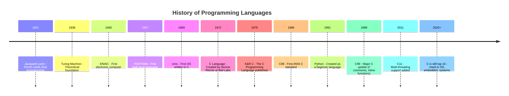

# 1.5: From Logic to Language — How We Bridge Gates and Code

---

## 🎯 Learning Objectives

By the end of this section, you will be able to:

- Explain how simple logic gates combine to create complex computation
- Describe the path from transistors → gates → circuits → machine code → programming languages
- Explain what machine code and assembly language are
- Place C on the abstraction ladder between hardware and high-level languages
- Summarize the key takeaways from Chapter 01

---

## 🧭 The Big Picture

> We started this chapter with binary — just 0s and 1s. Then we built logic gates (AND, OR, NOT). Then we saw how gates build a CPU. Then we saw how memory stores data.
>
> But how do we get from transistors to `printf("Hello, World!\n");`?
>
> The answer is **layers of abstraction**. Each layer builds on the one below, hiding complexity and providing a more human-friendly interface. By the end of this chapter, you should see the full picture: from the physics of silicon to the art of programming.

---

## 📚 Core Content

### The Abstraction Ladder — A Complete View

Let's climb the abstraction ladder from bottom to top:


**Layer 0: Physics (Transistors)**
- Silicon etched with microscopic switches
- Each switch can be ON (1) or OFF (0)
- Billions of transistors on a single chip

**Layer 1: Logic Gates**
- Groups of transistors form AND, OR, NOT, NAND gates
- Gates combine to form adders, multiplexers, memory cells

**Layer 2: Circuits**
- Gates combine into the ALU (arithmetic), Control Unit (sequencing), Registers (storage)
- These three + memory = the Von Neumann architecture

**Layer 3: Machine Code**
- Binary instructions the CPU understands directly
- Example: `10110000 01100001` (means "move the value 97 into register AL")
- Every program ultimately becomes machine code to run

**Layer 4: Assembly Language**
- Human-readable version of machine code
- Example: `MOV AL, 61h` (same as the machine code above)
- One assembly instruction = one machine code instruction
- Still tedious, but better than binary

**Layer 5: C Language**
- Human-readable, structured programming
- Example: `char letter = 'a';`
- One C line = many assembly instructions
- Still gives direct access to memory (pointers, manual allocation)
- This is where we live in this course

**Layer 6: High-Level Languages**
- Python, JavaScript, Java, etc.
- Example: `letter = "a"` (no type declaration, no memory management)
- One line = hundreds of assembly instructions
- Maximum abstraction, maximum convenience, minimum control

### How Code Becomes Machine Instructions

When you write a C program and compile it, here's what happens:

1. **You write:** `int sum = 5 + 3;`
2. **The compiler translates** this to assembly instructions (approximately):
   ```
   MOV R1, #5       ; Load 5 into register 1
   MOV R2, #3       ; Load 3 into register 2
   ADD R3, R1, R2   ; Add R1 and R2, store in R3
   STR R3, [sum]    ; Store R3 to memory location 'sum'
   ```
3. **The assembler** converts each assembly instruction to machine code (binary)
4. **The CPU fetches, decodes, and executes** each machine code instruction
5. **Each instruction** activates specific logic gates in the CPU
6. **The gates** switch transistors on and off
7. **Result:** The number 8 is stored at the memory address for `sum`

Every layer is connected. Every abstraction is built on the layer below.

### The History of This Journey



Programming languages evolved because machine code and assembly were too hard for humans to work with efficiently. C was a breakthrough because it was:
1. **Powerful enough** to write an entire operating system (Unix)
2. **Efficient enough** to compete with assembly language
3. **Portable enough** to run on different computers (unlike assembly, which is specific to one CPU type)

After C came higher-level languages that abstracted away even more: memory management (Java, C#), dynamic types (Python), garbage collection (Go), and web-specific features (JavaScript).

**But underneath, it's all still logic gates.** Every Python list, every JavaScript function, every Java class — they all compile down to instructions that the CPU executes one at a time, using the same fetch-decode-execute cycle we learned about in Section 1.3.

### Where C Sits in This Picture

C is special because it sits at a unique point on the abstraction ladder:

| Property | Assembly | C | Python |
|----------|----------|---|--------|
| Memory control | Full | Full | None (automatic) |
| Type system | None | Static, explicit | Dynamic, implicit |
| Compilation | Assembler → Machine | Compiler → Assembly → Machine | Interpreter (invisible) |
| Performance | Maximum | Near-maximum | 10-50x slower |
| Portability | One CPU type | Almost any CPU | Any CPU with interpreter |
| Learning curve | Steep | Moderate | Gentle |

C gives you **assembly-like control with high-level readability**. That's why it's the perfect teaching language: you see everything that's happening, but you don't have to write in binary to do it.

### Chapter 01 Summary: What You've Learned

Let's connect everything from this chapter into one coherent story:

1. **Binary** (1.1): Computers store everything as 0s and 1s because that's what switches can do
2. **Logic Gates** (1.2): Groups of switches form AND, OR, NOT gates that make decisions
3. **CPU** (1.3): Gates combine to form a processor that fetches, decodes, and executes instructions
4. **Memory** (1.4): Data lives in a hierarchy from fast registers to slow storage
5. **Abstraction** (1.5): Layers of translation turn human-readable code into machine instructions

This is the foundation. Everything else in this course — every variable, every function, every pointer — builds on this understanding.

---

## 🧪 Try It Yourself

> **Exercise 1:** Draw the full abstraction ladder from Chapter 00's section 0.1, but this time add the layers we covered in Chapter 01 (transistors, gates, circuits, machine code). What did Chapter 00's ladder have that this one adds?

> **Exercise 2:** Think about this Python line: `print("Hello")`. Trace through all the abstraction layers it passes through before the word "Hello" appears on your screen. Write down at least 4 layers.

> **Exercise 3:** Look at the history timeline. Why was C created in 1972? What problem was it solving that assembly language didn't solve?

---

## 💡 Common Pitfalls

- ❌ **"Compilation is magic"** — After this chapter, you know it's not. Compilation is a translation process, layer by layer, from human-readable to machine-executable. You've seen every step.

- ❌ **"I need to memorize all the layers"** — You don't. What matters is understanding the *concept* of layered abstraction. Each layer makes the layer above it possible by hiding complexity. You'll spend most of this course at the C layer, but you'll know what's below.

- ❌ **"Higher-level languages are 'better'"** — They're different tools for different jobs. You wouldn't write an operating system in Python. You wouldn't write a web form in assembly. C excels where control and performance matter.

---

## 🔗 Connections to What You Know

> **The abstraction ladder is like the layers of international governance.**
>
> Local government → National government → Regional alliances (EU, ASEAN) → International organizations (UN) → International law
>
> Each layer handles problems the layer below can't solve alone. Each layer has its own language and rules. Each layer abstracts complexity from the layer below.
>
> Programming languages work the same way. The transistor doesn't know about Python. But through layers of abstraction, the transistor ends up executing Python code. This is one of the most remarkable achievements in human engineering.

> **From Chapter 00's systems thinking:** You came into this course knowing how to analyze complex systems with interacting parts. You now understand the most fundamental system in computing: how a computer works from the ground up. You've built a mental model that most self-taught programmers never develop.

---

## 📖 Further Reading

- *Code* by Charles Petzold — The entire book. Read it. It's the best explanation of how computers work from the ground up.
- [From NAND to Tetris](https://www.nand2tetris.org/) — An entire course that starts with NAND gates and builds up to a working computer that can run Tetris
- [The Evolution of Programming Languages](https://www.youtube.com/watch?v=9m8_RM6gYrI) — A visual history

---

## ✅ Section Checklist

- [ ] I can explain how transistors → gates → circuits → machine code → C → high-level languages connect
- [ ] I understand the concept of layered abstraction
- [ ] I can explain why C sits in the "sweet spot" between control and readability
- [ ] I completed the abstraction trace exercise (Exercise 2: Python → C → Assembly → Machine Code → Gates → Transistors)
- [ ] I can summarize the entire Chapter 01 in 3-5 sentences
- [ ] I wrote a **journal entry** about what I learned today

---

*Next: [Chapter 01 Quiz →](./chapter-quiz.md)*
