# 2.2: Installing a Compiler — Setting Up Your C Development Environment

---

## 🎯 Learning Objectives

By the end of this section, you will be able to:

- Install GCC on your specific operating system
- Verify that GCC is installed and working
- Understand what a compiler does at a high level
- Compile and run your first C program

---

## 🧭 The Big Picture

> To send a message to someone who speaks a different language, you need a translator. Without one, no matter how carefully you choose your words, they'll never understand you.
>
> Your compiler is that translator. It's the tool that converts your C code (the message you want to send) into machine code (the language the computer understands). Without a compiler, you can write C all day and the computer will never understand a word.
>
> Installing a compiler is like hiring that translator. It takes a few minutes, you do it once, and then it just works. Let's get it done.

---

## 📚 Core Content

### What Is GCC?

**GCC** (GNU Compiler Collection) is the most popular C compiler in the world. It's free, open-source, and runs on every major operating system. It was originally written by Richard Stallman in 1987 for the GNU project, and it's been the standard C compiler for decades.

When you "compile" a C program, here's the simplified picture:

```
You write: hello.c (source code)
You type: gcc hello.c -o hello (compile)
You get: hello.exe (executable) or ./hello (runnable file)
```

### Installing GCC on Each Operating System



The diagram above shows the decision tree. Below are the exact steps for each OS.

#### Option A: Windows

**Method 1: MinGW-w64 (Recommended)**

1. Go to https://www.mingw-w64.org/
2. Download the installer (look for "MinGW-W64-install.exe")
3. Run the installer. Accept default settings.
4. During installation, make sure to check "gcc" and "g++"
5. After installation, you need to add MinGW to your PATH:
   - Open System Properties → Advanced → Environment Variables
   - Find the `Path` variable, click Edit
   - Add: `C:\Program Files\mingw-w64\x86_64-8.1.0-posix-seh-rt_v6-rev0\mingw64\bin`
   - (The exact path may vary slightly — find where MinGW installed)
6. Open a **new** Command Prompt and type: `gcc --version`

**Method 2: WSL (Windows Subsystem for Linux)**

If you prefer a more Linux-like experience:
1. Open PowerShell as Administrator
2. Run: `wsl --install`
3. Restart your computer
4. After restart, open "Ubuntu" from your Start Menu
5. In the Ubuntu terminal, run: `sudo apt update && sudo apt install gcc`
6. Type: `gcc --version` to verify

#### Option B: macOS

1. Open Terminal (Applications → Utilities → Terminal)
2. Type: `xcode-select --install`
3. A popup will appear asking you to install Command Line Developer Tools
4. Click "Install" and agree to the license
5. Wait for the download and installation to complete (several minutes)
6. Type: `gcc --version` to verify

> **Note:** On macOS, `gcc` is actually `clang` (another C compiler). It works the same way for everything we'll do. Don't worry about the difference.

#### Option C: Linux

**Ubuntu/Debian:**
```
sudo apt update
sudo apt install gcc
gcc --version
```

**Fedora:**
```
sudo dnf install gcc
gcc --version
```

**Arch Linux:**
```
sudo pacman -S gcc
gcc --version
```

### Verifying Your Installation

No matter which operating system you use, the verification is the same:

1. Open your terminal (Command Prompt on Windows, Terminal on Mac/Linux)
2. Type: `gcc --version`
3. You should see output similar to:
   ```
   gcc (Ubuntu 11.4.0-1ubuntu1~22.04) 11.4.0
   Copyright (C) 2021 Free Software Foundation, Inc.
   This is free software; see the source for copying conditions.
   ```
4. If you see a version number, **your compiler is installed and ready to go**.

**If you see an error instead:** The most common issue is that the terminal can't find `gcc` because it's not in your PATH. Go back and check the PATH step for your operating system.

### Your First Compilation

Let's make sure everything works:

1. Create a new file called `hello.c` (anywhere — your Desktop is fine)
2. Open it in a text editor and type:
   ```c
   #include <stdio.h>

   int main(void)
   {
       printf("My compiler works!\n");
       return 0;
   }
   ```
3. Save the file
4. In the terminal, navigate to where you saved the file and run:
   ```
   gcc hello.c -o hello
   ```
5. If you get no errors, run the program:
   - **Windows:** `hello.exe`
   - **Mac/Linux:** `./hello`
6. You should see: `My compiler works!`

### Opening VS Code from the Terminal

Once VS Code is installed, you can open any folder directly from the terminal:

```bash
code .     # Opens the current directory in VS Code
code ~/c_learning   # Opens a specific folder
```

This is incredibly convenient. Instead of navigating through your file system to find your project folder, you can just type `code .` in the terminal and VS Code opens instantly with your project ready.

### What If You Can't Install a Compiler?

If you hit technical issues (corporate laptop restrictions, tablet, etc.), use an online compiler:

- **[replit.com](https://replit.com/):** Create a free account → New Repl → Choose "C"
- **[onlinegdb.com](https://www.onlinegdb.com/):** Open the website → Choose "C" language → Write code → Run
- **[godbolt.org](https://godbolt.org/):** Shows the compiled assembly — great for later chapters

These work in your browser and require no installation. The downside is that you won't learn terminal navigation as thoroughly, but you can still learn C perfectly fine.

---

## 🧪 Try It Yourself

> **Exercise 1:** Install GCC on your computer using the instructions for your operating system. After installation, run `gcc --version` and write down the version number you see.

> **Exercise 2:** Create `hello.c` with the code above, compile it with `gcc hello.c -o hello`, and run it. Take a screenshot or write down the output as proof that your development environment works.

> **Exercise 3:** If you couldn't install GCC, set up an account on [replit.com](https://replit.com/) and create a new C Repl. Write the same "My compiler works!" program and run it there.

---

## 💡 Common Pitfalls

- ❌ **"I installed GCC but 'gcc' is not recognized"** — You forgot to add MinGW to your PATH (Windows) or you didn't open a **new** terminal after updating the PATH. PATH changes only apply to new terminal windows.

- ❌ **"My antivirus is blocking GCC"** — GCC is a legitimate development tool. Add it to your antivirus exceptions. It's not malware.

- ❌ **"I get 'permission denied' when running ./hello"** — On Mac/Linux, you may need to run `chmod +x hello` to make the file executable. (This is a one-time step.)

- ❌ **"I installed via WSL but can't find my files"** — WSL has its own file system. Your Windows files are accessible at `/mnt/c/` (so `C:\` files are at `/mnt/c/`). Use `cd /mnt/c/Users/YourName` to reach your files.

---

## 🔗 Connections to What You Know

> **Installing a compiler is like setting up a new workspace** — whether that's an office, a workshop, or a diplomatic mission. It takes some paperwork, you might need to navigate local bureaucracy (depending on your "host country" / operating system), and it can be frustrating. But once it's done, you have a permanent setup that enables all future work.
>
> The first time you see "My compiler works!" printed on your screen, that's the equivalent of hanging your shingle or raising the flag over a new post. You're established. Now the real work can begin.

---

## 📖 Further Reading

- [GCC Documentation](https://gcc.gnu.org/onlinedocs/) — Official manual (you won't need this for a while, but it exists)
- [MinGW-w64 Installation Guide](https://www.mingw-w64.org/downloads/) — Windows-specific details
- [Why Compilers Matter](https://www.youtube.com/watch?v=6mgXJIMjGgg) — Short video on what compilers do

---

## ✅ Section Checklist

- [ ] I installed GCC (or an alternative) on my computer
- [ ] I verified the installation by running `gcc --version`
- [ ] I compiled and ran my first C program ("My compiler works!")
- [ ] I understand that the compiler translates C code into an executable
- [ ] I wrote a **journal entry** about what I learned today

---

*Next: [2.3: The Terminal — Your New Command Center →](./03-the-terminal.md)*
