# 2.3: The Terminal — Your New Command Center

---

## 🎯 Learning Objectives

By the end of this section, you will be able to:

- Open the terminal on your operating system
- Navigate the file system using `pwd`, `ls`, and `cd`
- Create, copy, move, and delete files and directories
- Understand that the terminal is a powerful tool, not something to fear

---

## 🧭 The Big Picture

> Imagine you're starting work in a new building for the first time. You need to know:
> - Where are you? (What floor? Which office?)
> - What's in this room? (Files, supplies, people?)
> - How do I get to the meeting room? (Navigate the building)
>
> The terminal is like that building's layout — but for your computer's files. At first, it looks intimidating — just a blank screen with a blinking cursor. But it's actually the most direct way to communicate with your computer. No icons, no menus, no mouse — just pure command.
>
> Every professional programmer uses the terminal daily. It's not optional. But it's also not hard. By the end of this section, you'll navigate the terminal as naturally as you walk through a building you know well.

---

## 📚 Core Content

### What Is the Terminal?

The **terminal** (also called "command line," "shell," or "console") is a text-based interface to your operating system. Instead of clicking icons, you type commands. The computer types back its response.

**Why use the terminal for programming?**

| GUI (Graphical) | Terminal (Command Line) |
|----------------|------------------------|
| Click folders to navigate | Type `cd` to navigate |
| Right-click to create files | Type `touch` to create |
| Drag to move files | Type `mv` to move |
| Trash to delete | Type `rm` to delete |
| Slow for batch operations | Fast, scriptable, precise |

The terminal isn't better at everything. But for programming, it's essential because:
1. **Compilers run in the terminal** — You'll type `gcc` commands here
2. **Precision** — No accidental clicks or drag-and-drop mistakes
3. **Automation** — You can write scripts that run many commands
4. **Every professional uses it** — It's the common language of developers

### Opening Your Terminal

| OS | How to Open |
|----|-------------|
| Windows | Search for "Command Prompt" or "PowerShell" in Start Menu |
| Windows (WSL) | Search for "Ubuntu" or your Linux distribution |
| macOS | Applications → Utilities → Terminal (or Cmd+Space, type "Terminal") |
| Linux | Ctrl+Alt+T (Ubuntu) or search for "Terminal" in applications |

> **Pro tip:** Pin the terminal to your taskbar/dock. You'll use it constantly.

### Your First Commands

Let's start with the three most essential commands:

#### `pwd` — Where Am I?

Type `pwd` (Print Working Directory) and press Enter. The terminal shows your current location in the file system.

```
$ pwd
/home/yourname          (Linux/WSL)
/Users/yourname         (macOS)
C:\Users\YourName       (Windows)
```

> This is like looking at a building directory to confirm which floor you're on.

#### `ls` — What's Here?

Type `ls` (List) to see all files and folders in your current location.

```
$ ls
Desktop  Documents  Downloads  Music  Pictures  Videos
```

Add flags for more detail:
- `ls -l` — Long format (file sizes, dates, permissions)
- `ls -a` — Show hidden files (files starting with `.`)
- `ls -la` — Combine both

```
$ ls -la
total 48
drwxr-xr-x  7 yourname  staff   224 Mar 15 10:30 .
drwxr-xr-x  4 yourname  staff   128 Mar 14 09:00 ..
-rw-r--r--  1 yourname  staff  1024 Mar 15 10:30 .DS_Store
drwxr-xr-x  4 yourname  staff   128 Mar 15 10:30 Desktop
drwxr-xr-x  3 yourname  staff    96 Mar 15 10:30 Documents
```

> This is like opening a filing cabinet and seeing all the folders inside.

#### `cd` — Go Somewhere Else

Type `cd` (Change Directory) followed by a folder name to move into it.

```
$ cd Documents          # Move into the Documents folder
$ pwd
/home/yourname/Documents
$ cd ..                 # Move back up one level (.. means "parent directory")
$ pwd
/home/yourname
```

**Navigation shortcuts:**
- `cd ..` — Go up one level
- `cd ~` — Go to your home directory (always works)
- `cd /` — Go to the root of the entire file system
- `cd -` — Go back to where you just were

> Think of `cd` like walking through the hallways of a building. `cd Documents` = "Enter the Documents room." `cd ..` = "Step back into the main hallway."

### The Cheat Sheet



The mindmap above organizes terminal commands by category. Don't memorize them all now — refer to it whenever you need a command. With practice, the common ones will become automatic.

### Essential Commands — Deep Dive

#### Creating Directories: `mkdir`

```bash
$ mkdir my_project        # Create a directory called "my_project"
$ mkdir -p a/b/c          # Create nested directories (a, then b inside a, then c inside b)
```

#### Creating Files: `touch`

```bash
$ touch hello.c           # Create an empty file called hello.c
$ touch notes.txt main.c  # Create multiple files at once
```

> `touch` is a bit odd — it's named after "touching" a file to update its timestamp. But if the file doesn't exist, `touch` creates it. It's the quickest way to create empty files.

#### Copying Files: `cp`

```bash
$ cp hello.c hello_backup.c      # Copy hello.c to hello_backup.c
$ cp hello.c ../backup/           # Copy hello.c into the backup directory
$ cp -r my_project my_project_backup  # Copy a directory and everything inside it
```

#### Moving/Renaming Files: `mv`

```bash
$ mv hello.c main.c              # Rename hello.c to main.c
$ mv main.c ../other_folder/     # Move main.c into the other folder
$ mv my_project ../backup/       # Move the entire project directory
```

> **Key insight:** `mv` does double duty. Moving and renaming are the same operation — renaming is just moving a file to a new name in the same folder.

#### Viewing Files: `cat`

```bash
$ cat hello.c              # Print the entire contents of hello.c to the terminal
$ cat hello.c notes.txt    # Print both files (concatenate them)
```

> `cat` is short for "concatenate." For short files, it's perfect. For long files, use `less` (press `q` to quit).

#### Deleting Files: `rm`

```bash
$ rm hello.c               # Delete hello.c (permanently — no trash bin!)
$ rm -r my_project/        # Delete a directory and everything inside it (r = recursive)
$ rm -rf my_project/       # Force delete without asking (EXTREMELY dangerous)
```

> ⚠️ **WARNING:** `rm` deletes files **permanently**. There is no trash bin. There is no undo. The `-rf` flag combination (recursive + force) will delete anything without asking. Double-check your command before pressing Enter.
>
> This is where the terminal requires more care than the graphical interface. With great power comes great responsibility.

### Tab Completion — Your Best Friend

You don't need to type full file names. Type the first few letters and press **Tab**:

```bash
$ cd Doc[Tab]      # Auto-completes to "cd Documents"
$ ls my_p[Tab]     # Auto-completes to whatever file starts with "my_p"
```

- If only one match exists, Tab completes it automatically
- If multiple matches exist, pressing Tab twice shows all possibilities

> Tab completion alone makes the terminal faster than clicking. Once you get used to it, clicking through folders will feel painfully slow.

### Command History

Press the **Up Arrow** key to see previous commands. Press it repeatedly to scroll back through everything you've typed. Press **Down Arrow** to scroll forward again.

- `history` — Shows your entire command history with numbers
- `!123` — Re-run command number 123 from history

### Stopping Programs

- **Ctrl+C** — Interrupt (kill) the currently running program
- **Ctrl+D** — Exit the terminal session
- **Ctrl+Z** — Suspend the current program (advanced; use Ctrl+C for now)

### The Manual: `man`

Every command has a manual page. Type `man` followed by the command name:

```bash
$ man ls          # Read the manual for the ls command
$ man gcc         # Read the manual for GCC (it's very long)
```

- Press **Space** to scroll down
- Press **q** to quit
- Press **/** to search within the manual

Don't try to read entire manual pages. They're reference material, not tutorials. But when you forget a specific flag, `man` is the authoritative source.

---

## 🧪 Try It Yourself

> **Exercise 1: Navigate Your File System**
> 1. Open your terminal
> 2. Type `pwd` and write down where you are
> 3. Type `ls` and note what files/folders you see
> 4. Navigate to your Desktop: `cd Desktop` (or `cd ~/Desktop`)
> 5. Confirm with `pwd`

> **Exercise 2: Create a Project Directory**
> ```bash
> mkdir c_learning
> cd c_learning
> touch hello.c
> ls
> ```
> You just created your first programming project folder. Take a moment — this is the standard workflow for starting any new program.

> **Exercise 3: Practice the Commands**
> Inside your `c_learning` folder, try:
> - `mkdir subfolder` — Create a subfolder
> - `mv hello.c subfolder/` — Move hello.c into it
> - `cd subfolder` — Navigate into it
> - `ls` — Confirm hello.c is there
> - `cd ..` — Go back up
> - `cp subfolder/hello.c hello_copy.c` — Copy the file back
> - `ls` — You should see both the subfolder and hello_copy.c

> **Exercise 4: Command History**
> Press the **Up Arrow** a few times. See your previous commands? Press **Down Arrow** to go forward. Try pressing Enter on a previous command to re-run it.

---

## 💡 Common Pitfalls

- ❌ **"I can't find my files after using the terminal"** — You're likely in a different directory than you think. Always start with `pwd` to confirm your location. Then `ls` to see what's there.

- ❌ **"I accidentally deleted something with rm"** — There is no undo. If you're worried, use `rm -i` (interactive mode), which asks for confirmation before each deletion. Or just use the graphical Finder/File Explorer for deletions until you're more confident.

- ❌ **"The terminal says 'command not found'"** — Either you typed the command wrong, or the program isn't installed. Check your spelling first, then confirm the software is installed.

- ❌ **"I'm stuck and don't know what to type"** — Press **Ctrl+C** to cancel whatever is happening. This will return you to a clean prompt. Then try again.

- ❌ **"I can't get back to where I was"** — Type `cd ~` to go to your home directory. From there, you can navigate anywhere. Or close the terminal and open a new one — it starts in your home directory by default.

- ❌ **"The terminal is scary"** — This is the most common feeling. Everyone experiences it. Remember: the terminal is just a tool. It can't break your computer. The worst that can happen is you delete a file (which is why you practice with test folders first). Give it a week of daily use, and it will feel natural.

---

## 🔗 Connections to What You Know

> **The terminal is to a programmer what the controls are to a pilot, or an instrument panel to a mechanic.**
>
> Before digital tools, radio operators had to learn the codes and frequencies of their trade. Learning to use the codebook was a prerequisite for the job — not optional, but also not particularly difficult once you practiced for a few days.
>
> The terminal commands (`cd`, `ls`, `pwd`, `mkdir`) are your instrument panel. They're a small vocabulary — maybe 15 commands you'll use 95% of the time. Learning them is a ritual of entry into the profession, just like learning the tools of any trade.
>
> Every senior programmer you admire started exactly where you are now, staring at a blinking cursor, unsure what to type. They got comfortable by typing commands, making mistakes, and trying again. That's exactly what you're doing now.

---

## 📖 Further Reading

- [Terminal Cheat Sheet (LinuxCommand.org)](https://linuxcommand.org/lc3_cheatsheet.php) — Printable one-page reference
- [Learn the Command Line (Codecademy)](https://www.codecademy.com/learn/learn-the-command-line) — Free interactive course
- [The Art of Command Line](https://github.com/jlevy/the-art-of-command-line) — Advanced tips (bookmark for later)

---

## ✅ Section Checklist

- [ ] I opened my terminal and practiced `pwd`, `ls`, and `cd`
- [ ] I created a `c_learning` project directory using `mkdir`
- [ ] I created, moved, copied, and listed files using `touch`, `mv`, `cp`, and `ls`
- [ ] I understand that `rm` permanently deletes files (no undo!)
- [ ] I tried Tab completion and Up Arrow for command history
- [ ] I wrote a **journal entry** about what I learned today

---

*Next: [2.4: Your First C Program →](./04-your-first-c-program.md)*
