# 2.4: Your First C Program — Hello, World!

---

## 🎯 Learning Objectives

By the end of this section, you will be able to:

- Write, compile, and run a complete C program
- Explain every line of the "Hello, World!" program
- Identify the parts of a C program: `#include`, `main`, `printf`, and `return`
- Understand what happens when you press Enter after compiling

---

## 🧭 The Big Picture

> A new employee's first act at a company is often a simple, symbolic gesture — an introduction, a badge, a handshake. It's not a complex project. It's a declaration: "I am here. I am ready to work. The relationship is established."
>
> "Hello, World!" is your first handshake with the computer. It's the simplest complete program that does something visible. Every programmer in every language writes "Hello, World!" first. It's a tradition dating back to 1972 and the book *The C Programming Language* by Kernighan and Ritchie.
>
> You already installed your compiler (Section 2.2) and learned to navigate the terminal (Section 2.3). Now it's time to put them together.

---

## 📚 Core Content

### The Program

Create a new file called `hello.c` in your `c_learning` directory and type the following exactly:

```c
#include <stdio.h>

int main(void)
{
    printf("Hello, World!\n");
    return 0;
}
```

Yes, all of it. Yes, every punctuation mark matters. Yes, it's normal if you feel like you're copying without understanding — we're about to explain every single character.

### Compile and Run

In your terminal, make sure you're in the same directory as `hello.c`, then run:

```bash
gcc hello.c -o hello
```

If you see no output, that's good — it means compilation succeeded with no errors.

Now run the program:

```bash
./hello         # On macOS/Linux/WSL
# OR
hello.exe       # On Windows Command Prompt
```

You should see:

```
Hello, World!
```

**Congratulations. You just wrote, compiled, and ran your first C program.**

Take a moment. This is a genuine achievement. The first program is the hardest because everything is new. From here, you'll build by modifying and expanding what you already have working.

### What Every Line Does



The diagram above shows the complete program with annotations. Let's go through each line in detail.

#### Line 1: `#include <stdio.h>`

This is a **preprocessor directive**. It tells the compiler: "Before compiling, find the file `stdio.h` and insert its contents here."

- `#include` — "Include the contents of this file"
- `<stdio.h>` — The **standard input/output header** — a file that comes with your compiler and contains information about functions like `printf`
- The `.h` stands for **header file**

> Think of this like connecting a new appliance to your home's power and saying "Turn on the lights." The `#include` line connects your program to pre-written code that handles input and output.

#### Line 3: `int main(void)`

This declares the **main function**. Every C program must have exactly one `main` function — it's where execution begins.

- `int` — This function will return an **integer** (a whole number) when it finishes
- `main` — The name of this function. The computer looks for `main` when it runs your program
- `(void)` — This function takes **no arguments** (no inputs). `void` means "nothing"

> Think of `main` as the front door of a building. Everyone who arrives enters through this door. No matter how many rooms the building has, there's always exactly one main entrance.

#### Line 4: `{`

The **opening brace** marks the beginning of the function body. Everything between `{` and `}` is what the function does.

#### Line 5: `printf("Hello, World!\n");`

This is a **function call**. We're calling the `printf` function and passing it a string to print.

- `printf` — **Print formatted** — a function from `stdio.h` that displays text on the screen
- `("Hello, World!\n")` — The **argument** we pass to `printf`. This is the text to display
- `\n` — A **newline character**. It moves the cursor to the next line after printing
- `;` — The **semicolon** ends the statement. In C, every statement ends with a semicolon

> This is like telling the receptionist: "Please announce my arrival over the intercom." `printf` is the receptionist, and the string is what they say.

#### Line 6: `return 0;`

This terminates the `main` function and returns the value `0` to the operating system.

- `return` — Exit this function and send a value back
- `0` — Conventionally means "success." A non-zero value means "something went wrong"
- `;` — End of statement

> This is like clocking out at the end of the workday. Returning `0` says "Everything went smoothly today."

#### Line 7: `}`

The **closing brace** marks the end of the function body.

### Understanding the Structure

Every C program follows this pattern:

```c
#include <header_files>

return_type main(parameters)
{
    statements;
    return value;
}
```

For now, just memorize this structure. You'll internalize it as you write more programs. Here's a mnemonic:

> **"Include stuff, declare main, brace to start, do things, return zero, brace to end."**

### Common Variations You'll See

As you read other C code, you might see:

```c
int main()              // Same as int main(void) — omitting void is allowed
int main(int argc, char *argv[])  // Advanced: receives command-line arguments
void main()             // NON-STANDARD: Avoid this. It works on some compilers but not all.
```

Always use `int main(void)` for now. It's the correct, portable version.

### The Compilation Command Explained

```bash
gcc hello.c -o hello
```

- `gcc` — Invoke the GCC compiler
- `hello.c` — The source file to compile
- `-o hello` — The **output flag**. Name the resulting executable "hello" (without `-o`, it would be named `a.out` by default)

To understand exactly what happens during compilation, we'll dive deep in Section 2.5.

### Troubleshooting

If `gcc` gives you errors, the most common issues are:

| Error | Likely Cause | Fix |
|-------|-------------|-----|
| `gcc: command not found` | Compiler not installed or not in PATH | Go back to Section 2.2 |
| `hello.c: No such file or directory` | You're not in the right directory | Use `pwd` and `ls` to check |
| `'printf' undeclared` | Missing `#include <stdio.h>` | Add the include line |
| `expected ';'` | Missing semicolon | Check that every statement ends with `;` |
| `stray '\' in program` | You used smart quotes ("") instead of straight quotes ("") | Type quotes again using your keyboard |

### A Note on Accuracy

> C compilers are ruthlessly precise. A missing semicolon, a misspelled function name, or a curly brace in the wrong place will produce an error. This is not the computer being mean — it's the computer protecting you. In a contract, a misplaced comma can change its meaning. C is the same way. The compiler's errors are your allies, teaching you precision.

---

## 🧪 Try It Yourself

> **Exercise 1: Hello, World!**
> 1. Create `hello.c` with the exact code from this section
> 2. Compile it: `gcc hello.c -o hello`
> 3. Run it: `./hello` (or `hello.exe` on Windows)
> 4. Confirm you see: `Hello, World!`

> **Exercise 2: Change the Message**
> Edit `hello.c` and change `"Hello, World!"` to `"I wrote my first C program!"`
> Recompile and run. What do you see?

> **Exercise 3: Remove the Newline**
> Edit `hello.c` and remove the `\n` from the printf string:
> ```c
> printf("Hello, World!");
> ```
> Recompile and run. Notice how the output looks different. The `\n` character is invisible but important — it's like pressing Enter after typing.

> **Exercise 4: Break It On Purpose**
> Remove the semicolon from `return 0` and try to compile. Read the error message carefully. Then put the semicolon back. This teaches you to read compiler errors without fear.

---

## 💡 Common Pitfalls

- ❌ **"I got errors!"** — Good! Errors are normal. Read the error message. It tells you the file name, the line number, and what's wrong. Copy the error into a search engine if you don't understand it. You'll learn to read errors quickly with practice.

- ❌ **"I changed the file but the output didn't change"** — You need to **recompile** after editing. The executable is a snapshot of your code at compile time. Changes to the source file don't affect the executable until you recompile.

- ❌ **"My quotes look different"** — Text editors sometimes replace straight quotes (`"`) with curly/smart quotes (`"` `"`). C requires straight quotes. Turn off smart quotes in your editor, or type them manually.

- ❌ **"I typed everything but it says 'undefined reference to main'"** — Make sure your file has `int main(void)` (lowercase m, not Main or MAIN). C is case-sensitive.

---

## 🔗 Connections to What You Know

> **"Hello, World!" is your first message in a new language.**
>
> When you first learn a language, your first sentence is often simple — "Hello!" or "My name is..." It's not groundbreaking. But it establishes the channel. It proves you can form a sentence the other side understands. It builds confidence.
>
> Your `printf("Hello, World!\n");` is that first sentence — in the language of C. It proves your chain of tools works:
> - Your text editor created the file
> - Your terminal navigated to it
> - Your compiler translated it
> - Your operating system ran it
> - Your screen displayed the output
>
> That's an entire pipeline of technology, and you just made it work end-to-end. From here, every program you write is an expansion on this foundation.

---

## 📖 Further Reading

- [The original "Hello, World" from Kernighan & Ritchie](https://en.wikipedia.org/wiki/%22Hello,_World!%22_program) — A brief history
- [How C Programs Run (video)](https://www.youtube.com/watch?v=1v4REI6vzBA) — Visual explanation of compilation and execution
- [Online C Playground](https://godbolt.org/) — Enter C code and see the assembly output in real-time

---

## ✅ Section Checklist

- [ ] I wrote, compiled, and ran "Hello, World!"
- [ ] I can explain what each line of the program does
- [ ] I understand that every statement ends with a semicolon
- [ ] I know that I must recompile after editing
- [ ] I broke my program on purpose and read the error message
- [ ] I wrote a **journal entry** about what I learned today

---

*Next: [2.5: Understanding Compilation →](./05-understanding-compilation.md)*
