# 2.5: Understanding Compilation — From Source to Executable

---

## 🎯 Learning Objectives

By the end of this section, you will be able to:

- Describe the four stages of compilation: preprocessing, compiling, assembling, linking
- Explain what each stage does to your code
- Understand why compilation produces different intermediate files
- Appreciate why C gives you more transparency than high-level languages

---

## 🧭 The Big Picture

> A letter doesn't go directly from your desk to the recipient. It passes through several stages:
>
> 1. **Drafting** — You write the message
> 2. **Formatting** — It's typeset into a standard layout
> 3. **Printing** — It's turned into physical pages
> 4. **Mailing** — The pages go through the postal system
> 5. **Delivery** — The envelope reaches the recipient
>
> Each stage transforms the message. The final output — the letter the recipient reads — looks nothing like your original notes. But each transformation preserves the meaning.
>
> Compilation works the same way. Your C source code goes through multiple transformations before it becomes a running program. Each stage has a specific job, and understanding these stages is what separates programmers who "just know C" from those who truly understand how their code becomes reality.

---

## 📚 Core Content

### The Four Stages of Compilation

When you run `gcc hello.c -o hello`, four distinct stages happen in sequence:


The diagram above shows the entire pipeline. Let's walk through each stage.

### Stage 1: Preprocessing

**Input:** `hello.c`
**Command:** `gcc -E hello.c` (stop after preprocessing)
**Output:** Preprocessed source code (still C, but much larger)

The **preprocessor** handles lines that start with `#`:

1. **`#include <stdio.h>`** — The preprocessor finds the file `stdio.h` and literally inserts its contents into your source code. Your 6-line program becomes ~2,000 lines after this step.

2. **`#define`** — Any macros you've defined get expanded (we'll cover this in a later chapter).

3. **Comment removal** — All comments (`//` and `/* */`) are stripped out. The compiler doesn't need your explanations.

**Why this matters:** When you get an error in a header file (not your code), it's often because the preprocessor included it. The error might point to line 1827 of a file you didn't even know existed. Now you know why — the preprocessor inserted it.

### Stage 2: Compilation (Strict Sense)

**Input:** Preprocessed C code
**Command:** `gcc -S hello.c` (stop after compilation)
**Output:** `hello.s` — Assembly language code

This is the **core stage**. The compiler translates your C code into **assembly language** — a human-readable (barely) representation of the CPU instructions.

For example, `return 0;` might become:

```assembly
movl    $0, %eax
```

This says: "Move the value 0 into the EAX register." The CPU uses registers (tiny, ultra-fast memory locations inside the processor) to perform operations.

**Why this matters:** This is where optimizations happen. The compiler analyzes your code and makes it run faster. It's also where C's famous "trust the programmer" philosophy kicks in — the compiler assumes you wrote what you meant, and translates it literally.

### Stage 3: Assembling

**Input:** `hello.s` — Assembly code
**Command:** `gcc -c hello.c` (stop after assembling)
**Output:** `hello.o` — Object file (machine code, not human-readable)

The **assembler** translates assembly language into **machine code** — the raw binary instructions the CPU executes. Each assembly instruction corresponds to exactly one machine code instruction.

If you open `hello.o` in a text editor, it looks like garbage:

```
ELF����>�@@�����@��@8
                  ����  �������hello.cmainprintf...
```

That's because it's binary data — not meant for humans to read. But the computer understands it perfectly.

**Why this matters:** An object file is NOT executable. It's a partial translation. In our "Hello, World!" program, `hello.o` has a placeholder where `printf` should be — because `printf` lives in a separate library file.

### Stage 4: Linking

**Input:** `hello.o` + `stdio` library
**Command:** `gcc hello.c -o hello` (full compilation)
**Output:** `hello` — Executable file

The **linker** is an underappreciated hero. Its job:

1. **Find all external functions** — `printf` is defined in the C standard library, not in your code
2. **Resolve addresses** — Replace placeholders with actual memory addresses of the library functions
3. **Combine everything** — Merge your object file, the C standard library, and any other libraries into one executable



This diagram shows the complete pipeline with a focus on where libraries enter the process.

### Why Four Stages?

You might wonder: "Why not just do it all in one step?" Historically, this modular design was intentional:

- **Modularity** — Each stage is a separate tool that can be replaced independently
- **Debugging** — If something fails, you know which stage caused it
- **Cross-compilation** — You can compile on one type of computer for a different type (e.g., compile a Raspberry Pi program on your laptop)

### Practical Demonstration

Let's observe each stage in action:

```bash
# Stage 1: Preprocess only
gcc -E hello.c -o hello.i
# Look at how huge it is now
wc -l hello.i          # Count lines (probably ~2000)
head -50 hello.i       # Look at the first 50 lines

# Stage 2: Compile to assembly
gcc -S hello.c
# Creates hello.s - look at the assembly
cat hello.s

# Stage 3: Assemble to object file
gcc -c hello.c
# Creates hello.o - this is binary
# Try: cat hello.o   (it will look like gibberish)

# Stage 4: Full compile + link
gcc hello.c -o hello
# Creates the executable
./hello                # Run it!
```

Try these commands. Seeing the intermediate files makes the stages concrete.

> **Note for Windows Command Prompt users:** The commands `wc`, `head`, and `cat` are Unix commands. They work in WSL, Git Bash, or PowerShell (with aliases). If you're using Command Prompt, skip the `wc -l` and `head` commands for now — or install [Git Bash](https://git-scm.com/) which includes these tools.

### Compiler Flags You Should Know

| Flag | What It Does | When to Use |
|------|-------------|-------------|
| `-o name` | Name the output file | Always — avoid `a.out` |
| `-Wall` | Enable **all** common warnings | Always — catches many bugs |
| `-Wextra` | Enable even more warnings | Most of the time |
| `-Werror` | Treat warnings as errors | When you want strict discipline |
| `-O2` | Optimize for speed | After your code is working |
| `-g` | Include debug information | When using a debugger (later) |

Your standard compilation command should be:

```bash
gcc -Wall -Wextra -Werror hello.c -o hello
```

This catches as many potential issues as possible. Warnings that seem annoying now will later prevent you from spending hours debugging silly mistakes.

### The Transparency Principle

Remember this from Chapter 00? Here's where it becomes concrete.

When you write in Python:

```python
print("Hello, World!")
```

The Python interpreter does everything — reading, parsing, compiling to bytecode, and running — in one invisible step. You have no visibility into any of the stages.

When you write in C:

```bash
gcc hello.c -o hello
./hello
```

You control the compilation explicitly. You can stop at any stage and inspect the output. You decide when to compile and when to run. This transparency means:

- You can see the assembly your code produces
- You can inspect the intermediate object files
- You can optimize specific parts of the compilation
- You understand exactly what your code becomes

This is why C is the best language for learning how computers actually work.

---

## 🧪 Try It Yourself

> **Exercise 1: Examine Each Stage**
> Run through the demonstration commands above. For each stage:
> 1. Run the command
> 2. Look at the output file
> 3. Write down one observation about what you see

> **Exercise 2: The Size of Preprocessing**
> Run `gcc -E hello.c -o hello.i` then `wc -l hello.i` to count the lines.
> Your 6-line program becomes how many lines? Write that number down. This is what `#include` actually does.

> **Exercise 3: Read the Assembly**
> Run `gcc -S hello.c` and open `hello.s` in a text editor. You don't need to understand it all. Just find:
> - The line that says `main:` (the entry point)
> - The line with `printf` (a function call)
> - The line with `movl` (moving values)

> **Exercise 4: Strict Mode**
> Try adding the strict flags:
> ```bash
> gcc -Wall -Wextra -Werror hello.c -o hello
> ```
> Does it still compile? If so, your code is clean. If you get warnings, read them carefully.

> **Exercise 5: The Object File**
> Run `gcc -c hello.c` and then `cat hello.o`. It will look like random characters. That's machine code — binary data displayed as text. Try `hexdump hello.o` or `od -c hello.o` if available to see the actual bytes.
> *(Note: `hexdump` and `od` are Unix commands. On Windows, use PowerShell's `Format-Hex hello.o` instead.)

---

## 💡 Common Pitfalls

- ❌ **"I compiled with -O2 and my program broke"** — Optimization flags change your code. They can reveal undefined behavior or bugs. Debug without optimization (`-O0` is the default), then enable optimization for the final build.

- ❌ **"My object file won't run"** — Object files (`.o`) are not executables. They need to be linked first. Run the full `gcc` command without `-c` to produce an executable.

- ❌ **"I got a linker error: undefined reference"** — The linker can't find a function you called. Common causes: you misspelled the function name, you forgot to include the library, or you forgot to compile all your source files.

- ❌ **"The assembly output scares me"** — It's supposed to be intimidating at first. You won't write assembly in this course. Just seeing it gives you a mental model of what your C code becomes. Think of it like looking at the engine of a car — you don't need to rebuild it, but knowing it's there helps you understand why the car moves.

---

## 🔗 Connections to What You Know

> **The four stages of compilation are like the four stages of producing a formal document** — a published book, a building permit, or an international treaty.
>
> 1. **Drafting (Preprocessing):** The initial text is prepared, with all referenced documents attached. Just as `#include` pulls in `stdio.h`, the drafting team pulls in supporting materials.
>
> 2. **Translation (Compilation):** The draft is translated from the working language into the final language. The meaning is preserved, but the expression changes — just as C code becomes assembly.
>
> 3. **Review (Assembling):** Every part is checked for precision. The result is a final, binding text — specific and unchangeable, like machine code.
>
> 4. **Publication (Linking):** The document is finalized and connected to everything it references (appendices, libraries). It's now a complete, usable whole.
>
> A writer who understands the full publishing process writes better. A programmer who understands the full compilation process codes better.

---

## 📖 Further Reading

- [GCC Compilation Process (GNU Docs)](https://gcc.gnu.org/onlinedocs/gccint/Passes.html) — Official documentation of each stage (advanced)
- [Compiler Explorer (godbolt.org)](https://godbolt.org/) — See C code compiled to assembly in real-time, side by side
- [How a Compiler Works (YouTube)](https://www.youtube.com/watch?v=Z7e8kLh9WSU) — Visual explanation of the pipeline

---

## ✅ Section Checklist

- [ ] I can name the four stages of compilation and explain what each does
- [ ] I ran the intermediate compilation stages and examined the outputs
- [ ] I understand the difference between a source file, object file, and executable
- [ ] I know why `printf` requires the linker to find it in the standard library
- [ ] I use `-Wall -Wextra` in my compilation commands
- [ ] I wrote a **journal entry** about what I learned today

---

*Next: Chapter 2 Quiz →*
