# 3.1: What Is a Variable?

---

## 🎯 Learning Objectives

By the end of this section, you will be able to:

- Define what a variable is in programming terms
- Explain the relationship between a variable's name, type, value, and address
- Understand that variables are named storage locations in memory
- Follow C's rules for naming variables

---

## 🧭 The Big Picture

> Think about how any organized system keeps track of things — a library cataloging books, a clinic filing patient records, an office labeling project folders, or an embassy numbering its documents. Each item gets a clear label — "Trade Agreement 2026/04," "Patient #1187," "Invoice 2026-011." Anyone can find that item later by looking up the label. The label doesn't change even when the item is updated.
>
> A **variable** is exactly that: a labeled storage location. When you write a program, you need places to store data — a user's age, a country's population, a yes/no decision. You could keep track of raw memory addresses, but that would be like filing every document by its exact shelf position — technically possible, but absurdly impractical.
>
> Instead, you give each piece of data a **name**. The computer handles the address; you handle the name. That's a variable.

---

## 📚 Core Content

### What Is a Variable?

A **variable** is a named storage location in the computer's memory. It has three essential properties:

1. **A name** — The label you use to refer to it (like `age`, `population`, `temperature`)
2. **A type** — What kind of data it can hold (integer, floating-point number, character, etc.)
3. **A value** — The actual data currently stored in it

Think of it this way:

| Property | Filing Cabinet Analogy | In C |
|----------|----------------------|------|
| Variable name | The label on a folder | `age` |
| Variable type | What kind of document fits (passport vs. memo) | `int`, `float`, `char` |
| Variable value | The actual document inside | `25` |
| Memory address | Which cabinet, which drawer, which position | `0x7ffd1234` (hexadecimal) |

### Memory as a Filing Cabinet

The diagram below shows how variables are stored in your computer's memory:



Each "drawer" has:
- A **unique address** (drawer number — the computer's way of finding data)
- A **value** (what's inside)
- A **type** (what kind of thing belongs there)

As a programmer, you work with **names**. The computer works with **addresses**. The compiler translates your names into addresses automatically.

### Your First Variable

Here's how you create a variable in C:

```c
int age;    // Declare a variable named 'age' that holds integers
```

This tells the compiler:
1. Reserve space in memory large enough for an integer (usually 4 bytes)
2. Let me refer to that space using the name `age`

Once declared, you can store a value:

```c
age = 25;   // Store the value 25 in the variable 'age'
```

Or do it all in one line:

```c
int age = 25;   // Declare AND initialize in one step
```

### Variable Naming Rules

C has strict rules for what names you can use. Like the rules of a contract, these rules are non-negotiable:

| Rule | Good Example | Bad Example |
|------|-------------|-------------|
| Must start with a letter or underscore | `age`, `_temp` | `1stPlace` (starts with digit) |
| Remaining characters: letters, digits, underscores | `myAge`, `count_1` | `my-age` (hyphen not allowed) |
| No spaces | `totalCount` | `total count` (space!) |
| No C keywords | `value`, `myInt` | `int` (it's a keyword), `return` |
| Case-sensitive | `age`, `Age`, `AGE` (three different variables!) | `age` and `Age` are NOT the same |

**Keywords you cannot use as variable names:**

```
int      float    char     double   void     return
if       else     for      while    do       switch
case     break    continue default  goto     const
static   extern   struct   union    typedef  enum
sizeof   signed   unsigned short    long     volatile
```

You don't need to memorize these — your compiler will tell you if you accidentally use one. But as a rule: if it looks like it might be a C command, don't use it as a variable name.

### Naming Conventions (Not Rules, But Strongly Recommended)

Beyond the strict rules, the C community follows **conventions** — not required by the compiler, but expected by other programmers:

- **Use descriptive names** — `age` is good, `x` is not (what does `x` mean?)
- **Use `camelCase` or `snake_case`** — `myFavoriteColor` or `my_favorite_color`
- **Use UPPER_CASE for constants** — `MAX_SIZE`, `PI`
- **Never start with an underscore in normal code** — Reserved for system libraries

> You wouldn't label an important contract or document "Doc1." You'd label it "StrategicTradeAgreement2026" or "Q3BudgetReport." The same principle applies to variables — a good name makes your code self-documenting.

### A Simple Program with Variables

Let's put variables to work:

```c
#include <stdio.h>

int main(void)
{
    // Declare two integer variables
    int age;
    int year;
    
    // Assign values
    age = 25;
    year = 2026;
    
    // Use them
    printf("I am %d years old in %d.\n", age, year);
    
    // Change a variable's value
    age = age + 1;   // One year passes
    printf("Next year I will be %d.\n", age);
    
    return 0;
}
```

**Output:**
```
I am 25 years old in 2026.
Next year I will be 27.
```

Notice what happens with `age = age + 1;`:
1. The computer reads the current value of `age` (25)
2. It adds 1 to that value (26)
3. It stores the result back into `age` (now 26)
4. The old value (25) is gone — overwritten

### lvalues and rvalues (A Peek Under the Hood)

You might hear programmers talk about "lvalues" and "rvalues." Here's a simple explanation:

- An **lvalue** (left value) is something that can appear on the LEFT side of `=` — it has a memory address. Variables are lvalues.
- An **rvalue** (right value) is something that can only appear on the RIGHT side of `=` — it's a pure value, like `25` or `age + 1`.

```c
int x;       // x is an lvalue
x = 5;       // OK: 5 is an rvalue, x is an lvalue
5 = x;       // ERROR: 5 is NOT an lvalue — you can't assign to a literal
x + 1 = 10;  // ERROR: x + 1 is an rvalue expression, not a storage location
```

This distinction becomes important later when we work with pointers and references. For now, just know: **the thing on the left of `=` must be a variable (a named storage location).**

---

## 🧪 Try It Yourself

> **Exercise 1: Declare and Print**
> Write a program that declares an integer variable called `temperature`, assigns it the value `22`, and prints `"The current temperature is 22 degrees."`

> **Exercise 2: Two Variables**
> Write a program with two integer variables: `students` = 30 and `courses` = 5. Print the total number of student-course combinations (hint: multiply them).

> **Exercise 3: Breaking the Rules**
> Try to compile a program with each of these illegal variable names. Read the error messages carefully. Then fix them:
> - `int 1stPlace;`
> - `int my-name;`
> - `int return;`
> - `int my name;`

> **Exercise 4: Update a Variable**
> Write a program that declares `int score = 10;`, prints it, adds 5 to it, prints it again, multiplies it by 2, and prints it one more time.

---

## 💡 Common Pitfalls

- ❌ **Using `=` when you mean `==`** — In C, `=` is assignment (store a value), and `==` is comparison (check if equal). Using `=` inside an `if` condition is one of the most common C bugs.

- ❌ **Using a variable before giving it a value** — C doesn't automatically initialize variables to zero. If you write `int x; printf("%d", x);`, the output is whatever random data was already in that memory location. Unlike in diplomacy, where an unassigned document drawer might default to "empty," C's memory doesn't default to anything.

- ❌ **CamelCase confusion** — Remember: C is case-sensitive. `myAge`, `myage`, and `MyAge` are three different variables. Pick one style and stick with it.

- ❌ **Using keywords as variable names** — The compiler will reject `int int;` or `float return;`. If you get a confusing error, check if you accidentally used a keyword.

---

## 🔗 Connections to What You Know

> **A variable is like a filing system** — in an office, a clinic, a library, or an embassy.
>
> Every organized system has folders labeled by topic, arranged in cabinets. When something new comes in, a new folder is created with a clear label. When the contents change, the folder is updated but the label stays the same.
>
> Variables work the same way. You create a labeled storage location, put data in it, read it, update it — all by referring to the name. The computer manages the actual filing cabinets (memory addresses) invisibly.
>
> And just as every organization has rules for how documents must be labeled, C has rules for how variables must be named. These rules aren't arbitrary — they make communication possible between all parties.

---

## 📖 Further Reading

- [C Variable Names (GNU C Manual)](https://gcc.gnu.org/onlinedocs/gccint/Identifier-names.html) — Official naming rules
- [Memory and Variables (video)](https://www.youtube.com/watch?v=9Qx5l7LbN1M) — Visual explanation of how variables use memory
- [C Keywords List](https://en.cppreference.com/w/c/keyword) — Complete reference of reserved words

---

## ✅ Section Checklist

- [ ] I can explain what a variable is and why we use them instead of raw memory addresses
- [ ] I know C's naming rules and can identify illegal variable names
- [ ] I wrote a program that declares, assigns, reads, and updates variables
- [ ] I understand the difference between `=` (assignment) and `==` (comparison)
- [ ] I wrote a **journal entry** about what I learned today

---

*Next: [3.2: Basic Data Types →](./02-basic-data-types.md)*
