# 3.2: Basic Data Types — What Kind of Data Lives Where

---

## 🎯 Learning Objectives

By the end of this section, you will be able to:

- List C's basic data types and describe what each is used for
- Explain the difference between integers, floating-point numbers, and characters
- Use `sizeof()` to determine how much memory a type uses on your machine
- Choose the appropriate data type for a given piece of data

---

## 🧭 The Big Picture

> Imagine a storage room — in a warehouse, an office, a library, or an embassy. Different items need different types of storage:
> - Letters need a small, secure drawer (small, precise)
> - Financial amounts need a box with decimal precision (variable size)
> - Long reports need vast archive space (large, expandable)
> - Country codes need a single, fixed slot (tiny, standardized)
>
> The computer's memory is the same. Different kinds of data need different amounts of space and have different capabilities. An integer (whole number) needs 4 bytes. A character needs 1 byte. A high-precision decimal needs 8 bytes.
>
> Choosing the right type is like choosing the right storage container. Put data in the wrong type of container, and you'll either waste space or lose precision. C gives you precise control over this — one of the reasons it's the best language for understanding how computers actually work.

---

## 📚 Core Content

### The Four Basic Data Types

C has four fundamental data types. Every other type in C is built from these:

| Type | What It Stores | Memory | Range (Typical) | Format Specifier |
|------|---------------|--------|-----------------|------------------|
| `char` | A single character | 1 byte | -128 to 127 or 0 to 255 | `%c` |
| `int` | A whole number | 4 bytes | -2,147,483,648 to 2,147,483,647 | `%d` |
| `float` | A decimal number (single precision) | 4 bytes | ~7 decimal digits of precision | `%f` |
| `double` | A decimal number (double precision) | 8 bytes | ~15 decimal digits of precision | `%lf` |

> **⚠️ Important:** The exact sizes can vary by system. On some systems (especially embedded devices), `int` might be 2 bytes. On others, it might be 8 bytes. The ranges above are for a typical modern computer.

### Visualizing Type Sizes

The diagram below shows each type and what it's used for:



Notice how each type has a different purpose. A `char` for characters, `int` for most whole numbers, `float` for decimals when precision isn't critical, and `double` when it is.

### `char` — The Humble Character

A `char` stores a single character. But here's the twist: computers don't understand letters. They understand numbers. So every character is stored as a number using a code called **ASCII** (American Standard Code for Information Interchange).

```c
char letter = 'A';   // Stores the VALUE 65 (ASCII code for 'A')
char digit = '9';    // Stores the value 57 (NOT the number 9!)
char newline = '\n'; // Special: newline character (value 10)
```

**Important:** `'A'` (with single quotes) is a **character**. `"A"` (with double quotes) is a **string** — a different concept entirely. Always use single quotes for single characters.

```c
char good = 'A';    // ✅ Correct: single character in single quotes
char bad = "A";     // ❌ WRONG: "A" is a string, not a single character
```

### `int` — The Workhorse

`int` is the default type for whole numbers. It's the most commonly used type in C.

```c
int count = 100;
int temperature = -5;
int year = 2026;
```

You can also use **variations** of `int` for different ranges:

```c
short int small;   // Usually 2 bytes, smaller range (-32,768 to 32,767)
long int big;      // Usually 4 or 8 bytes, larger range
long long int huge; // Usually 8 bytes, very large range

// The 'int' keyword is optional for short and long:
short s;    // Same as 'short int'
long l;     // Same as 'long int'
long long ll; // Same as 'long long int'
```

**Signed vs. Unsigned:**

```c
int regular = -5;              // signed (default) — can be negative
unsigned int positive_only = 5; // only non-negative, but double the positive range

// unsigned doubles the upper range:
// int:        -2,147,483,648 to 2,147,483,647
// unsigned int:               0 to 4,294,967,295
```

### `float` and `double` — Numbers with Decimals

When you need fractional values, you have two choices:

```c
float price = 19.99f;         // Single precision — note the 'f' suffix
double precise = 3.141592653589793;  // Double precision — no suffix needed

// Why the 'f' suffix?
// 19.99 without 'f' is a double. The 'f' tells C: "I know this is
// a double literal, but I want to store it as a float."
```

**The key difference:**

```c
float f = 1.0f / 3.0f;
double d = 1.0 / 3.0;

printf("float:   %.10f\n", f);   // float:   0.3333333433 (loses precision after ~7 digits)
printf("double:  %.10lf\n", d);  // double:  0.3333333333 (correct for 10 digits)
```

For most learning purposes, `double` is the safer choice. Only use `float` when memory is very tight (thousands of values) or when working with graphics hardware that prefers floats.

### Using `sizeof()`

C provides a special operator called `sizeof()` that tells you exactly how many bytes a type uses on YOUR machine:

```c
#include <stdio.h>

int main(void)
{
    printf("char:   %zu byte(s)\n", sizeof(char));
    printf("int:    %zu byte(s)\n", sizeof(int));
    printf("float:  %zu byte(s)\n", sizeof(float));
    printf("double: %zu byte(s)\n", sizeof(double));
    printf("short:  %zu byte(s)\n", sizeof(short));
    printf("long:   %zu byte(s)\n", sizeof(long));
    printf("long long: %zu byte(s)\n", sizeof(long long));
    
    return 0;
}
```

The `%zu` format specifier is specifically for `sizeof()` values. On a typical modern computer, you'll see:

```
char:   1 byte(s)
int:    4 byte(s)
float:  4 byte(s)
double: 8 byte(s)
short:  2 byte(s)
long:   8 byte(s)
long long: 8 byte(s)
```

> **Run this program on your machine.** The output tells you the exact sizes for YOUR computer. This is part of C's transparency — you can always ask the computer exactly what's happening.

### Putting It All Together

```c
#include <stdio.h>

int main(void)
{
    // Characters
    char grade = 'A';
    char newline = '\n';
    
    // Integers
    int students = 42;
    short room_number = 101;
    unsigned int population = 3500000000u;  // 'u' suffix for unsigned
    
    // Floating point
    float temperature = 36.6f;
    double pi = 3.141592653589793;
    
    // Print them all with their sizes
    printf("grade:      %c (%zu byte)\n", grade, sizeof(grade));
    printf("students:   %d (%zu bytes)\n", students, sizeof(students));
    printf("room:       %d (%zu bytes)\n", room_number, sizeof(room_number));
    printf("population: %u (%zu bytes)\n", population, sizeof(population));
    printf("temp:       %.1f (%zu bytes)\n", temperature, sizeof(temperature));
    printf("pi:         %.15lf (%zu bytes)\n", pi, sizeof(pi));
    
    return 0;
}
```

### Format Specifier Quick Reference

When using `printf()`, each type needs the correct format specifier:

| Type | Format Specifier | Example |
|------|-----------------|---------|
| `int` | `%d` | `printf("%d", age);` |
| `unsigned int` | `%u` | `printf("%u", pop);` |
| `long` | `%ld` | `printf("%ld", big);` |
| `long long` | `%lld` | `printf("%lld", huge);` |
| `float` | `%f` | `printf("%f", price);` |
| `double` | `%lf` | `printf("%lf", pi);` |
| `char` | `%c` | `printf("%c", letter);` |
| `char` as number | `%d` | `printf("%d", letter);` // prints ASCII value |
| `sizeof()` value | `%zu` | `printf("%zu", sizeof(int));` |

**Wrong format specifiers produce garbage output.** If you print a `double` with `%d`, you'll get nonsense. Always match the specifier to the type.

---

## 🧪 Try It Yourself

> **Exercise 1: Type Sizes on Your Machine**
> Write and run the `sizeof()` program above. Write down the sizes for your specific computer. Are they the same as the typical values listed in this section?

> **Exercise 2: Char as Number**
> Write a program that declares `char letter = 'Z';` and prints it twice: once with `%c` and once with `%d`. What number does 'Z' correspond to in ASCII? Try other letters.

> **Exercise 3: Precision Comparison**
> Write a program that divides 1 by 3 and stores the result in both a `float` and a `double`. Print both with `%.15f`. Which one is more accurate?

> **Exercise 4: Wrong Format Specifiers**
> Declare `int x = 42;` and print it with `%f`. Then declare `double y = 3.14;` and print it with `%d`. What happens? Don't leave this in your final code — but it's educational to see what garbage output looks like so you recognize it later.

---

## 💡 Common Pitfalls

- ❌ **Forgetting the `f` suffix on float literals** — `float f = 3.14;` generates a warning because `3.14` is a `double`, and storing it in a `float` loses precision. Write `float f = 3.14f;` instead.
- ❌ **Using `%d` for `double`** — This produces garbage output. Always use `%lf` for double.
- ❌ **Integer division without realizing it** — `int x = 5 / 2;` gives `2`, not `2.5`. Both numbers are integers, so C does integer division (truncates the decimal). Use `5.0 / 2` if you want `2.5`.
- ❌ **Assuming `int` is always 4 bytes** — On some systems (especially older or embedded), `int` might be 2 bytes. Use `sizeof()` to check, or use the fixed-width types from `<stdint.h>` (like `int32_t`) when exact size matters.
- ❌ **Character vs. string confusion** — `'A'` (single quotes) is a character (1 byte). `"A"` (double quotes) is a string (2 bytes: the 'A' plus a null terminator). They are NOT interchangeable.

---

## 🔗 Connections to What You Know

> **Choosing the right data type is like choosing the right container for what you're storing.**
>
> A short text message fits on a post-it note (like a `char`). A long report needs a folder (like a `double`). A count of people in a stadium needs a counter that can hold big whole numbers (like an `int`). You wouldn't write an essay on a post-it note, and you wouldn't store a single phone number in a shipping container.
>
> C forces you to think about these choices explicitly. A high-level language like Python just stores everything in a generic "object" container — convenient, but you lose the understanding of what's actually happening in memory. C's type system is transparent, and that transparency is your teacher.

---

## 📖 Further Reading

- [C Data Types (cppreference.com)](https://en.cppreference.com/w/c/language/types) — Complete reference
- [ASCII Table](https://www.asciitable.com/) — Full character-to-number mapping
- [IEEE 754 Floating Point](https://en.wikipedia.org/wiki/IEEE_754) — How floats are actually stored (advanced, but fascinating)
- [sizeof operator (GNU Docs)](https://gcc.gnu.org/onlinedocs/gcc/Size-of.html) — Official documentation

---

## ✅ Section Checklist

- [ ] I can list the four basic C data types and their typical sizes
- [ ] I ran `sizeof()` on my machine and know my system's sizes
- [ ] I understand the difference between `float` and `double` precision
- [ ] I know that `char` is stored as a number (ASCII) under the hood
- [ ] I can match format specifiers to their types
- [ ] I wrote a **journal entry** about what I learned today

---

*Next: [3.3: Declaring and Initializing Variables →](./03-declaring-and-initializing.md)*
