# 3.3: Declaring and Initializing — Giving Variables Life

---

## 🎯 Learning Objectives

By the end of this section, you will be able to:

- Declare variables with the correct syntax
- Initialize variables at declaration time
- Explain what happens when you use an uninitialized variable
- Declare multiple variables in one statement
- Differentiate between declaration, initialization, and assignment

---

## 🧭 The Big Picture

> Announcing a plan and carrying it out are two different things. When a company announces a new policy (a declaration), it hasn't yet been implemented. Implementation comes later through specific actions (assignment).
>
> In the same way, declaring a variable and giving it a value are separate operations — though C lets you combine them. Understanding the difference is crucial because using a variable before giving it a value produces unpredictable results, like citing a contract that was never signed.

---

## 📚 Core Content

### The Anatomy of a Variable Declaration

Let's dissect a variable declaration piece by piece:

```c
int age = 25;
```

The diagram below shows each part visually:



Every declaration has at least two parts: a **type** and a **name**. The assignment (`= value`) and semicolon (`;`) complete the statement.

### Declaration vs. Initialization vs. Assignment

These three terms are related but distinct:

| Term | What It Means | Example |
|------|--------------|---------|
| **Declaration** | Telling the compiler: "I want a variable with this name and type" | `int age;` |
| **Initialization** | Giving a variable its **first** value (at declaration time) | `int age = 25;` |
| **Assignment** | Changing a variable's value (any time after declaration) | `age = 30;` |

```c
int x;          // Declaration only — x has no meaningful value yet
x = 10;         // Assignment — putting a value in an already-declared variable
int y = 20;     // Declaration + Initialization — combined in one line
y = 30;         // Assignment — changing y's value
```

### The Danger of Uninitialized Variables

Here's one of C's most important warnings:

```c
#include <stdio.h>

int main(void)
{
    int x;     // Declared but NOT initialized
    printf("%d\n", x);  // ⚠️ What prints? No one knows!
    return 0;
}
```

**What prints here?** Whatever garbage was already in that memory location. It might be `0`. It might be `32765`. It might be `-1423912824`. It changes every time you run the program.

> In a high-level language like Java or Python, uninitialized variables default to 0 or `null`. **C does not do this.** C's philosophy is "trust the programmer" — if you want it to be 0, you'll set it to 0. This makes C faster but also more error-prone.

**Always initialize your variables.** Here's the safe approach:

```c
int x = 0;      // ✅ Always initialized
int y;          // ❌ Dangerous — easy to forget to initialize later
```

### Multiple Declarations

You can declare multiple variables of the same type in one statement:

```c
int a, b, c;                    // Three uninitialized integers
int x = 1, y = 2, z = 3;       // Three initialized integers
double p, q = 3.14, r;         // Mixed: p and r uninitialized, q = 3.14
```

**Common mistake:** Trying to initialize multiple variables with one value:

```c
int a = b = c = 0;   // ❌ WRONG! This doesn't compile
int a, b, c;         
a = b = c = 0;       // ✅ Correct: assignment chaining
int a = 0, b = 0, c = 0;  // ✅ Also correct: separate initializations
```

### The `auto` Keyword (You'll Never Use It)

In C, variables declared inside functions are **automatic** by default — they're created when the function runs and destroyed when it returns. There's an `auto` keyword that explicitly states this, but it's almost never used because it's the default:

```c
auto int x = 5;     // Same as 'int x = 5;' — auto is the default
```

99.99% of C code never uses `auto`. We mention it only so you don't confuse it with the completely different `auto` in C++.

### Declaration Placement

In older C (C89/C90), all declarations had to come at the beginning of a block:

```c
// OLD STYLE (C89):
int main(void)
{
    int x;          // All declarations first
    int y;
    
    x = 5;          // Then statements
    y = 10;
    printf("%d\n", x + y);
    return 0;
}
```

In modern C (C99 and later), you can declare variables anywhere, as long as you declare them before you use them:

```c
// MODERN STYLE (C99+):
int main(void)
{
    int x = 5;          // Declare and use
    printf("%d\n", x);
    
    int y = 10;         // Declare later — perfectly valid
    printf("%d\n", y);
    
    return 0;
}
```

Place declarations close to where the variable is first used. This makes the code easier to read — you don't have to scroll up to find the declaration.

### Re-declaration Is Not Allowed

You cannot declare the same variable twice in the same scope:

```c
int x = 5;
int x = 10;     // ❌ ERROR: re-declaration of 'x'
```

But you can assign a new value:

```c
int x = 5;
x = 10;         // ✅ OK: assigning a new value to the same variable
```

### A Complete Example

```c
#include <stdio.h>

int main(void)
{
    // Declaration + Initialization (best practice)
    int students = 42;
    int courses = 5;
    
    // Declaration only (then assign later — use with care)
    int total;
    total = students * courses;
    
    printf("Total combinations: %d\n", total);
    
    // Declare and initialize close to first use
    char grade = 'A';
    printf("Target grade: %c\n", grade);
    
    return 0;
}
```

---

## 🧪 Try It Yourself

> **Exercise 1: Declaration Variations**
> Write a program that demonstrates all three forms:
> 1. Declaration only (`int x;`)
> 2. Declaration + initialization (`int y = 5;`)
> 3. Declaration then later assignment (`int z; z = 10;`)
> Print all three values. Notice that `x` might print garbage if you run it without initializing.

> **Exercise 2: Multiple Declarations**
> Write a program that declares three integers on one line, initializes two of them, then prints all three. What happens to the uninitialized one?

> **Exercise 3: Modern Placement**
> Rewrite the following code so declarations appear close to first use:
> ```c
> int main(void)
> {
>     int x, y, total;
>     x = 10;
>     y = 20;
>     total = x + y;
>     printf("%d\n", total);
>     return 0;
> }
> ```

> **Exercise 4: Re-declaration Error**
> Try to compile this and read the error message:
> ```c
> int main(void) {
>     int x = 5;
>     int x = 10;
>     return 0;
> }
> ```

---

## 💡 Common Pitfalls

- ❌ **Using an uninitialized variable** — The most common beginner bug. C does NOT auto-initialize to zero. Always initialize at declaration when possible: `int x = 0;`
- ❌ **Thinking `=` means "equals"** — `=` means "assign the value on the right to the variable on the left." It's not a mathematical equation. `x = x + 1` makes no sense in algebra, but in C it means "take x's current value, add 1, and store the result back in x."
- ❌ **Re-declaring a variable** — `int x = 5; int x = 10;` is an error. You can only declare a variable once.
- ❌ **Using assignment chaining incorrectly** — `int a = b = c = 0;` is invalid in a declaration. Use `int a = 0, b = 0, c = 0;` instead.
- ❌ **Old-style declarations** — Putting all variables at the top of a function is no longer necessary. Declare them close to where they're used for readability.

---

## 🔗 Connections to What You Know

> **Declaration is like reserving a parking space.**
>
> When you declare `int x;`, you're saying to the compiler: "Reserve a space in memory for an integer, and let me call it `x`." No car is parked there yet — it's just a reserved spot.
>
> When you initialize `int x = 5;`, you're parking the car (value 5) in that reserved spot immediately. When you later assign `x = 10;`, you're replacing the car with a different one.
>
> Using an uninitialized variable is like pulling into a parking spot and finding a random car already there that you didn't park — it belongs to whoever used that space last. In the world of computing, that's called a **garbage value**, and it's the source of countless bugs.

---

## 📖 Further Reading

- [C Declarations (cppreference.com)](https://en.cppreference.com/w/c/language/declarations) — Official reference
- [Uninitialized Variables (video)](https://www.youtube.com/watch?v=M1qTp9W3XoU) — Visual demonstration of what garbage values look like
- [C89 vs C99 Declaration Rules](https://stackoverflow.com/questions/2892007) — Why you might see old-style code

---

## ✅ Section Checklist

- [ ] I can explain the difference between declaration, initialization, and assignment
- [ ] I understand the danger of using uninitialized variables
- [ ] I can declare multiple variables in one statement
- [ ] I know that re-declaration of the same variable is an error
- [ ] I write my declarations close to where I first use the variable
- [ ] I wrote a **journal entry** about what I learned today

---

*Next: [3.4: Constants and Literals →](./04-constants-and-literals.md)*
