# 3.4: Constants and Literals — Values That Don't Change

---

## 🎯 Learning Objectives

By the end of this section, you will be able to:

- Distinguish between literals and constants in C
- Declare and use `const` variables
- Use `#define` to create symbolic constants
- Understand when to use `const` vs. `#define`

---

## 🧭 The Big Picture

> International treaties contain fixed values that cannot be changed unilaterally: the number of signatories required for ratification, the percentage of GDP for contributions, the exact boundaries of territorial waters. These are **constants** — they are agreed upon once and remain fixed throughout the agreement.
>
> In the same way, C programs often need values that should never change: the speed of light, the tax rate, the maximum number of students, the version number of your software. If these values were stored in regular variables, they could be accidentally modified — like accidentally changing a signed contract.
>
> C gives you tools to protect these values. `const` and `#define` are your locks — they ensure that certain values remain exactly as you set them.

---

## 📚 Core Content

### Literals vs. Constants

First, let's clarify two related but different concepts:

| Concept | Meaning | Example |
|---------|---------|---------|
| **Literal** | A value written directly in the code | `42`, `3.14`, `'A'`, `"Hello"` |
| **Constant** | A named value that cannot be changed | `const int MAX = 100;` or `#define MAX 100` |

A literal is just a raw value. A constant is a named entity that protects that value.

### Types of Literals

Every value you write in your code has a type:

```c
42          // int literal
42u         // unsigned int literal
42L         // long literal
42LL        // long long literal
3.14        // double literal
3.14f       // float literal
'A'         // char literal (single character)
"Hello"     // string literal (multiple characters)
'\n'        // special character literal (newline)
```

The diagram below shows all the literal types:



### The `const` Keyword

The `const` keyword turns a variable into a read-only constant:

```c
const int MAX_STUDENTS = 100;
const double PI = 3.14159;
const char NEWLINE = '\n';

MAX_STUDENTS = 200;  // ❌ ERROR! 'const' variable cannot be modified
```

Once declared `const`, the variable **cannot** be changed after initialization. The compiler will refuse to compile any code that tries.

**Important rules for `const`:**

1. **Must be initialized at declaration** — You can't declare it and assign later:
   ```c
   const int X;    // ❌ ERROR: uninitialized const
   const int X = 10;  // ✅ OK
   ```

2. **Cannot be assigned to after declaration:**
   ```c
   const int X = 10;
   X = 20;         // ❌ ERROR: assignment of read-only variable
   ```

3. **Can be used anywhere a regular variable is used (except as an lvalue):**
   ```c
   const int SIZE = 5;
   int arr[SIZE];  // ✅ OK in C99+
   printf("%d", SIZE);  // ✅ OK
   int y = SIZE + 3;    // ✅ OK
   ```

### The `#define` Directive

`#define` is a **preprocessor directive** — it runs before the compiler, doing text substitution:

```c
#define MAX_STUDENTS 100
#define PI 3.14159
#define COURSE_NAME "Foundations of Programming"
```

Before the compiler even sees your code, the preprocessor replaces every occurrence of `MAX_STUDENTS` with the text `100`. It's like a "find and replace" that runs automatically.

```c
#include <stdio.h>

#define MAX 100
#define MESSAGE "The maximum is: "

int main(void)
{
    printf("%s%d\n", MESSAGE, MAX);
    // The preprocessor turns this into:
    // printf("%s%d\n", "The maximum is: ", 100);
    return 0;
}
```

**Convention:** `#define` constants are written in ALL_CAPS with underscores. This makes them immediately recognizable in the code.

### `const` vs. `#define`: Which to Use?

| Aspect | `const` | `#define` |
|--------|---------|-----------|
| When it runs | At compile time | Before compile (preprocessor) |
| Has a type | ✅ Yes (int, double, etc.) | ❌ No (just text replacement) |
| Has a memory address | ✅ Yes (can use `&`) | ❌ No |
| Debugger can see it | ✅ Yes | ❌ No (replaced before compilation) |
| Scope controlled | ✅ Yes (block scope) | ❌ No (file-wide unless `#undef`) |
| Type safety | ✅ Full | ❌ None (can cause subtle bugs) |

**Recommendation:** Use `const` for almost everything. Use `#define` only for:
- Header guards (`#ifndef HEADER_H`)
- Conditional compilation (`#ifdef DEBUG`)
- Truly global constants shared across many files
- When you need the constant to work with preprocessor directives (`#if`)

For this course, we'll use `const` in almost all cases.

### Practical Examples

```c
#include <stdio.h>

#define TAX_RATE 0.08        // #define — preprocessor constant
#define STORE_NAME "My Shop" // Also #define — for variety

int main(void)
{
    // const — compiler-enforced constant
    const double PRICE = 19.99;
    const int QUANTITY = 3;
    
    // Using both types of constants
    double subtotal = PRICE * QUANTITY;
    double tax = subtotal * TAX_RATE;
    double total = subtotal + tax;
    
    printf("=== %s ===\n", STORE_NAME);
    printf("Price:    $%.2f\n", PRICE);
    printf("Quantity: %d\n", QUANTITY);
    printf("Subtotal: $%.2f\n", subtotal);
    printf("Tax:      $%.2f\n", tax);
    printf("Total:    $%.2f\n", total);
    
    return 0;
}
```

### Special Literal: The Null Character

A special character you'll encounter frequently is the **null character**: `'\0'`. It has ASCII value 0 and is used to mark the end of strings. It's NOT the same as the digit `'0'` (ASCII 48) or the number `0`.

```c
char null_char = '\0';    // ASCII value 0 — end of string marker
char zero_char = '0';     // ASCII value 48 — the digit zero
int zero_num = 0;         // The integer zero
```

We'll explore this more in the chapter on strings.

### Magic Numbers — What to Avoid

A **magic number** is a literal value that appears in code without explanation:

```c
// ❌ BAD: What is 3600? Why 24? What do these mean?
int seconds_in_day = 3600 * 24;
```

Use constants instead:

```c
// ✅ GOOD: Named constants make the meaning clear
const int SECONDS_PER_HOUR = 3600;
const int HOURS_PER_DAY = 24;
int seconds_per_day = SECONDS_PER_HOUR * HOURS_PER_DAY;
```

Magic numbers make code hard to read, hard to maintain, and error-prone. If 3600 appears in 10 places and you need to change it to 3601, you'll miss one. A single `const` or `#define` fixes this.

---

## 🧪 Try It Yourself

> **Exercise 1: const Practice**
> Write a program with `const double RATE = 0.15;` and `const int HOURS = 40;`. Calculate and print the pay for working `HOURS` at `RATE` dollars per hour.

> **Exercise 2: Try to Modify a const**
> Write a program that declares a `const` variable and then tries to modify it. What error does your compiler give? Read the error carefully.

> **Exercise 3: Eliminate Magic Numbers**
> Take this code and replace all magic numbers with named constants:
> ```c
> int main(void)
> {
>     double area = 3.14159 * 5 * 5;
>     double circumference = 2 * 3.14159 * 5;
>     printf("Area: %f\n", area);
>     printf("Circumference: %f\n", circumference);
>     return 0;
> }
> ```

> **Exercise 4: #define Temperature**
> Use `#define` to create a temperature conversion program:
> ```c
> #define FREEZING 32
> #define BOILING 212
> ```
> Print the boiling and freezing points of water in Fahrenheit.

---

## 💡 Common Pitfalls

- ❌ **Trying to modify a `const`** — The compiler will stop you. If you need a variable's value to change, don't use `const`.
- ❌ **`#define` without ALL_CAPS** — Convention is ALL_CAPS for `#define`. `#define pi 3.14` is confusing — is `pi` a variable or a constant?
- ❌ **Semicolon after `#define`** — `#define MAX 100;` is wrong! The semicolon becomes part of the replacement text. `int x = MAX;` becomes `int x = 100;;` — the extra semicolon usually causes an error.
- ❌ **`#define` in the middle of a function** — This is confusing. Put `#define` directives at the top of the file with other preprocessor directives.
- ❌ **Forgetting that `#define` has no scope** — Once defined, a `#define` is visible until the end of the file or until `#undef`. It doesn't respect `{}` blocks.

---

## 🔗 Connections to What You Know

> **Constants are like fixed rules that everyone agrees never change.**
>
> A speed limit is 60 km/h — it isn't renegotiated every time a car passes. A shop's opening hours are fixed — they don't change with each customer. These numbers become reliable reference points because they're **constant**.
>
> In your C programs, `const` and `#define` serve the same function. They establish fixed values that your code can rely on. A `const` is like a posted rule that explicitly states, "This value shall not be changed." A `#define` is like a dictionary definition — it establishes the vocabulary before the main text begins.
>
> And just as a good rulebook avoids unexplained numbers — "the refund period is 30 days," not "the refund period is 30" with the "days" only implied — good programmers avoid **magic numbers** in code.

---

## 📖 Further Reading

- [const keyword (cppreference.com)](https://en.cppreference.com/w/c/language/const) — Official reference
- [#define directive (cppreference.com)](https://en.cppreference.com/w/c/preprocessor/replace) — Preprocessor macro reference
- [Magic Numbers (Wikipedia)](https://en.wikipedia.org/wiki/Magic_number_(programming)) — Why they're harmful

---

## ✅ Section Checklist

- [ ] I can explain the difference between a literal and a constant
- [ ] I know how to declare and use `const` variables
- [ ] I know how to use `#define` for preprocessor constants
- [ ] I can identify and eliminate magic numbers in code
- [ ] I understand why `const` is preferred over `#define` in most cases
- [ ] I wrote a **journal entry** about what I learned today

---

*Next: [3.5: Type Conversion →](./05-type-conversion.md)*
