# 3.5: Type Conversion — When Types Meet

---

## 🎯 Learning Objectives

By the end of this section, you will be able to:

- Predict what happens when you mix different data types in an expression
- Distinguish between implicit (automatic) and explicit (cast) conversion
- Perform explicit type casting using the cast operator
- Recognize when implicit conversion might cause data loss

---

## 🧭 The Big Picture

> Documents often need to be translated between languages. A report written in English might need a French version or a Spanish version. The meaning should stay the same, but the representation changes. Sometimes the translation is straightforward (English "United Nations" → French "Nations Unies"). Other times, a concept doesn't translate cleanly and meaning is lost (like the English word "privacy" in some legal systems).
>
> C data types work the same way. When you mix different types in an expression (like adding an `int` to a `double`), C automatically "translates" one to the other. This is called **implicit conversion**. Usually it works fine. But just like any translation, sometimes meaning can be lost — and you need to explicitly ask for the translation (an **explicit cast**) so you're aware of the risk.

---

## 📚 Core Content

### The Problem: Different Types in One Expression

What happens when you write this?

```c
int x = 5;
double y = 2.5;
// What is x + y? int + double?
```

A variable can only be one type. But an expression can contain multiple types. C needs a rule for handling this.

### Implicit Conversion (Automatic)

C automatically converts types in mixed expressions. The rule is simple:

> **Values are converted to the "largest" type in the expression.**

```c
int x = 5;
double y = 2.5;
double result = x + y;   // x (int) is converted to double BEFORE the addition
                          // result = 7.5 (double)
```

Behind the scenes, C creates a temporary `double` copy of `x` (value: `5.0`) and adds that to `y`. The original `x` remains an `int` — it's just a copy that gets converted.

The diagram below shows the conversion hierarchy:



**The promotion rules (from lowest to highest):**

```
char → short → int → unsigned int → long → unsigned long → float → double
```

When types are mixed, the smaller type is promoted to match the larger one. Think of it as: "everyone gets upgraded to first class."

**Critical rule for mixing integers and floating-point:** If any operand in an expression is a floating-point type (`float` or `double`), the result is floating-point — even if the integer type is larger. For example, `long + float` produces a `float`, not a `long`. Floating-point "wins" over integer types in mixed expressions.

### Common Implicit Conversions

```c
int i = 5;
double d = 3.14;
double r1 = i + d;      // int → double: r1 = 8.14

char c = 'A';           // ASCII value 65
int r2 = c + 1;         // char → int: r2 = 66 (prints 'B' as %c)

int a = 10;
double b = 3;
double r3 = a / b;      // int → double: r3 = 3.333...
                         // Because ONE operand (b) is double

int x = 5;
int y = 2;
double r4 = x / y;      // ⚠️ BOTH are ints, so integer division first:
                         // 5 / 2 = 2 (integer division!)
                         // THEN 2 is converted to 2.0
                         // r4 = 2.0, NOT 2.5!
```

The last example is a classic C trap. Because `x` and `y` are both integers, C does integer division (truncating the remainder to 0). The result `2` is then stored in `r4` as `2.0`. To get `2.5`, you need at least one operand to be a `double`:

```c
double r4 = (double)x / y;  // Cast x to double first: 5.0 / 2 = 2.5
double r5 = x / (double)y;  // Cast y to double: 5 / 2.0 = 2.5
double r6 = x / 2.0;        // Use a double literal: 5 / 2.0 = 2.5
```

### The Integer Division Trap

This is so common it deserves its own subsection:

```c
// You want to average three numbers:
int a = 10, b = 20, c = 30;
int count = 3;

double average1 = (a + b + c) / count;    // 60 / 3 = 20.0  ❌ WRONG (integer division)
double average2 = (double)(a + b + c) / count;  // 60.0 / 3 = 20.0  ✅ (but we wanted a fraction)

// Better example — true average:
int total = 10;
int items = 3;
double avg1 = total / items;              // 3.0 — WRONG! Integer division: 10/3 = 3
double avg2 = (double)total / items;      // 3.333... — CORRECT! Cast before division
double avg3 = total / (double)items;      // 3.333... — CORRECT! Either operand as double works
```

### Explicit Conversion (Casting)

When you want to control the conversion yourself, you use a **cast**:

```c
(type) expression
```

```c
double pi = 3.14159;
int approx = (int)pi;          // approx = 3 (truncates the decimal part!)
```

Casting is like telling the translator: "I know this might lose meaning, but do it anyway."

**Common uses:**

```c
// 1. Truncating a double to int
double price = 19.99;
int dollars = (int)price;      // 19 (the .99 is lost!)

// 2. Forcing floating-point division
int x = 7, y = 3;
double result = (double)x / y; // 2.333..., not 2

// 3. Printing a character as its ASCII number
char letter = 'Z';
printf("Character: %c, ASCII: %d\n", letter, (int)letter);  // Z, 90

// 4. Narrowing a larger type to a smaller one (dangerous!)
int large = 1000;
char small = (char)large;      // ⚠️ 1000 doesn't fit in a char (max 255)!
                                 // small will have a WRONG value
```

### When Implicit Conversion Causes Data Loss

Some implicit conversions lose data without warning:

```c
double precise = 3.14159265358979;
float less_precise = precise;   // ⚠️ Warning! double → float loses precision

int large = 1000000;
short small = large;            // ⚠️ Warning! int → short may overflow
```

These produce **compiler warnings** (not errors). With `-Wall`, GCC will warn you. With `-Werror`, these warnings become errors, forcing you to add explicit casts and acknowledge the risk.

### The `bool` Type and Conversion

C doesn't have a native boolean type (true/false). Instead, it uses integers:

- **0** means **false**
- **Any non-zero value** means **true**

```c
int is_ready = 1;        // 1 = true
int is_done = 0;         // 0 = false

if (is_ready) {          // Works because 1 is non-zero
    printf("Ready!\n");
}
```

When converting to `_Bool` (C99's boolean type):

```c
#include <stdbool.h>

bool flag = 42;          // Non-zero → true (stored as 1)
bool zero = 0;           // 0 → false (stored as 0)
bool negative = -5;      // Non-zero → true (stored as 1)
```

### Summary Table

| Conversion | Direction | Automatic? | Safe? |
|-----------|-----------|-----------|-------|
| `int` → `double` | Smaller → larger | ✅ Yes | ✅ Safe |
| `char` → `int` | Smaller → larger | ✅ Yes | ✅ Safe |
| `float` → `double` | Smaller → larger | ✅ Yes | ✅ Safe |
| `double` → `int` | Larger → smaller | ✅ Yes | ❌ Loses decimal |
| `int` → `char` | Larger → smaller | ✅ Yes | ❌ May overflow |
| `double` → `float` | Larger → smaller | ✅ Yes | ❌ Loses precision |
| Any → `double` (in expr) | Upcast | ✅ Yes | ✅ Safe |
| Explicit cast | Any direction | ❌ Manual | Depends on you |

---

## 🧪 Try It Yourself

> **Exercise 1: Integer Division**
> Write a program that divides 7 by 3 and stores the result in a `double`. Try these versions and print all results:
> ```c
> double a = 7 / 3;
> double b = 7.0 / 3;
> double c = (double)7 / 3;
> double d = 7 / 3.0;
> ```
> Which ones give 2.333...? Which give 2.0? Why?

> **Exercise 2: Cast a Double**
> Write a program that declares `double price = 49.99;` and prints it as a truncated integer using a cast. What value prints?

> **Exercise 3: Char Arithmetic**
> Declare `char letter = 'A';` and print `letter + 1` both as an integer (`%d`) and as a character (`%c`). What do you get? Try starting with different letters.

> **Exercise 4: Overflow Experiment**
> Write a program that assigns a very large integer (like 300) to a `char` using a cast. Print the result. Does it match what you expect? Research what happens when a value overflows a type.

---

## 💡 Common Pitfalls

- ❌ **Integer division without realizing it** — `int a = 5 / 2;` gives `2`, not `2.5`. Always check: if you want decimal results, at least one operand must be a floating-point type.
- ❌ **Losing precision with implicit conversion** — `double d = 3.14159; float f = d;` loses precision silently. Use `-Wconversion` to catch these.
- ❌ **Casting too late** — `(double)(7 / 3)` gives `2.0`, not `2.333`. The integer division happens BEFORE the cast. Cast one operand BEFORE the division: `(double)7 / 3`.
- ❌ **Assuming `true` is always `1`** — In C, any non-zero value is true. `if (42)` is true. `if (-1)` is true. Only `0` is false.
- ❌ **Overflowing smaller types** — Storing a value larger than 255 in a `char` wraps around (modulo 256). The result is not what you'd expect and there's no automatic error message.

---

## 🔗 Connections to What You Know

> **Type conversion is like translating between languages.**
>
> When a message is translated from English to French, most concepts translate cleanly — just like `int` to `double` is safe. But some concepts have no direct equivalent — like the German word "Schadenfreude" or the Japanese "wabi-sabi." To express these in English, you lose some nuance.
>
> An explicit cast (`(int)my_double`) is like a translator adding a footnote: "I know this translation isn't perfect. I'm choosing to lose some precision to make it fit the target language." And a `double` value of 3.14159 cast to `int` becomes 3, just as the nuanced Japanese concept of "omotenashi" gets translated simply as "hospitality" — close, but not quite the same.

---

## 📖 Further Reading

- [Implicit Conversions (cppreference.com)](https://en.cppreference.com/w/c/language/conversion) — Official reference
- [Explicit Cast (cppreference.com)](https://en.cppreference.com/w/c/language/cast) — Cast operator reference
- [What Every C Programmer Should Know About Undefined Behavior](https://blog.llvm.org/2011/05/what-every-c-programmer-should-know.html) — Why type mistakes cause subtle bugs (advanced)

---

## ✅ Section Checklist

- [ ] I understand when C automatically converts between types (implicit conversion)
- [ ] I can explain the integer division trap and how to avoid it
- [ ] I can perform explicit casts using the `(type)` syntax
- [ ] I know which conversions are safe and which lose data
- [ ] I wrote a **journal entry** about what I learned today

---

*Next: [3.6: Scope and Lifetime →](./06-scope-and-lifetime.md)*
