# 3.6: Scope and Lifetime — Where Variables Live and How Long

---

## 🎯 Learning Objectives

By the end of this section, you will be able to:

- Determine a variable's scope (where it can be accessed) from its declaration location
- Explain the difference between local, global, and static variables
- Predict when a variable is created and destroyed
- Understand why you can have two variables with the same name in different scopes

---

## 🧭 The Big Picture

> In any organization — a company, a school, a hospital, or an embassy — different people have different levels of access. An executive's assistant can enter their office, but a visitor can only reach the lobby. An intern doesn't have access to the safe, and the executive doesn't need to know where the cleaning supplies are kept.
>
> This is not about secrecy — it's about **scope**. Every person has a defined area where they can act. Stay within your scope, and everything works. Try to access something outside your scope, and you're stopped by security (or in C's case, the compiler gives you an error).
>
> And just as roles have a duration — a manager serves a multi-year term, a temp worker stays for a week — variables have a **lifetime**. Some exist for the entire program. Others are created and destroyed within a single function call.

---

## 📚 Core Content

### What Are Scope and Lifetime?

**Scope** determines *where* a variable can be accessed in your code.
**Lifetime** determines *how long* a variable exists in memory.

These two concepts are related but distinct. A variable might exist in memory (alive) but not be accessible (out of scope).

### The Three Types of Scope

The diagram below shows the different variable categories:



### 1. Local Variables (Automatic Storage)

A variable declared **inside a function** is **local** to that function:

```c
#include <stdio.h>

void print_age(void)
{
    int age = 25;     // 'age' is LOCAL to print_age()
    printf("%d\n", age);
}

int main(void)
{
    // printf("%d\n", age);  // ❌ ERROR! 'age' doesn't exist here
    print_age();              // ✅ Works: calls the function that HAS 'age'
    return 0;
}
```

**Scope:** From the declaration to the closing `}` of the block.
**Lifetime:** Created when the function runs, destroyed when the function returns.

**Block scope** works the same way — variables declared inside `{}` only exist within those braces:

```c
int main(void)
{
    int x = 10;
    
    if (x > 5)
    {
        int y = 20;     // 'y' only exists within these braces
        printf("%d %d\n", x, y);  // ✅ Can access both x and y
    }
    
    // printf("%d\n", y);  // ❌ ERROR! 'y' doesn't exist here
    
    return 0;
}
```

### 2. Global Variables (Static Storage)

A variable declared **outside any function** is **global**:

```c
#include <stdio.h>

int GLOBAL_COUNT = 0;     // Global — accessible everywhere in this file

void increment(void)
{
    GLOBAL_COUNT++;        // ✅ Can access global from any function
}

int main(void)
{
    GLOBAL_COUNT = 10;     // ✅ Can access global from main()
    increment();
    printf("%d\n", GLOBAL_COUNT);  // 11
    return 0;
}
```

**Scope:** From declaration to end of the file (and possibly beyond with `extern`).
**Lifetime:** Created when the program starts, destroyed when the program ends.

> **⚠️ Global variables are controversial.** They're convenient but dangerous — any function can modify them, making it hard to track down bugs. In this course, you'll use them sparingly. The convention is to write global variable names in ALL_CAPS (like `#define` constants) to distinguish them from local variables.

### 3. Static Variables

A variable declared **`static` inside a function** keeps its value between function calls:

```c
#include <stdio.h>

void call_counter(void)
{
    static int count = 0;   // Initialized ONCE, then persists
    
    count++;
    printf("Called %d time(s)\n", count);
}

int main(void)
{
    call_counter();  // Called 1 time(s)
    call_counter();  // Called 2 time(s)
    call_counter();  // Called 3 time(s)
    return 0;
}
```

If `count` were a regular local variable, it would be reset to `0` every time `call_counter` runs. But because it's `static`, it keeps its value across calls.

**Scope:** Inside the function only (like a local variable).
**Lifetime:** The entire program (like a global).

> **Everyday analogy:** A static variable is like the shop's visitor log. Each time someone visits, they add to the same log book. The log book stays in the shop (persists), but only the front desk can access it (limited scope).

### Variable Shadowing

What happens if a local variable has the same name as a global variable?

```c
int x = 100;       // Global x

int main(void)
{
    int x = 5;     // Local x — SHADOWS the global x
    printf("%d\n", x);  // 5 (local wins)
    
    // To access the global, you'd need a different approach
    // (in C, the global is simply hidden)
    return 0;
}
```

The local variable **shadows** (hides) the global one inside its scope. Avoid this — it's confusing. The compiler may warn you with `-Wshadow`.

### Lifetime in the Call Stack

When you understand how the **call stack** works, you understand local variable lifetimes:

```c
#include <stdio.h>

void inner(void)
{
    int z = 3;      // 3. z is created on the stack
    printf("%d\n", z);  // 4. prints 3
}                   // 5. z is destroyed — stack pops back

void outer(void)
{
    int y = 2;      // 2. y is created on the stack
    inner();        // 3. inner() runs with its own z
    printf("%d\n", y);  // 6. y still exists, prints 2
}                   // 7. y is destroyed

int main(void)
{
    int x = 1;      // 1. x is created on the stack
    outer();        // 2. outer() runs
    printf("%d\n", x);  // 8. x still exists, prints 1
    return 0;
}                   // 9. x is destroyed
```

The stack grows when functions are called and shrinks when they return — like a stack of papers on a desk. Each function gets its own clean stack space, and when it returns, that space is freed.

### Static Global Variables (File Scope)

If you write `static` outside a function, it limits the variable's scope to the current source file:

```c
// file1.c
static int internal_count = 0;  // Only accessible in THIS file

void file1_func(void)
{
    internal_count++;  // ✅ OK
}

// file2.c
// Cannot see or access internal_count from file1.c
```

This is useful for organizing larger programs. We'll explore it more when we cover multi-file programs.

### Table Summary

| Type | Declaration | Scope | Lifetime | Initialization |
|------|------------|-------|----------|---------------|
| **Local** | Inside function | Enclosing `{}` block | Function execution | Manual, garbage if uninitialized |
| **Global** | Outside all functions | Entire file | Program execution | Automatically to 0 |
| **Static (local)** | Inside function with `static` | Enclosing `{}` block | Program execution | Automatically to 0 (once) |
| **Static (global)** | Outside all functions with `static` | Current file only | Program execution | Automatically to 0 |

---

## 🧪 Try It Yourself

> **Exercise 1: Scope Error**
> Write this program and try to compile it. Read the error message carefully:
> ```c
> int main(void)
> {
>     {
>         int x = 10;
>     }
>     printf("%d\n", x);  // Will this work?
>     return 0;
> }
> ```

> **Exercise 2: Static Counter**
> Write a function `static_counter()` that uses a `static int` to count how many times it's been called. Call it 5 times in `main()` and print the count each time.

> **Exercise 3: Global Access**
> Write a program with a global variable `int TOTAL = 0;`. Create two functions that each increment `TOTAL` by different amounts. Call both from `main()` and print the final value.

> **Exercise 4: Shadowing (and Why to Avoid It)**
> Write a program where a global variable `int value = 100;` is shadowed by a local variable `int value = 5;` inside `main()`. Print both. Can you find a way to access the global from inside main? (Hint: In C, you can't — the global is hidden. This is why you avoid shadowing.)

---

## 💡 Common Pitfalls

- ❌ **Trying to access a local variable outside its function** — This is the most common scope error. If `x` is declared inside `main()`, it doesn't exist in any other function.
- ❌ **Overusing global variables** — Globals seem convenient, but every function can modify them. Debugging a program where 10 different functions modify the same global is a nightmare. Use function parameters and return values instead.
- ❌ **Forgetting that `static` local is initialized only once** — `static int x = 5;` inside a function creates `x` ONCE and never re-initializes it. If the function is called multiple times, `x` keeps its previous value.
- ❌ **Shadowing without realizing it** — If you declare a local variable with the same name as a global, the local wins inside that scope. The compiler will warn you with `-Wshadow`.

---

## 🔗 Connections to What You Know

> **Scope and lifetime are like access levels and temporary spaces in a building.**
>
> A local variable is like a temporary workspace. It's set up when someone arrives (function call), they work there, and it's cleared out when they leave (function return). Another person might use the same workspace later, but they get a clean desk.
>
> A global variable is like the building's permanent infrastructure — the address, the utility connections, the fire safety system. Every department uses it, everyone can rely on it, and it exists as long as the building is open.
>
> A static variable is like the building's visitor log book. It sits at the front desk (limited scope — only the guard uses it), but it persists across every visit. Each page says "Visited 1 time(s), Visited 2 time(s), Visited 3 time(s)" — the book itself remains between visitors.
>
> Understanding scope means understanding who has access to what — the foundation of all organizational design, whether in diplomacy or in C.

---

## 📖 Further Reading

- [Scope (cppreference.com)](https://en.cppreference.com/w/c/language/scope) — Official reference for C scope rules
- [Storage Class Specifiers](https://en.cppreference.com/w/c/language/storage_duration) — `static`, `extern`, `auto`, `register`
- [The Call Stack (video)](https://www.youtube.com/watch?v=Q2sFmqvpBE0) — Visual explanation of how function calls and variables interact with memory

---

## ✅ Section Checklist

- [ ] I can explain the difference between local, global, and static variables
- [ ] I know that a local variable is destroyed when its function returns
- [ ] I understand that global variables persist for the entire program
- [ ] I can use `static` inside a function to preserve values between calls
- [ ] I understand why shadowing is dangerous and avoid it in my code
- [ ] I wrote a **journal entry** about what I learned today

---

*→ You've completed Chapter 3! Test your knowledge with the [Chapter 3 Quiz →](./chapter-quiz.md)*
