# 4.3: Logical Operators — Combining Conditions

---

## 🎯 Learning Objectives

By the end of this section, you will be able to:

- Use `&&` (AND), `||` (OR), and `!` (NOT) to combine conditions
- Explain short-circuit evaluation and its practical effects
- Build complex conditions that control program flow
- Write truth tables for logical operators

---

## 🧭 The Big Picture

> Making a big decision rarely comes down to just one factor:
> > "Should I go on this trip?" depends on multiple conditions: **AND** I can afford it, **AND** I have the time off, **OR** at least a friend can come with me. If **NOT** any of these hold, the trip is off.
>
> This is exactly how logical operators work in C. They let you combine simple yes/no questions into complex decisions. `&&` means "both must be true," `||` means "at least one must be true," and `!` means "the opposite."

---

## 📚 Core Content

### The Three Logical Operators

| Operator | Name | Example | Result | English |
|----------|------|---------|--------|---------|
| `&&` | AND | `a > 0 && b > 0` | True only if BOTH are true | "a is positive AND b is positive" |
| `||` | OR | `a > 0 || b > 0` | True if AT LEAST ONE is true | "a is positive OR b is positive" |
| `!` | NOT | `!(a > 0)` | Reverses the condition | "a is NOT positive" |

The diagram below visualizes how each operator works:



### The Truth Tables

A **truth table** shows every possible combination of inputs and the output:

| A | B | A && B | A \|\| B | !A |
|---|---|--------|----------|-----|
| 0 (false) | 0 (false) | 0 | 0 | 1 |
| 0 (false) | 1 (true) | 0 | 1 | 1 |
| 1 (true) | 0 (false) | 0 | 1 | 0 |
| 1 (true) | 1 (true) | 1 | 1 | 0 |

**Memory trick:**
- `&&` requires **both** to be true — like needing **both** a ticket and an ID to enter
- `||` requires **either** to be true — like having **either** a key card or a door code
- `!` flips the result — like a "no entry" sign reversing a decision

### AND (`&&`) — Both Conditions Must Be True

```c
int age = 25;
int has_id = 1;    // 1 = true

if (age >= 18 && has_id) {
    printf("You can enter.\n");  // Both conditions true → runs
}
```

If either condition is false, the whole AND is false:

```c
int age = 16;      // Too young
int has_id = 1;

if (age >= 18 && has_id) {
    printf("You can enter.\n");  // NOT printed — first condition is false
}
```

### OR (`||`) — At Least One Must Be True

```c
int is_vip = 1;      // VIP member
int has_ticket = 0;  // No ticket

if (is_vip || has_ticket) {
    printf("Welcome to the event.\n");  // VIP status is enough
}
```

OR is inclusive — it's true if either one or both are true:

```c
int is_vip = 0;      // Not VIP
int has_ticket = 0;  // No ticket

if (is_vip || has_ticket) {
    printf("Welcome.\n");  // NOT printed — both false
}
```

### NOT (`!`) — Flip the Result

```c
int is_closed = 1;   // Store is closed

if (!is_closed) {
    printf("We're open!\n");  // NOT printed — !1 = 0 (false)
}

// Same as writing: if (is_closed == 0)
```

Double NOT cancels out:

```c
int x = 1;
printf("%d\n", !!x);  // !1 = 0, !0 = 1 → prints 1
```

This is sometimes used to convert any non-zero value to exactly 1:

```c
int value = 42;
int normalized_true = !!value;  // !!42 = !0 = 1 (always exactly 1 for any truthy value)
```

### Short-Circuit Evaluation

This is one of C's most important behaviors — and a source of subtle bugs:

```c
if (condition1 && condition2) {
    // C checks condition1 FIRST
    // If condition1 is FALSE, condition2 is NEVER evaluated
    // This is called "short-circuiting"
}

if (condition1 || condition2) {
    // C checks condition1 FIRST
    // If condition1 is TRUE, condition2 is NEVER evaluated
}
```

**Why this matters:** If the second condition has side effects (like a function call), those side effects might not happen:

```c
int count = 0;

int increment(void) {
    count++;
    return count;
}

int main(void)
{
    if (0 && increment()) {
        // increment() is NEVER called — short-circuits!
    }
    printf("%d\n", count);  // 0 (increment was never called)
    
    count = 0;
    if (1 || increment()) {
        // increment() is NEVER called — short-circuits!
    }
    printf("%d\n", count);  // 0 (increment was never called)
    
    return 0;
}
```

**Practical benefits of short-circuit evaluation:**

```c
// SAFE: Short-circuit prevents division by zero
if (divisor != 0 && numerator / divisor > 10) {
    printf("Result is > 10\n");
}

// Without short-circuit: if divisor is 0, the division crashes
// With short-circuit: if divisor is 0, the second condition is skipped
                                            
// SAFE: Check pointer before dereferencing
int *ptr = NULL;  // null pointer
if (ptr != NULL && *ptr == 42) {
    // Never crashes — second condition skipped if ptr is NULL
}
```

### Building Complex Conditions

```c
int age = 20;
int has_license = 1;
int is_suspended = 0;
int is_international = 1;
int has_international_permit = 0;

// Complex decision: can this person rent a car?
if ((age >= 21 && has_license && !is_suspended) ||
    (is_international && has_international_permit)) {
    printf("Can rent a car.\n");
} else {
    printf("Cannot rent a car.\n");
}
```

**Readability tip:** Break complex conditions into named variables:

```c
int meets_age = (age >= 21);
int has_valid_license = (has_license && !is_suspended);
int has_valid_permit = (is_international && has_international_permit);

if (meets_age && has_valid_license || has_valid_permit) {
    printf("Can rent a car.\n");
}
```

### Precedence of Logical Operators

Just like arithmetic operators, logical operators have precedence:

1. `!` (highest — like unary minus)
2. `&&` (middle)
3. `||` (lowest)

```c
// Precedence: ! is highest, then &&, then ||
int result = 1 || 0 && !0;

// Step 1: !0 → 1
// Step 2: 0 && 1 → 0
// Step 3: 1 || 0 → 1
// result = 1

// But parentheses are clearer:
int clearer = 1 || (0 && (!0));
```

**When in doubt, use parentheses.** They cost nothing and prevent confusion.

### De Morgan's Laws

Two useful rules for simplifying negated conditions:

```
!(A && B)  =  !A || !B    (NOT both = either NOT one)
!(A || B)  =  !A && !B    (NOT either = NOT both)
```

```c
// These two conditions are equivalent:
if (!(age >= 18 && has_id)) {
    printf("Cannot enter.\n");
}
// Same as:
if (age < 18 || !has_id) {
    printf("Cannot enter.\n");
}
```

De Morgan's laws help you express conditions in a more readable way. If a negated AND/OR condition looks confusing, try applying De Morgan to rewrite it.

---

## 🧪 Try It Yourself

> **Exercise 1: Truth Table Verification**
> Write a program that declares `int a = 0, b = 0;` and prints `a && b`, `a || b`, and `!a`. Then change `a` and `b` to all four combinations (0/0, 0/1, 1/0, 1/1) and confirm the truth table values.

> **Exercise 2: Short-Circuit Demo**
> Write this program and predict the output before running:
> ```c
> int x = 0;
> if (1 || (x = 5)) { }
> printf("x = %d\n", x);
> if (0 && (x = 10)) { }
> printf("x = %d\n", x);
> ```

> **Exercise 3: Age Verification**
> Write a program that checks if someone can enter a venue with these rules:
> - Must be 21 or older
> - OR must be 18+ AND accompanied by a guardian
> - Must NOT be on the banned list
> Test your conditions with different combinations.

> **Exercise 4: Apply De Morgan's Laws**
> Given `!(age < 18 || !has_id)`, simplify using De Morgan's laws. Then write a program that tests both the original and simplified version with different inputs to verify they produce the same results.

---

## 💡 Common Pitfalls

- ❌ **Assuming both sides of `&&`/`||` always execute** — They don't. Short-circuit evaluation means the right side might be skipped. If the right side has side effects (like a function call or assignment), this can cause unexpected behavior.
- ❌ **Using `&` instead of `&&`** — `&` is bitwise AND, not logical AND. `1 && 2` = 1 (both non-zero). `1 & 2` = 0 (bitwise: 01 & 10 = 00). Totally different results.
- ❌ **Forgetting operator precedence** — `!` binds tighter than `&&`, which binds tighter than `||`. Always use parentheses for complex conditions.
- ❌ **Overcomplicating conditions** — Instead of `if (!(age >= 18))`, write `if (age < 18)`. Negate the whole condition, not individual parts.
- ❌ **Using `!` on non-boolean values without understanding** — `!42` is `0`, `!0` is `1`. This is correct C but can confuse readers.

---

## 🔗 Connections to What You Know

> **Logical operators are the decision rules of everyday life.**
>
> A student passes a course only if they pass **both** the exam AND the assignments (that's `&&`). You can enter a building with **either** a key card OR a door code (`||`). A parking restriction applies when it is **not** a holiday (`!`).
>
> Short-circuit evaluation is just smart prioritization: if the first condition already fails, you don't waste time checking the second. If you're already too far from the airport, you don't bother checking the flight's on-time status — the trip is off anyway. This isn't laziness; it's efficiency.
>
> And just as real rules have clear precedence (a safety rule overrides a convenience rule), C has clear precedence rules for logical operators. Learn them, and your conditions will be as precise as a well-written checklist.

---

## 📖 Further Reading

- [Logical Operators (cppreference.com)](https://en.cppreference.com/w/c/language/operator_logical) — Official reference
- [Short-Circuit Evaluation (Wikipedia)](https://en.wikipedia.org/wiki/Short-circuit_evaluation) — Deep dive
- [De Morgan's Laws (Wikipedia)](https://en.wikipedia.org/wiki/De_Morgan%27s_laws) — Mathematical foundation

---

## ✅ Section Checklist

- [ ] I can use `&&`, `||`, and `!` correctly in conditions
- [ ] I understand short-circuit evaluation and its practical implications
- [ ] I can write truth tables for all three logical operators
- [ ] I can apply De Morgan's laws to simplify negated conditions
- [ ] I wrote a **journal entry** about what I learned today

---

*Next: [4.4: Bitwise Operators →](./04-bitwise-operators.md)*
