# 4.4: Bitwise Operators — Operating on Individual Bits

---

## 🎯 Learning Objectives

By the end of this section, you will be able to:

- Use the six bitwise operators: `&`, `|`, `^`, `~`, `<<`, `>>`
- Explain the difference between logical and bitwise operators
- Use bitwise operations for flags, permissions, and fast arithmetic
- Understand when and why bitwise operations are useful

---

## 🧭 The Big Picture

> Imagine you manage building security. Each staff member has a security badge with 8 toggle switches representing permissions:
> - Switch 1: Can enter the building
> - Switch 2: Can access the server room
> - Switch 3: Can use the company courier service
> - Switch 4: Can access the manager's office
> - ...and so on.
>
> One byte (8 bits) can represent all these permissions simultaneously. Setting a permission = setting that bit to 1. Removing it = setting it to 0. Checking a permission = testing if that bit is 1.
>
> This is exactly what bitwise operators do. They let you manipulate individual bits within a byte — the smallest unit of data the computer can address. High-level languages hide this from you. C exposes it, giving you the same power that an embedded systems programmer or a kernel developer has.

---

## 📚 Core Content

### Bits vs. Bytes — A Quick Refresher

A **bit** is a single 0 or 1. A **byte** is 8 bits. When we write a number in binary, each position represents a power of 2:

```
Decimal 60 in binary (8 bits):

Position:  128  64  32  16   8   4   2   1
Bit:         0   0   1   1   1   1   0   0
             0 + 0 + 32 + 16 + 8 + 4 + 0 + 0 = 60
```

The diagram below shows how bitwise operations work on each bit:



### The Six Bitwise Operators

| Operator | Name | Example | What It Does |
|----------|------|---------|-------------|
| `&` | Bitwise AND | `5 & 3` | Each bit: 1 only if BOTH are 1 |
| `|` | Bitwise OR | `5 | 3` | Each bit: 1 if AT LEAST ONE is 1 |
| `^` | Bitwise XOR | `5 ^ 3` | Each bit: 1 if bits DIFFER |
| `~` | Bitwise NOT | `~5` | Flips every bit (0→1, 1→0) |
| `<<` | Left shift | `5 << 2` | Moves bits left (multiply by 2^N) |
| `>>` | Right shift | `5 >> 2` | Moves bits right (divide by 2^N) |

### Bitwise AND (`&`)

Each bit position is compared. The result bit is 1 only if BOTH bits are 1:

```c
unsigned char a = 60;   // Binary: 0011 1100
unsigned char b = 13;   // Binary: 0000 1101
unsigned char c = a & b; // Binary: 0000 1100 = 12

//   0011 1100  (60)
// & 0000 1101  (13)
//   ---------
//   0000 1100  (12)
```

**Common use:** Checking if a specific bit is set (masking):

```c
unsigned char permissions = 0b00001101;  // Binary literal (C14 feature)
// Or in hex: permissions = 0x0D;

unsigned char CAN_ENTER = 0b00000001;     // Bit 0
unsigned char CAN_ACCESS_FILES = 0b00000010;  // Bit 1
unsigned char CAN_USE_COURIER = 0b00000100;   // Bit 2

// Check if the user has file access
if (permissions & CAN_ACCESS_FILES) {
    printf("Access granted to files.\n");  // Runs: permissions & 0b00000010 = 0b00000000 (false)
}
```

### Bitwise OR (`|`)

The result bit is 1 if AT LEAST ONE bit is 1:

```c
unsigned char a = 60;   // Binary: 0011 1100
unsigned char b = 13;   // Binary: 0000 1101
unsigned char c = a | b; // Binary: 0011 1101 = 61

//   0011 1100  (60)
// | 0000 1101  (13)
//   ---------
//   0011 1101  (61)
```

**Common use:** Setting specific bits (permissions):

```c
unsigned char permissions = 0;  // Start with no permissions

// Grant all three permissions
permissions = permissions | CAN_ENTER;
permissions = permissions | CAN_ACCESS_FILES;
permissions = permissions | CAN_USE_COURIER;

// Shorter version using compound assignment:
permissions |= CAN_ENTER;
permissions |= CAN_ACCESS_FILES;

printf("Permissions: %d\n", permissions);  // 7 (0b00000111)
```

### Bitwise XOR (`^`)

The result bit is 1 if the two bits are DIFFERENT:

```c
unsigned char a = 60;   // Binary: 0011 1100
unsigned char b = 13;   // Binary: 0000 1101
unsigned char c = a ^ b; // Binary: 0011 0001 = 49

//   0011 1100  (60)
// ^ 0000 1101  (13)
//   ---------
//   0011 0001  (49)
```

> 🧠 **Advanced preview:** The next example shows something cool that bitwise operators can do. Read through it to see what's possible — you don't need to master this today.

**Interesting property:** XORing twice with the same value gives you back the original:

```c
unsigned char secret = 42;         // 0010 1010
unsigned char key = 0b10101010;    // The "key"

unsigned char encrypted = secret ^ key;  // XOR encrypts
unsigned char decrypted = encrypted ^ key; // XOR with same key decrypts
// decrypted = 42 — back to the original!
```

This is the basis of many encryption algorithms.

### Bitwise NOT (`~`)

Flips every bit: 0 becomes 1, 1 becomes 0:

```c
unsigned char a = 60;   // Binary: 0011 1100
unsigned char b = ~a;   // Binary: 1100 0011 = 195

// ~0011 1100 = 1100 0011
```

**Common use:** Clearing specific bits (AND with NOT):

```c
unsigned char permissions = 0b00000111;  // All three permissions set
unsigned char CAN_ENTER = 0b00000001;

// Remove the CAN_ENTER permission:
permissions = permissions & ~CAN_ENTER;
// permissions = 0b00000111 & (~0b00000001)
//             = 0b00000111 & 0b11111110
//             = 0b00000110 (CAN_ENTER removed)
```

### Left Shift (`<<`) and Right Shift (`>>`)

Shift operators move bits left or right:

```c
unsigned char x = 5;       // Binary: 0000 0101

unsigned char left = x << 2;  // Shift left by 2: 0001 0100 = 20
                               // 5 × 2² = 5 × 4 = 20

unsigned char right = x >> 2; // Shift right by 2: 0000 0001 = 1
                               // 5 ÷ 2² = 5 ÷ 4 = 1 (integer division)
```

**Key insight:** Left shift by N is equivalent to multiplying by 2^N. Right shift by N is equivalent to dividing by 2^N (for unsigned integers). This is much faster than regular multiplication/division, and compilers often optimize `* 2` into `<< 1` automatically.

```c
// These are equivalent:
int fast = 7 << 3;      // 7 × 8 = 56
int slow = 7 * 8;       // Same result, but compiler might optimize anyway

// And these:
int div_fast = 64 >> 3;   // 64 ÷ 8 = 8
int div_slow = 64 / 8;    // Same result
```

### `&` vs `&&` — A Critical Distinction

New C programmers often confuse these:

```c
int a = 1;   // Binary: 0001
int b = 2;   // Binary: 0010

// Bitwise AND: operates on each bit
int bitwise = a & b;  // 0001 & 0010 = 0000 → 0

// Logical AND: treats values as true/false
int logical = a && b; // true && true = true → 1
```

| Operator | Type | What It Checks |
|----------|------|----------------|
| `&` | Bitwise | Compares each BIT position |
| `&&` | Logical | Checks if both values are non-zero (true) |
| `|` | Bitwise | ORs each BIT position |
| `||` | Logical | ORs the truth values (non-zero check) |

> **Mnemonic:** The longer operator (`&&`, `||`) is the logical one, used in conditions. The shorter one (`&`, `|`) is the bitwise one, used for bit manipulation.

### Flags Example — Putting It All Together

```c
#include <stdio.h>

// Define flags (permissions)
#define READ    0b00000001   // 1
#define WRITE   0b00000010   // 2
#define EXECUTE 0b00000100   // 4
#define DELETE  0b00001000   // 8

void print_permissions(unsigned char perm)
{
    printf("Permissions: ");
    printf("%s ", (perm & READ)    ? "R" : "-");
    printf("%s ", (perm & WRITE)   ? "W" : "-");
    printf("%s ", (perm & EXECUTE) ? "E" : "-");
    printf("%s\n", (perm & DELETE) ? "D" : "-");
}

int main(void)
{
    unsigned char user_perm = 0;  // Start: no permissions
    
    // Grant READ and WRITE
    user_perm |= READ;
    user_perm |= WRITE;
    print_permissions(user_perm);  // R W - -
    
    // Add EXECUTE
    user_perm |= EXECUTE;
    print_permissions(user_perm);  // R W E -
    
    // Remove WRITE
    user_perm &= ~WRITE;
    print_permissions(user_perm);  // R - E -
    
    // Toggle (XOR) DELETE
    user_perm ^= DELETE;
    print_permissions(user_perm);  // R - E D
    user_perm ^= DELETE;
    print_permissions(user_perm);  // R - E -
    
    return 0;
}
```

---

## 🧪 Try It Yourself

> **Exercise 1: Manual Bit Calculation**
> Calculate the result of each operation by hand, then write a program to verify:
> - `12 & 10`
> - `12 | 10`
> - `12 ^ 10`
> - `~12` (as an unsigned char)
> - `10 << 2`
> - `10 >> 1`

> **Exercise 2: Flags System**
> Create a flag system with `#define` for four permissions (READ=1, WRITE=2, EXECUTE=4, DELETE=8). Write a program that:
> 1. Starts with all permissions
> 2. Removes DELETE
> 3. Checks if READ is still set (it should be)
> 4. Prints the final permission value

> **Exercise 3: Fast Multiply**
> Use left shift to multiply 9 by 8 (`9 << 3`). Use right shift to divide 64 by 4 (`64 >> 2`). Then write a function that multiplies any number by 2^N using shift.

> **Exercise 4: Toggle a Bit**
> Write a program that starts with `unsigned char value = 0b00000000;` and toggles bit 3 (the 4th bit from the right, value 8) on and off 5 times using `^=`. Print the value after each toggle.

---

## 💡 Common Pitfalls

- ❌ **Confusing `&` and `&&`** — `1 & 2` is 0 (bitwise: 01 & 10 = 00). `1 && 2` is 1 (both non-zero, so true). They're completely different operators.
- ❌ **Shifting signed negative integers** — Left-shifting a negative integer or right-shifting a negative value has implementation-defined behavior in C. Use `unsigned` types for bitwise operations.
- ❌ **Shifting by too many bits** — Shifting a 32-bit type by 32 or more positions is undefined behavior. Never shift by more than the number of bits in the type minus one.
- ❌ **Forgetting that `~` flips ALL bits, not just the ones in your variable** — `~0b00000001` applied to an `int` gives `0b11111111111111111111111111111110` (all 32 bits flipped), not `0b11111110`. Cast to `unsigned char` if you want 8-bit behavior.

---

## 🔗 Connections to What You Know

> **Bitwise operators are like the toggle switches on a code machine.**
>
> In the era of physical cryptography, machines used switches and rotors to encode messages. Each switch could be up (1) or down (0). Setting the switches correctly was the difference between a readable message and gibberish.
>
> Bitwise `&` is like checking if a specific switch is on. Bitwise `|` is like turning a switch on. `~` is like flipping every switch. `^` is like the encryption rotor — applying it twice with the same key returns you to the original state.
>
> Most modern programmers rarely use bitwise operations. But when you need them — for low-level system programming, embedded devices, graphics, or cryptography — they're essential. C gives you this power because C was designed for systems programming, where every bit counts.

---

## 📖 Further Reading

- [Bitwise Operators (cppreference.com)](https://en.cppreference.com/w/c/language/operator_bitwise) — Official reference
- [Bit Twiddling Hacks](https://graphics.stanford.edu/~seander/bithacks.html) — Advanced bit manipulation techniques
- [Binary and Bitwise Operations (video)](https://www.youtube.com/watch?v=4qH4unVtJkE) — Visual explanation

---

## ✅ Section Checklist

- [ ] I can use all six bitwise operators and predict their results
- [ ] I understand the difference between `&` and `&&` (and `|` vs `||`)
- [ ] I can use bitwise operators to set, clear, check, and toggle individual bits
- [ ] I understand that left shift multiplies by 2^N and right shift divides by 2^N
- [ ] I wrote a **journal entry** about what I learned today

---

*Next: [4.5: Assignment and Increment Operators →](./05-assignment-and-increment.md)*
