# 4.5: Assignment and Increment Operators — Changing Values

---

## 🎯 Learning Objectives

By the end of this section, you will be able to:

- Use compound assignment operators (`+=`, `-=`, `*=`, `/=`, `%=`)
- Distinguish between prefix (`++x`) and postfix (`x++`) increment/decrement
- Understand the comma operator and its use in `for` loops
- Apply these operators to write concise, readable code

---

## 🧭 The Big Picture

> Daily budgeting involves many small adjustments:
> - "Increase the grocery budget **by** 10%" (addition assignment)
> - "Reduce the guest list **by** 3 people" (subtraction assignment)
> - "Double the savings target" (multiplication assignment)
> - "Move to the next line in a list" (increment)
> - "Move back to the previous clause" (decrement)
>
> These are not one-time absolute assignments — they're **adjustments** relative to the current value. C's compound assignment and increment operators capture exactly this pattern. They let you say "increase by" instead of "set equal to current plus."

---

## 📚 Core Content

### The Simple Assignment Operator

You already know the basic `=`:

```c
int x = 10;  // x is now 10
x = x + 5;   // x is now 15 (read current x, add 5, store back)
```

This is so common that C provides a shortcut:

```c
int x = 10;
x += 5;      // x is now 15 — exactly the same as x = x + 5
```

Every arithmetic operator has a compound assignment version.

### Compound Assignment Operators

| Operator | Example | Equivalent To | IR Analogy |
|----------|---------|--------------|------------|
| `+=` | `x += 5` | `x = x + 5` | Increasing budget allocation |
| `-=` | `x -= 3` | `x = x - 3` | Reducing staff count |
| `*=` | `x *= 2` | `x = x * 2` | Doubling security presence |
| `/=` | `x /= 4` | `x = x / 4` | Splitting resources equally |
| `%=` | `x %= 3` | `x = x % 3` | Finding leftover after redistribution |
| `&=` | `x &= mask` | `x = x & mask` | Masking permissions |
| `\|=` | `x \|= mask` | `x = x \| mask` | Adding permissions |
| `^=` | `x ^= mask` | `x = x ^ mask` | Toggling permissions |
| `<<=` | `x <<= 2` | `x = x << 2` | Scaling up (×4) |
| `>>=` | `x >>= 2` | `x = x >> 2` | Scaling down (÷4) |

```c
#include <stdio.h>

int main(void)
{
    int score = 100;
    
    score += 50;    // score = 150
    printf("After bonus: %d\n", score);
    
    score -= 30;    // score = 120
    printf("After penalty: %d\n", score);
    
    score *= 2;     // score = 240
    printf("After doubling: %d\n", score);
    
    score /= 3;     // score = 80 (integer division!)
    printf("After splitting 3 ways: %d\n", score);
    
    score %= 7;     // score = 80 % 7 = 3
    printf("After modulo: %d\n", score);
    
    return 0;
}
```

**Readability benefit:** `x += 5` reads as "add 5 to x," which is closer to natural language than `x = x + 5`. It also avoids repeating the variable name.

### The Increment and Decrement Operators

`++` and `--` are unique to C (and its descendants like C++, Java, C#). They add or subtract exactly 1:

```c
int count = 0;
count++;   // count is now 1
count++;   // count is now 2
count--;   // count is now 1
```

There are two forms — and the difference is critical:

#### Postfix: `x++` (Use Then Increment)

```c
int x = 5;
int y = x++;   // Step 1: y = x (y gets 5)
               // Step 2: x = x + 1 (x becomes 6)

printf("x = %d, y = %d\n", x, y);  // x = 6, y = 5
```

The value of `x++` is the **old** value of `x` (before incrementing).

#### Prefix: `++x` (Increment Then Use)

```c
int x = 5;
int y = ++x;   // Step 1: x = x + 1 (x becomes 6)
               // Step 2: y = x (y gets 6)

printf("x = %d, y = %d\n", x, y);  // x = 6, y = 6
```

The value of `++x` is the **new** value of `x` (after incrementing).

#### Comparison Table

| Expression | Called | x Before | Step 1 | Step 2 | x After | Result Value |
|-----------|--------|----------|--------|--------|---------|-------------|
| `y = x++` | Postfix | 5 | y = 5 | x = 6 | 6 | 5 (old x) |
| `y = ++x` | Prefix | 5 | x = 6 | y = 6 | 6 | 6 (new x) |
| `y = x--` | Postfix | 5 | y = 5 | x = 4 | 4 | 5 (old x) |
| `y = --x` | Prefix | 5 | x = 4 | y = 4 | 4 | 4 (new x) |

#### Same Effect — Different Timing

When the increment operator stands alone, both forms do the same thing:

```c
x++;   // ✅ same effect as ++x; when used alone
++x;   // ✅ same effect as x++; when used alone
```

The difference only matters when you use the result of the increment in a larger expression.

#### Where It Matters

```c
#include <stdio.h>

int main(void)
{
    int i = 0;
    
    // These loops do DIFFERENT things:
    while (i++ < 3) {     // POSTFIX: compares 0,1,2 → runs 3 times
        printf("Postfix: %d\n", i);  // prints 1, 2, 3
    }
    
    i = 0;
    while (++i < 3) {    // PREFIX: compares 1,2 → runs 2 times
        printf("Prefix: %d\n", i);   // prints 1, 2
    }
    
    return 0;
}
```

**The golden rule:** Unless you specifically need the old value, prefer prefix (`++x`). It's slightly more efficient (no temporary copy) and avoids subtle bugs.

### The Comma Operator

The comma operator `,` lets you put multiple expressions where one is expected:

```c
int x = (1, 2, 3);  // Comma operator: evaluates each, returns the LAST
printf("%d\n", x);  // 3
```

This isn't very useful on its own, but it's essential in `for` loops:

```c
// Comma operator allows multiple initializations and updates:
for (int i = 0, j = 10; i < j; i++, j--) {
    printf("i=%d, j=%d\n", i, j);
}
```

Without the comma operator, you'd need multiple statements before the loop and duplicate work inside it.

**Important distinction:** The comma in declarations (`int a, b, c;`) is not the comma operator — it's the declaration separator. The comma operator appears in expressions.

```c
// Declaration separator (NOT comma operator):
int a = 1, b = 2, c = 3;

// Comma operator (in an expression):
int result = (a += 2, a += 3, a);  // a becomes 3, then 6, result = 6
```

### Operator Precedence and Associativity

All these operators have precedence rules. The diagram below shows the complete hierarchy:



**Key points from the diagram:**

1. **Postfix `++` and `--`** have the highest precedence (tied with function calls)
2. **Prefix `++` and `--`** have the same precedence as unary operators (below postfix)
3. **Compound assignment** (`+=`, `-=`, etc.) has among the lowest precedence
4. **Comma** has the lowest precedence of all

```c
int x = 5;
int y = x++ * 2 + 3;  // Postfix ++ first: y = (x++) * 2 + 3
                        //                   y = 5 * 2 + 3 = 13
                        // x is now 6
```

### Choosing the Right Style

Consider readability when choosing between these forms:

```c
// Clear: compound assignment
balance += 30;                    // "Add 30 to balance"

// Clear: compound assignment
balance -= 50;                    // "Subtract 50 from balance"

// Tight loop idiom (using postfix is standard)
for (int i = 0; i < 10; i++) { } // Postfix is conventional in for loops

// Side effect in larger expression (avoid unless obvious)
int middle = arr[++index];        // Is this clear? Or confusing?

// For complex expressions, separate the steps:
index++;
int middle = arr[index];         // Clearer: increment, then access
```

> **The readability rule:** If incrementing as part of a larger expression makes the code harder to read, split it into separate statements. C lets you write terse code, but good C programmers write readable code.

---

## 🧪 Try It Yourself

> **Exercise 1: Compound Assignment**
> Start with `int x = 10;`. Apply these operations in sequence using compound assignment operators: add 5, multiply by 2, subtract 3, divide by 4. Print the final result. (Expected: `(10 + 5) * 2 = 30, 30 - 3 = 27, 27 / 4 = 6`)

> **Exercise 2: Prefix vs. Postfix**
> Write a program that demonstrates the difference:
> ```c
> int a = 5;
> int b = a++;   // What is b? What is a?
> int c = 5;
> int d = ++c;   // What is d? What is c?
> printf("a=%d b=%d c=%d d=%d\n", a, b, c, d);
> ```
> Predict before running, then verify.

> **Exercise 3: Loop with Comma**
> Write a `for` loop using the comma operator to count down from 10 to 1 while simultaneously counting up from 1 to 10. Print both counters on each iteration.

> **Exercise 4: Convert to Compound**
> Rewrite the following code using compound assignment operators:
> ```c
> int budget = 1000;
> budget = budget + 200;
> budget = budget - 50;
> budget = budget * 3;
> budget = budget / 5;
> budget = budget % 100;
> ```

---

## 💡 Common Pitfalls

- ❌ **Misunderstanding prefix vs. postfix in loops** — `while (i++ < 5)` and `while (++i < 5)` behave differently. Test them both to internalize the difference.
- ❌ **Using postfix increment on complex objects** — For basic types like `int`, there's almost no performance difference. But for C++ objects (which you'll encounter later), prefix `++x` is more efficient.
- ❌ **Overcomplicating expressions with too many operators** — `while (*p++ = *q++)` is a valid C idiom (copying a string), but it's also famously terse. For now, favor clarity over brevity.
- ❌ **Missing the assignment in a compound assignment** — `x = +5;` is not the same as `x += 5;`. `x = +5` assigns positive 5 (unary plus). `x += 5` adds 5 to x.
- ❌ **Thinking `++` means "add whatever comes after"** — `++` specifically means "add 1." You can't do `++5` (can't increment a literal) or `x ++ 2` (not valid syntax). Use `+=` for other amounts.

---

## 🔗 Connections to What You Know

> **Increment and compound assignment are like shorthand in a shared notebook.**
>
> In a shared notebook, common phrases are abbreviated. "Increase the total by 10%" becomes "TOTAL+10%." "Reduce the count by 3" becomes "COUNT−3." "Move to the next line" becomes "→NEXT." These are not just abbreviations — they're standard notations that everyone on the team understands instantly.
>
> C's operators are the same. `x += 5` is the standard way to say "increase x by 5." `x++` is the standard way to say "advance x by one." Other programmers reading your code will recognize these operators immediately.
>
> The prefix vs. postfix distinction is like the difference between "sign the form and then date it" (postfix: use the value, then modify) and "date the form and then sign it" (prefix: modify, then use the new value). The order matters — getting the order wrong can change the meaning entirely.

---

## 📖 Further Reading

- [Assignment Operators (cppreference.com)](https://en.cppreference.com/w/c/language/operator_assignment) — Official reference
- [Increment/Decrement (cppreference.com)](https://en.cppreference.com/w/c/language/operator_incdec) — Official reference
- [Comma Operator (cppreference.com)](https://en.cppreference.com/w/c/language/operator_other) — Official reference

---

## ✅ Section Checklist

- [ ] I can use all compound assignment operators (`+=`, `-=`, `*=`, `/=`, `%=`, etc.)
- [ ] I understand the difference between prefix (`++x`) and postfix (`x++`) increment
- [ ] I can use the comma operator to write concise loop headers
- [ ] I understand operator precedence and when to use parentheses
- [ ] I wrote a **journal entry** about what I learned today

---

*→ You've completed Chapter 4! Test your knowledge with the [Chapter 4 Quiz →](./chapter-quiz.md)*
