# 5.1: Boolean Expressions — True and False in C

---

## 🎯 Learning Objectives

By the end of this section, you will be able to:

- Determine whether any C value is "truthy" or "falsy"
- Write conditions that combine multiple comparisons
- Use short-circuit evaluation to write safe conditions
- Recognize that C treats any non-zero value as true

---

## 🧭 The Big Picture

> Life is full of yes/no questions:
> - "Has the package arrived?" — true or false
> - "Is the shop open today?" — true or false
> - "Does the recipe have enough eggs?" — true or false
>
> But in the real world, answers aren't always clean. "It's on the way" is not a simple yes or no. Reality is nuanced.
>
> C is not so nuanced. In C, everything boils down to a simple rule: **zero is false, and everything else is true.** This is one of C's most defining characteristics — and one of its most liberating. You can use integers, characters, pointers, even the result of a function call directly in a condition. As long as the value is non-zero, it's true.

---

## 📚 Core Content

### The Fundamental Rule of C Truth

> **0 is false. Any non-zero value is true.**

That's it. That's the entire truth system of C.

```c
if (0)     printf("This will NEVER print\n");   // 0 = false
if (1)     printf("This will ALWAYS print\n");   // 1 = true
if (-42)   printf("This will ALSO print\n");     // -42 = non-zero = true
if (3.14)  printf("Floats work too\n");          // 3.14 = non-zero = true
if ('A')   printf("Characters work: %d\n", 'A'); // 65 = non-zero = true
```

This means any expression that produces a value can be used as a condition — not just comparisons.

### Relational Operators Produce 1 or 0

When you use relational operators (`==`, `!=`, `<`, `>`, etc.), they produce either `1` (true) or `0` (false):

```c
int result = (5 > 3);   // result = 1 (true)
printf("%d\n", result); // prints 1

result = (5 < 3);       // result = 0 (false)
printf("%d\n", result); // prints 0
```

You can use these directly in conditions, store them in variables, or even do arithmetic with them:

```c
int correct_answers = 0;
correct_answers += (5 > 3);   // adds 1 (true)
correct_answers += (2 > 10);  // adds 0 (false)
printf("%d\n", correct_answers);  // 1
```

### Combining Conditions with Logical Operators

You already learned `&&`, `||`, and `!` in Chapter 4. Let's see them used in real control flow:

```c
#include <stdio.h>

int main(void)
{
    int age = 25;
    int has_id = 1;
    int is_vip = 0;
    
    // Combined condition: both must be true
    if (age >= 18 && has_id) {
        printf("Entry granted.\n");
    }
    
    // Either condition works
    if (has_id || is_vip) {
        printf("You can enter the lounge.\n");
    }
    
    // Negation
    if (!is_vip) {
        printf("Upgrade available.\n");
    }
    
    return 0;
}
```

### The Truth Table

The diagram below shows the complete truth table for all logical operators and C's truth rules:



Notice the "In C, truth is numeric" section — this is the key insight. Unlike some languages that have a separate `bool` type, C simply uses integers. Any non-zero value is true.

### Short-Circuit Evaluation (Revisited)

Short-circuit evaluation is particularly important in control flow because it can prevent errors:

```c
// SAFE: Short-circuit prevents division by zero
int divisor = 0;
if (divisor != 0 && 10 / divisor > 2) {
    // This code never runs — and the division never happens
    // If divisor is 0, the second condition is skipped entirely
}

// Compare: what if we didn't check first?
if (10 / divisor > 2) {  // CRASH! Division by zero!
    printf("This never runs either\n");
}
```

**The pattern for safe conditions:** Always check whether an operation is safe BEFORE performing it:

```c
// Check pointer before dereferencing
if (ptr != NULL && *ptr == 42) {  // Safe: second part skipped if ptr is NULL
    printf("Found the answer!\n");
}

// Check array index before accessing
int index = get_index();
if (index >= 0 && index < 10 && array[index] == 5) {
    printf("Found at position %d\n", index);
}
```

### Common Boolean Patterns

```c
// 1. Direct test (most natural)
if (flag)           // Instead of: if (flag == 1)
if (!flag)          // Instead of: if (flag == 0)

// 2. Testing for non-zero
if (count)          // True if count is NOT zero
if (!count)         // True if count IS zero

// 3. Testing function return
if (scanf("%d", &x) == 1) {  // Check that scanf succeeded
    printf("Read %d\n", x);
}

// 4. Chained range check (WRONG - doesn't work as expected)
// if (0 <= x <= 10)  ← This is WRONG! Don't do this!

// 4b. Range check (CORRECT)
if (x >= 0 && x <= 10) {  // Correct way to check range
    printf("x is between 0 and 10\n");
}
```

### The `_Bool` Type (C99+)

C99 introduced a native boolean type called `_Bool`:

```c
#include <stdbool.h>   // Include this for the 'bool' macro

_Bool flag = 1;        // _Bool is the official name (ugly, I know)
bool another = true;   // With <stdbool.h>, you can use 'bool', 'true', 'false'
```

When you assign any value to a `_Bool`, it's automatically converted to 0 or 1:

```c
bool is_ready = 42;    // 42 is non-zero → is_ready = 1 (true)
bool is_done = 0;      // 0 → is_done = 0 (false)
bool empty = NULL;     // NULL is 0 → empty = 0 (false)
```

For this course, we'll mostly use plain `int` for boolean values. The `_Bool` type is there when you want to be explicit.

> **Just like a checkout screen never says "maybe" when it asks for your payment, C never returns "maybe" from a condition. It's always 0 or 1. The nuance is in how you combine and interpret those simple answers.**

---

## 🧪 Try It Yourself

> **Exercise 1: Truth Table Verification**
> Write a program that prints the result of `10`, `-5`, `0`, `'Z'`, and `0.001` used directly as conditions (`if(value)`). Which ones are true? Which are false?

> **Exercise 2: Score as Boolean**
> Write a program that declares `int score = 85;` and uses `if (score)` to check if it's non-zero. Then try `score = 0`. What happens in each case?

> **Exercise 3: Safe Division**
> Write a program that:
> 1. Declares `int divisor = 0;`
> 2. Uses short-circuit evaluation to safely check if `10 / divisor > 2`
> 3. ⚠️ **WARNING:** Now try the same WITHOUT the safety check. This WILL crash your program with a division-by-zero error. Read the error message carefully, then fix the code by adding the safety check back.
> 4. Understand why the first version is safe — and never write unsafe division code in your real programs.

> **Exercise 4: Counting True Conditions**
> Write a program that counts how many of these conditions are true, then prints the count:
> `(5 > 3) + (10 == 10) + (0 != 0) + (-1 > 0)`

---

## 💡 Common Pitfalls

- ❌ **Forgetting that 0 is the only false value** — `-1`, `100`, `0.001`, and `' '` (space, ASCII 32) are all true. Only `0`, `0.0`, `'\0'` (null char), and `NULL` are false.
- ❌ **Testing floating-point equality** — `if (0.1 + 0.2 == 0.3)` evaluates to false due to precision. Use a tolerance check instead.
- ❌ **Chaining comparisons like math** — `if (0 <= x <= 10)` doesn't work in C. Use `if (x >= 0 && x <= 10)`.
- ❌ **Using assignment in a condition** — `if (x = 5)` assigns 5 to x and is always true. Meant to write `if (x == 5)`.
- ❌ **Assuming `true` is always 1** — In C, `true` (from `<stdbool.h>`) is 1, but any non-zero is truthy. `if (2)` is true.

---

## 🔗 Connections to What You Know

> **C's truth system is like the UN Security Council veto.**
>
> In the Security Council, a resolution passes unless it receives a veto (a zero). All other outcomes — abstentions, absences, affirmative votes — are non-zero and effectively "true." The resolution goes through.
>
> C's truth system operates the same way. Everything is "true" unless it's exactly zero. A variable with value -1 is true. A character 'A' with value 65 is true. Only 0, 0.0, and NULL are false.
>
> This "anything non-zero is true" philosophy gives C tremendous flexibility. Functions can return meaningful values (like a count, a pointer, or an error code) that also serve as truth values in conditions. It's one of C's most elegant design decisions — and one of the first things new programmers need to internalize.

---

## 📖 Further Reading

- [C Boolean (cppreference.com)](https://en.cppreference.com/w/c/language/boolean_type) — Official reference
- [Short-Circuit Evaluation (Wikipedia)](https://en.wikipedia.org/wiki/Short-circuit_evaluation) — Deep dive
- [Truthiness in Programming Languages](https://en.wikipedia.org/wiki/Truthiness) — How different languages handle "truthy" values

---

## ✅ Section Checklist

- [ ] I understand that in C, 0 is false and anything else is true
- [ ] I can use relational and logical operators to build conditions
- [ ] I understand short-circuit evaluation and use it for safe conditions
- [ ] I know the difference between `=` and `==` in conditions
- [ ] I wrote a **journal entry** about what I learned today

---

*Next: [5.2: If, Else If, Else →](./02-if-else.md)*
