# 5.2: If, Else If, Else — Making Decisions

---

## 🎯 Learning Objectives

By the end of this section, you will be able to:

- Write `if`, `if-else`, and `if-else if-else` statements
- Nest conditions within other conditions
- Use indentation to show the structure of nested code
- Choose between chained `if-else if` and multiple separate `if` statements

---

## 🧭 The Big Picture

> Imagine a venue checking guests at the door:
> - **If** the guest has a valid ticket **and** a matching ID → entry allowed
> - **Else if** the guest has a staff pass → entry allowed (different criteria)
> - **Else if** the guest has an emergency contact inside → entry considered urgently
> - **Else** → entry denied
>
> This is exactly how `if-else` chains work in C. You start with the most specific condition, and fall through to more general ones. Only one branch executes — the first one whose condition is true.
>
> Control flow is the art of making decisions in code. It's what transforms a linear program (do step 1, do step 2, do step 3) into something that can respond differently to different situations.

---

## 📚 Core Content

### The Basic `if` Statement

The simplest form of decision-making:

```c
if (condition) {
    // Code here runs ONLY if condition is true (non-zero)
}
```

```c
int temperature = 35;

if (temperature > 30) {
    printf("It's hot outside!\n");  // Runs because 35 > 30
}
```

Note the `{}` braces. They group multiple statements into a block. Even for single statements, it's best practice to use braces.

### The `if-else` Statement

The condition either runs one block or the other — never both:

```c
if (temperature > 30) {
    printf("It's hot!\n");    // Runs if condition is true
} else {
    printf("It's not hot.\n"); // Runs if condition is false
}
```

The diagram below visualizes this decision flow:



### The `if-else if-else` Chain

When you have multiple conditions, chain them:

```c
int score = 85;

if (score >= 90) {
    printf("Grade: A\n");
} else if (score >= 80) {
    printf("Grade: B\n");        // This runs: 85 >= 80
} else if (score >= 70) {
    printf("Grade: C\n");
} else if (score >= 60) {
    printf("Grade: D\n");
} else {
    printf("Grade: F\n");
}
```

**Important:** Only the FIRST true branch executes. Even if multiple conditions are true, only the first matching one runs. In this example, `score >= 80` is checked only because `score >= 90` was false.

The order matters. If you wrote it in reverse:

```c
// BAD ORDER: 85 >= 60 is true, but you'd get 'D' instead of 'B'!
if (score >= 60) {
    printf("Grade: D\n");   // Runs first! Never checks >= 80 or >= 90
} else if (score >= 70) {
    printf("Grade: C\n");
} else if (score >= 80) {
    printf("Grade: B\n");
} else if (score >= 90) {
    printf("Grade: A\n");
}
```

**Rule of thumb:** In an `if-else if` chain, put the most specific (hardest to satisfy) condition first.

### Multiple Separate `if` Statements vs. Chained `if-else`

These do DIFFERENT things:

```c
// Chained: only ONE branch runs
int x = 5;
if (x > 0) {
    printf("Positive\n");
} else if (x < 0) {
    printf("Negative\n");
} else {
    printf("Zero\n");
}
// Output: "Positive"

// Separate: ALL matching branches run
if (x > 0) {
    printf("Positive\n");     // Runs: x > 0 is true
}
if (x < 0) {
    printf("Negative\n");     // Doesn't run
}
if (x == 0) {
    printf("Zero\n");         // Doesn't run
}
// Output: "Positive"
```

Use chained `if-else` when the conditions are **mutually exclusive** (at most one should run). Use separate `if` statements when multiple conditions could be true simultaneously.

### Nested `if` Statements

Conditions inside conditions — like decisions within a larger decision:

```c
int age = 25;
int has_id = 1;
int is_vip = 0;

if (age >= 18) {
    // Outer condition: adult
    if (has_id) {
        // Inner condition: has identification
        printf("Entry granted.\n");
        
        if (is_vip) {
            printf("Welcome to the VIP lounge!\n");
        }
    } else {
        printf("ID required for entry.\n");
    }
} else {
    printf("Must be 18 or older.\n");
}
```

**Be careful with indentation.** Each level of nesting should be indented further (typically by 4 spaces). Proper indentation makes nested code readable. Bad indentation makes nested code a nightmare.

### Keep Nesting to a Minimum

Deeply nested code is hard to read. As a rule of thumb, if you need more than 3 levels of nesting, refactor:

```c
// HARD TO READ: 4 levels of nesting
if (user_exists) {
    if (user->age >= 18) {
        if (user->has_id) {
            if (!user->is_banned) {
                grant_entry();
            }
        }
    }
}

// BETTER: Early returns flatten the structure
if (!user_exists) return;        // return exits the function immediately — detailed in Ch. 7
if (user->age < 18) return;
if (!user->has_id) return;
if (user->is_banned) return;
grant_entry();
```

This "early return" pattern (which we'll cover more in the functions chapter) keeps each condition at the same level. It reads like a checklist: pass all checks → do the action. For now, understand that `return` exits the function immediately — you'll learn how to write your own functions in Chapter 7.

### The Diplomacy Analogy

The diagram below shows how control flow maps to UN Security Council decision-making:



Just like a resolution only passes if no permanent member vetoes (a decision), an `if` block only runs if its condition is true.

### A Complete Decision Program

```c
#include <stdio.h>

int main(void)
{
    int temperature;
    
    printf("Enter temperature in Celsius: ");
    scanf("%d", &temperature);
    
    // Decision chain
    if (temperature > 40) {
        printf("Extreme heat! Stay indoors.\n");
    } else if (temperature > 30) {
        printf("Hot day. Drink water.\n");
    } else if (temperature > 20) {
        printf("Pleasant weather.\n");
    } else if (temperature > 10) {
        printf("Cool. Bring a jacket.\n");
    } else if (temperature > 0) {
        printf("Cold. Wear a coat.\n");
    } else {
        printf("Freezing! Stay warm.\n");
    }
    
    return 0;
}
```

---

## 🧪 Try It Yourself

> **Exercise 1: Grade Classifier**
> Write a program that reads an integer score (0–100) and prints a letter grade using `if-else if-else`. Use these ranges: 90+ = A, 80+ = B, 70+ = C, 60+ = D, below 60 = F.

> **Exercise 2: Chained vs. Separate**
> Write two versions of a program that checks a number:
> - Version 1 (chained `if-else if`): prints "Positive", "Negative", or "Zero"
> - Version 2 (separate `if` statements): prints "Positive", "Negative", and "Zero" independently
> Test with 5, -3, and 0. Observe the difference.

> **Exercise 3: Nested Conditions**
> Write a program that checks if someone can board a flight:
> - Must have a ticket
> - If they have a ticket, check if they have a passport
> - If they have both, check if their passport is valid (not expired)
> - If all checks pass, print "Boarding pass issued."

> **Exercise 4: Decision Tree**
> Write a program that asks the user a yes/no question and uses `if-else` to print different responses based on the answer (store the answer as 1 or 0 in an `int` variable).

---

## 💡 Common Pitfalls

- ❌ **Missing braces for single statements** — Without braces, only the first line after `if` is conditional. `if (x > 0) printf("Positive\n"); return 0;` — the `return 0;` runs REGARDLESS of the condition!
- ❌ **Putting a semicolon after the condition** — `if (x > 5);` ends the if statement immediately. The block `{ }` below always runs, regardless of x.
- ❌ **Wrong order in `if-else if` chains** — Check the most specific conditions first. If you check `x > 0` before `x > 100`, the `x > 100` branch never runs (because 100 satisfies `x > 0` too).
- ❌ **Using `=` instead of `==` in conditions** — `if (x = 5)` is assignment, not comparison. It's always true and changes x.
- ❌ **Over-nesting** — If you're 4+ levels deep, step back and reconsider your approach. Early returns, helper functions, or reorganized conditions can flatten the structure.

---

## 🔗 Connections to What You Know

> **If-else chains are like everyday decision trees.**
>
> A shop has a simple rulebook: "If the customer is a member → full discount. Else if the customer has a coupon → partial discount. Else if the customer is a first-time visitor → welcome discount. Else → standard price."
>
> The structure is always: check the most important condition first, then fall through to less specific ones. And only one treatment applies — you don't give a member the welcome discount just because they're also a first-time visitor.
>
> Nested `if` statements are like decisions-within-decisions. The outer condition ("Is this a business expense?") determines the context. The inner conditions ("Is it under the approval limit?") determine the specifics. Each level of nesting adds a layer of detail — but too many layers, and the structure becomes as confusing as a tax form.

---

## 📖 Further Reading

- [if Statement (cppreference.com)](https://en.cppreference.com/w/c/language/if) — Official reference
- [Dangling Else Problem (Wikipedia)](https://en.wikipedia.org/wiki/Dangling_else) — Why braces matter
- [Structured Programming (Wikipedia)](https://en.wikipedia.org/wiki/Structured_programming) — The history of control flow

---

## ✅ Section Checklist

- [ ] I can write `if`, `if-else`, and `if-else if-else` chains
- [ ] I understand the difference between chained and separate `if` statements
- [ ] I can nest conditions and use proper indentation
- [ ] I know that only the first true branch executes in an `if-else if` chain
- [ ] I wrote a **journal entry** about what I learned today

---

*Next: [5.3: Switch-Case →](./03-switch-case.md)*
