# 5.3: Switch-Case — Multiple Paths, One Choice

---

## 🎯 Learning Objectives

By the end of this section, you will be able to:

- Write a `switch` statement with multiple cases
- Use `break` to exit a case
- Explain fall-through and when it's intentional
- Choose between `switch` and `if-else if` for different situations

---

## 🧭 The Big Picture

> Imagine you're at a large conference. Each session has a room number:
> - Room 101: Opening Ceremony
> - Room 202: Design Talks
> - Room 303: Security Briefing
> - Room 404: Community Panel
> - Any other room: Information Desk
>
> Instead of checking "Is the room 101? Is it 202? Is it 303?" with a long chain of `if-else if`, you simply look at the room number and go directly to the corresponding session. This is exactly what `switch` does — it jumps directly to the matching case, making the code cleaner and often faster.

---

## 📚 Core Content

### The `switch` Statement

`switch` is an alternative to long `if-else if` chains when you're comparing a single value against many possible constants:

```c
switch (expression) {
    case constant1:
        // Code for constant1
        break;
    case constant2:
        // Code for constant2
        break;
    // more cases...
    default:
        // Code if no case matches
        break;
}
```

### Basic Example

```c
#include <stdio.h>

int main(void)
{
    int day = 3;
    
    switch (day) {
        case 1:
            printf("Monday\n");
            break;
        case 2:
            printf("Tuesday\n");
            break;
        case 3:
            printf("Wednesday\n");    // Runs because day == 3
            break;
        case 4:
            printf("Thursday\n");
            break;
        case 5:
            printf("Friday\n");
            break;
        default:
            printf("Weekend\n");
            break;
    }
    
    return 0;
}
```

The diagram below shows how `switch` works:



> **Note about the diagram:** The code examples in the diagram use single quotes around strings for Mermaid formatting. In actual C, strings always use double quotes: `printf("One");`. Single quotes in C are for single characters only, like `'A'`.

### The `break` Statement

`break` does two things:
1. Exits the current `case`
2. Jumps to the end of the `switch` block

**Without `break`, execution falls through to the next case — this is called "fall-through" and is usually a bug:**

```c
int x = 2;

switch (x) {
    case 1:
        printf("One\n");
        // No break! Falls through to case 2
    case 2:
        printf("Two\n");    // Runs because x == 2
        break;              // Exits the switch
    case 3:
        printf("Three\n");
        break;
}
// Output: "Two" — correct, no fall-through

int y = 1;
switch (y) {
    case 1:
        printf("One\n");    // Runs
        // No break! Falls through!
    case 2:
        printf("Two\n");    // ALSO runs! (fall-through)
        break;
}
// Output: "One\nTwo" — probably NOT what you wanted!
```

### Intentional Fall-Through

Sometimes fall-through is useful — when multiple cases should execute the same code:

```c
char grade = 'B';

switch (grade) {
    case 'A':
        printf("Excellent!\n");
        break;
    case 'B':
    case 'C':
        printf("Good\n");         // Runs for B OR C
        break;
    case 'D':
        printf("Passing\n");
        break;
    case 'F':
        printf("Failing\n");
        break;
    default:
        printf("Invalid grade\n");
        break;
}
```

When you intentionally use fall-through, add a comment to tell other programmers it's deliberate:

```c
switch (response) {
    case 'y':
    case 'Y':
        printf("Confirmed\n");    // Both y and Y do the same thing
        break;                    // ← Explicit comment helps
}
```

### What Can You Switch On?

The expression in `switch` must be an **integer type** (or a `char`, which is an integer type underneath). You cannot use:
- `float` or `double`
- Strings (`char*`)
- Ranges (`case 1-5:`)

```c
int number = 2;
switch (number) {
    case 1: /* OK */ break;
    case 2: /* OK */ break;
}

float price = 1.99;
// switch (price) {  // ❌ ERROR: float not allowed in switch

char letter = 'B';
switch (letter) {     // ✅ OK: char is an integer type
    case 'A': break;
    case 'B': break;
}
```

### Case Values Must Be Constants

Case values must be **compile-time constants** — known when the program compiles, not when it runs:

```c
int target = 5;
int user_input = get_value();

switch (user_input) {
    case 1:       break;  // ✅ Constant literal
    case target:  break;  // ❌ ERROR: target is a variable, not a constant
    case 2 + 3:   break;  // ✅ Constant expression (5)
    default:      break;
}
```

### Multiple Cases, Same Action

When several values should trigger the same code, stack the cases:

```c
// Days of the week
switch (day_num) {
    case 1:
    case 2:
    case 3:
    case 4:
    case 5:
        printf("Weekday\n");
        break;
    case 6:
    case 7:
        printf("Weekend\n");
        break;
    default:
        printf("Invalid day\n");
        break;
}
```

### `switch` vs. `if-else if` — When to Use Which

| Situation | Use | Reason |
|-----------|-----|--------|
| Comparing one value against 3+ constants | `switch` | Cleaner, faster, less typing |
| Comparing ranges (x > 10 && x < 20) | `if-else if` | Switch doesn't support ranges |
| Comparing strings | `if-else if` | Switch only works with integers |
| Two or three simple conditions | `if-else` | Switch is overkill |
| Complex conditions with && or \|\| | `if-else if` | Switch tests equality only |
| Menu-driven programs | `switch` | Clear mapping of option to action |

```c
// Use switch for menus:
int choice = get_menu_choice();

switch (choice) {
    case 1: add_record(); break;
    case 2: search_record(); break;
    case 3: delete_record(); break;
    case 4: quit(); break;
    default: printf("Invalid choice\n"); break;
}

// Use if-else for ranges:
if (temperature >= 30) {
    printf("Hot\n");
} else if (temperature >= 20) {
    printf("Warm\n");
} else {
    printf("Cold\n");
}
```

### A Practical Menu Program

```c
#include <stdio.h>

int main(void)
{
    int choice;
    
    printf("=== Company Directory ===\n");
    printf("1. Manager's Office\n");
    printf("2. Sales Team\n");
    printf("3. Support Line\n");
    printf("4. Events Team\n");
    printf("5. Exit\n");
    printf("Select a department: ");
    scanf("%d", &choice);
    
    switch (choice) {
        case 1:
            printf("Dialing Manager...\n");
            break;
        case 2:
            printf("Connecting to Sales Team...\n");
            break;
        case 3:
            printf("Welcome to the Support Line.\n");
            break;
        case 4:
            printf("Events Team — next event: Film Festival\n");
            break;
        case 5:
            printf("Goodbye.\n");
            break;
        default:
            printf("Invalid department number.\n");
            break;
    }
    
    return 0;
}
```

---

## 🧪 Try It Yourself

> **Exercise 1: Weekday Printer**
> Write a program that reads an integer (1–7) and prints the corresponding day of the week using `switch`. Include a `default` for invalid inputs.

> **Exercise 2: Calculator Menu**
> Write a program that presents a menu (1. Add, 2. Subtract, 3. Multiply, 4. Divide), reads two numbers and a choice, and performs the selected operation using `switch`.

> **Exercise 3: Fall-Through Experiment**
> Write a `switch` statement for a vowel/consonant checker. Given a lowercase letter, use fall-through to identify if it's a vowel (a, e, i, o, u) or a consonant. Print the result.

> **Exercise 4: Grade Comment**
> Rewrite this `if-else if` chain as a `switch` statement:
> ```c
> char grade = 'B';
> if (grade == 'A') printf("Excellent");
> else if (grade == 'B') printf("Good");
> else if (grade == 'C') printf("Average");
> else if (grade == 'D') printf("Below Average");
> else if (grade == 'F') printf("Failing");
> else printf("Invalid");
> ```

---

## 💡 Common Pitfalls

- ❌ **Forgetting `break`** — The most common `switch` bug. Execution falls through to the next case. If you see unexpected behavior where multiple cases run, check for missing `break` statements.
- ❌ **Using a variable as a case value** — Case labels must be compile-time constants. `case x:` where `x` is a variable won't compile.
- ❌ **Using `float` or `double` in switch** — Switch only works with integer types. Use `if-else if` for floating-point comparisons.
- ❌ **Forgetting the `default` case** — Always include a `default` to handle unexpected values. It's your safety net.
- ❌ **Putting a semicolon after `switch(condition)`** — `switch(x);` is valid C that does nothing. The `{ }` block below becomes a regular block, and all code runs unconditionally.

---

## 🔗 Connections to What You Know

> **A `switch` statement is like a directory lookup.**
>
> The international dialing system is a switch statement: "If the country code is 1 → United States. If it's 44 → United Kingdom. If it's 91 → India." You don't check each country code with a long chain of questions — you look up the code and connect directly.
>
> The key difference between `switch` and `if-else if` is intent. `if-else if` asks "Is this condition true? What about this one?" — it's a sequence of questions. `switch` asks "What is this value?" — it's a single lookup with multiple possible answers.
>
> And just as you would never dial a country code and then forget to hang up before dialing the next number (that's fall-through), you should always `break` after each case unless you intentionally want to continue.

---

## 📖 Further Reading

- [switch Statement (cppreference.com)](https://en.cppreference.com/w/c/language/switch) — Official reference
- [Duff's Device (Wikipedia)](https://en.wikipedia.org/wiki/Duff%27s_device) — Famous (and infamous) intentional fall-through (advanced)
- [Control Flow in C (YouTube)](https://www.youtube.com/watch?v=uT3pYRh3vhQ) — Visual comparison of if-else and switch

---

## ✅ Section Checklist

- [ ] I can write a `switch` statement with multiple cases and `default`
- [ ] I understand that `break` prevents fall-through
- [ ] I know when fall-through is intentional and when it's a bug
- [ ] I can choose between `switch` and `if-else if` for different situations
- [ ] I wrote a **journal entry** about what I learned today

---

*Next: [5.4: The Ternary Operator →](./04-ternary-operator.md)*
