# 5.4: The Ternary Operator — Compact Decisions

---

## 🎯 Learning Objectives

By the end of this section, you will be able to:

- Write a ternary expression using `? :`
- Convert a simple `if-else` to a ternary expression
- Decide when to use the ternary operator vs. `if-else`
- Avoid common pitfalls like nesting ternaries

---

## 🧭 The Big Picture

> You often need to make quick, one-line decisions:
> > "Book the flight to Rome **if** the ticket is under budget, **otherwise** book the train."
>
> This is a single decision that produces a single value (the transport). It's not a complex multi-step procedure — it's a simple "choose between two options based on a condition."
>
> C's ternary operator `? :` is exactly this. It's a compact way to write a simple if-else that returns a value. Use it when the decision is simple and fits on one line. Use regular `if-else` when the logic is more complex.

---

## 📚 Core Content

### The Ternary Operator Syntax

The ternary operator is C's only operator that takes three operands:

```c
condition ? value_if_true : value_if_false
```

How to read it out loud: "Is the condition true? If yes, use this value. If no, use that value."

```c
int age = 20;
const char *status = (age >= 18) ? "Adult" : "Minor";
// Reads as: "Is age >= 18? If yes, status = 'Adult'. If no, status = 'Minor'."
```

### Ternary vs. If-Else

The diagram below shows the comparison:



These two code blocks produce the same result:

```c
// Using if-else (6 lines):
int max;
if (a > b) {
    max = a;
} else {
    max = b;
}

// Using ternary (1 line):
int max = (a > b) ? a : b;
```

Both are correct. The ternary version is shorter. The `if-else` version is more explicit. Choose based on clarity.

### Where Ternary Shines

The ternary is most useful in three situations:

#### 1. Assignment

```c
int fee = (is_vip) ? 0 : 50;
double discount = (quantity > 10) ? 0.15 : 0.05;
```

#### 2. Function Arguments

```c
printf("Status: %s\n", (grade >= 60) ? "Passed" : "Failed");

int min = (x < y) ? x : y;
```

#### 3. Return Statements

```c
int absolute(int x) {
    return (x < 0) ? -x : x;
}
```

### Ternary with Different Types

The two result expressions should have compatible types:

```c
int x = (condition) ? 10 : 20;       // ✅ Both int
double d = (flag) ? 3.14 : 2.71;     // ✅ Both double
const char *s = (ok) ? "Yes" : "No"; // ✅ Both string pointers

// Mixing types can cause warnings:
int val = (flag) ? 10 : 3.14;   // ⚠️ 3.64 gets truncated to 3
```

### Nested Ternary — Proceed with Caution

You can nest ternary operators, but readability suffers quickly:

```c
// HARD TO READ:
const char *result = (score >= 90) ? "A" : (score >= 80) ? "B" : (score >= 70) ? "C" : "D";

// EASIER TO READ:
int grade;
if (score >= 90)      grade = 'A';
else if (score >= 80) grade = 'B';
else if (score >= 70) grade = 'C';
else                  grade = 'D';
```

**General rule:** If your ternary expression wraps to more than one line, or contains another ternary, it's time to use `if-else` instead.

### Common Idioms

```c
// Absolute value
int abs_val = (x < 0) ? -x : x;

// Cap a value at a maximum
int capped = (value > MAX) ? MAX : value;

// Minimum of two values
int min = (a < b) ? a : b;

// Even or odd
const char *parity = (num % 2 == 0) ? "even" : "odd";

// Sign (positive, negative, or zero)
int sign = (x > 0) ? 1 : (x < 0) ? -1 : 0;  // Borderline acceptable
```

### When NOT to Use Ternary

The ternary operator is NOT appropriate when:

1. **Each branch has multiple statements:**
   ```c
   // ❌ BAD: Don't put multiple statements in a ternary
   (condition) ? (printf("Hi\n"), do_something()) : (printf("Bye\n"), do_other());
   
   // ✅ GOOD: Use if-else for multiple statements
   if (condition) {
       printf("Hi\n");
       do_something();
   } else {
       printf("Bye\n");
       do_other();
   }
   ```

2. **The condition or branches are complex:**
   ```c
   // ❌ BAD: Hard to read
   x = (a > b && c < d && !flag) ? (x + y + func(z)) : (x - y);
   
   // ✅ GOOD: Use if-else for clarity
   if (a > b && c < d && !flag) {
       x = x + y + func(z);
   } else {
       x = x - y;
   }
   ```

3. **You're choosing between actions, not values:**
   ```c
   // ❌ BAD: Ternary used for side effects
   (condition) ? launch_missiles() : stand_down();
   
   // ✅ GOOD: Use if-else for actions
   if (condition) {
       launch_missiles();
   } else {
       stand_down();
   }
   ```

### The Ternary is an Expression, Not a Statement

The key difference: `if-else` is a **statement** (it does something), while ternary is an **expression** (it produces a value). This means you can use ternary inside other expressions:

```c
// Ternary inside printf:
printf("Result: %d\n", (x > y) ? x : y);

// Ternary inside arithmetic:
int total = base + (is_expedited ? 50 : 0);

// Ternary inside another ternary (CAUTION):
int category = (age < 13) ? 1 : (age < 20) ? 2 : 3;
```

### Precedence of the Ternary Operator

The ternary operator has lower precedence than most operators but higher than assignment:

```c
int x = 5;
int y = 10;
int result = x > y ? x + 1 : y - 1;
// Equivalent to: int result = (x > y) ? (x + 1) : (y - 1);
// result = 9 (since x > y is false, we get y - 1)
```

When in doubt, add parentheses around the condition: `(x > y) ? a : b`.

---

## 🧪 Try It Yourself

> **Exercise 1: Max of Two**
> Write a program that reads two integers and prints the larger one. Use the ternary operator to determine the maximum in a single line.

> **Exercise 2: Even or Odd**
> Write a program that uses the ternary operator to print "even" or "odd" based on a number. `(num % 2 == 0) ? "even" : "odd"`

> **Exercise 3: Convert if-else to Ternary**
> Convert this code to use the ternary operator:
> ```c
> double price;
> if (is_member) {
>     price = 9.99;
> } else {
>     price = 14.99;
> }
> ```

> **Exercise 4: Absolute Value Function**
> Write a program with a function that returns the absolute value of an integer using the ternary operator. Don't use `if-else` inside the function.

> **Exercise 5: Nested Ternary (Readability Check)**
> Write a nested ternary that classifies a number as "positive", "negative", or "zero". Then rewrite it using `if-else if-else`. Which is easier to read?

---

## 💡 Common Pitfalls

- ❌ **Nesting ternaries too deeply** — `a ? b ? c : d : e` is hard to read. One level is fine. Two is questionable. Three+ is almost always wrong.
- ❌ **Using ternary for actions, not values** — The ternary operator produces a value. Using it for side effects (like `printf` calls) works but is confusing. Use `if-else` for actions.
- ❌ **Forgetting parentheses when needed** — `x > y ? x : y + 1` might not mean what you think. Without parentheses, the `+` binds tighter than `?` : `y + 1` is the else-branch. Use `(x > y) ? x : (y + 1)` for clarity.
- ❌ **Overusing ternary to look "clever"** — Code is read far more often than it's written. If a ternary makes the code less clear, use `if-else`. Cleverness is not a virtue in programming.

---

## 🔗 Connections to What You Know

> **The ternary operator is like shorthand for simple decisions.**
>
> In a well-organized office, complex procedures are written out in full. But simple, binary choices are abbreviated: "APPROVE/DENY," "SEND/RETURN," "IN/OUT." These are the ternary operator of everyday life — a compact way to express a two-outcome decision.
>
> The key is knowing when to use shorthand and when to write in full. A simple "Is the guest a member? If yes, seat them upstairs. If no, seat them downstairs" fits in one line of shorthand. But "If the guest is a VIP, arrange a full welcome with the manager, a tour, and a complimentary meal" requires the full `if-else` treatment.
>
> Use ternary for the quick yes/no decisions. Use `if-else` for the complex ones. Your fellow programmers (and the people reading your code) will thank you.

---

## 📖 Further Reading

- [Ternary Operator (cppreference.com)](https://en.cppreference.com/w/c/language/operator_other) — Official reference
- [Conditional Operator (Wikipedia)](https://en.wikipedia.org/wiki/%3F:) — History and usage in different languages
- [Code Readability Research](https://www.researchgate.net/publication/220492675) — Why readable code matters (academic paper)

---

## ✅ Section Checklist

- [ ] I can write a ternary expression `? :` correctly
- [ ] I can convert a simple `if-else` to ternary and back
- [ ] I know when to use ternary and when to use `if-else`
- [ ] I understand that nesting ternaries reduces readability
- [ ] I wrote a **journal entry** about what I learned today

---

*→ You've completed Chapter 5! Test your knowledge with the [Chapter 5 Quiz →](./chapter-quiz.md)*
