# 6.1: While Loops — Repeat Until Done

---

## 🎯 Learning Objectives

By the end of this section, you will be able to:

- Write a `while` loop with a clear condition
- Trace the execution of a `while` loop step by step
- Explain why a `while` loop might execute zero times
- Use incrementing/decrementing to control loop termination

---

## 🧭 The Big Picture

> Waiting for guests rarely has a fixed number of rounds. You don't say "we'll check the door exactly 7 times and then stop." You keep checking until everyone has arrived — or until it's clear no one else is coming. The number of checks is unknown; the condition for stopping is clear.
>
> This is the essence of the `while` loop. It doesn't count iterations. It checks a condition — and keeps going as long as the condition is true. When the condition becomes false, it stops. This makes `while` perfect for situations where you don't know in advance how many times you'll need to repeat.

---

## 📚 Core Content

### The `while` Loop Syntax

```c
while (condition) {
    // Loop body — runs repeatedly while condition is true
}
```

The condition is checked **before** each iteration. If it's initially false, the body never runs.

### Basic Example

```c
#include <stdio.h>

int main(void)
{
    int count = 0;
    
    while (count < 5) {
        printf("Count is: %d\n", count);
        count++;   // ⚠️ Crucial! Without this, the loop runs forever
    }
    
    printf("Done! Count reached %d\n", count);
    return 0;
}
```

**Output:**
```
Count is: 0
Count is: 1
Count is: 2
Count is: 3
Count is: 4
Done! Count reached 5
```

### Tracing the Execution

Let's step through the loop manually:

| Iteration | Before | Condition `count < 5` | Body | After `count++` |
|-----------|--------|----------------------|------|-----------------|
| 1st | count = 0 | 0 < 5 → true | Prints 0 | count = 1 |
| 2nd | count = 1 | 1 < 5 → true | Prints 1 | count = 2 |
| 3rd | count = 2 | 2 < 5 → true | Prints 2 | count = 3 |
| 4th | count = 3 | 3 < 5 → true | Prints 3 | count = 4 |
| 5th | count = 4 | 4 < 5 → true | Prints 4 | count = 5 |
| 6th | count = 5 | **5 < 5 → false** | **Not entered** | — |

The loop exits when `count < 5` becomes false (i.e., count = 5).

### The Forgotten Update Bug

The single most common `while` loop bug:

```c
int i = 0;
while (i < 5) {
    printf("Hello\n");
    // Forgot: i++;
}
// This loop runs FOREVER — i never changes from 0!
```

If you never update the variable that the condition checks, the condition never becomes false. This is called an **infinite loop**.

> **Everyday equivalent:** Two people who keep meeting but never change their positions. The condition (disagreement) remains true forever.

### Reading User Input with `while`

A practical use: keep asking until you get valid input:

```c
int number;
printf("Enter a number between 1 and 10: ");
scanf("%d", &number);

while (number < 1 || number > 10) {
    printf("Invalid! Enter between 1 and 10: ");
    scanf("%d", &number);
}

printf("You entered: %d\n", number);
```

This pattern keeps asking until the user provides valid input. The number of iterations depends entirely on the user — you can't predict it in advance.

### Counting Down

```c
int seconds = 10;

while (seconds > 0) {
    printf("T-minus %d...\n", seconds);
    seconds--;       // Decrement: count down
}

printf("Liftoff!\n");
```

### The Waiting-for-Guests Analogy

The diagram below shows how a `while` loop mirrors everyday waiting:



Just like you keep checking the door while guests are missing, your loop continues while the condition is true. The "update" is like ticking names off the guest list — each iteration changes the state, potentially bringing you closer to the exit condition.

### Comparing the Three Loop Types

The diagram below compares all three loop types side by side:



---

## 🧪 Try It Yourself

> **Exercise 1: Count to 10**
> Write a `while` loop that prints numbers from 1 to 10.

> **Exercise 2: Count Down from 10**
> Write a `while` loop that counts down from 10 to 1, then prints "Blast off!"

> **Exercise 3: Sum Until Zero**
> Write a program that reads integers from the user using a `while` loop. Keep a running total. Stop when the user enters 0. Then print the total.

> **Exercise 4: Infinite Loop (Then Fix It)**
> Write a `while` loop that's intended to print numbers 0 through 4 but forgets to increment the counter. Run it (with caution — use Ctrl+C to stop). Then fix it.

> **Exercise 5: Guess the Number**
> Write a program that picks a secret number (like 7) and uses a `while` loop to keep asking the user to guess until they get it right. Provide "too high" / "too low" hints.

---

## 💡 Common Pitfalls

- ❌ **Forgetting to update the loop variable** — This is the most common loop bug. If the condition never changes, the loop runs forever.
- ❌ **Using `=` instead of `==` in the condition** — `while (x = 5)` assigns 5 to x and is always true. Use `while (x == 5)` for comparison.
- ❌ **Off-by-one errors** — `while (x < 5)` runs 5 times (0,1,2,3,4). `while (x <= 5)` runs 6 times (0,1,2,3,4,5). Count carefully.
- ❌ **Infinite loops in production** — Always double-check that your loop has a path to exit. Test with edge cases (empty input, zero iterations).

---

## 🔗 Connections to What You Know

> **A `while` loop is like waiting for everyone to arrive.**
>
> Hosting a dinner party is a `while` loop: "Keep checking the door while guests are missing." You don't know how many checks it will take — it could be 2 or 200. But the condition is clear: when everyone has arrived, the loop exits.
>
> Each check updates the guest list (the loop body changes the state). With each round, you get closer to everyone being there — or further away. The condition is checked before each round: "Is anyone still missing?" When the answer is no, dinner starts, and the loop exits.
>
> The `while` loop captures this perfectly: a condition-driven process where the number of iterations is unknown but the stopping criterion is clear.

---

## 📖 Further Reading

- [while Loop (cppreference.com)](https://en.cppreference.com/w/c/language/while) — Official reference
- [Infinite Loops (Wikipedia)](https://en.wikipedia.org/wiki/Infinite_loop) — Famous infinite loop disasters
- [Loop Patterns in C (YouTube)](https://www.youtube.com/watch?v=Yt2u0vF2MhA) — Visual explanation of while loop execution

---

## ✅ Section Checklist

- [ ] I can write a `while` loop with a clear condition
- [ ] I understand that the condition is checked BEFORE each iteration
- [ ] I know that a `while` loop might execute zero times
- [ ] I remember to update the loop variable to avoid infinite loops
- [ ] I wrote a **journal entry** about what I learned today

---

*Next: [6.2: For Loops →](./02-for-loops.md)*
