# 6.2: For Loops — Counting with Precision

---

## 🎯 Learning Objectives

By the end of this section, you will be able to:

- Write a `for` loop with initialization, condition, and update
- Trace the execution of a `for` loop step by step
- Use loop variables to control iteration count
- Understand when `for` is the right loop choice

---

## 🧭 The Big Picture

> Someone preparing a 5-day event doesn't say "book a room, then book another room if needed, then another..." They say "book exactly 5 rooms." The number is known upfront, the pattern is regular, and the structure is clear from the start.
>
> This is what `for` loops excel at. When you know exactly how many times you need to repeat something — process 10 array elements, send 100 emails, calculate 12 monthly payments — the `for` loop gives you a clean, compact structure that says "do this N times" in a single line.

---

## 📚 Core Content

### The `for` Loop Anatomy

```c
for (initialization; condition; update) {
    // Loop body — runs while condition is true
}
```

The three parts of the `for` header:

| Part | What It Does | Example |
|------|-------------|---------|
| **Initialization** | Runs ONCE before the loop starts | `int i = 0;` |
| **Condition** | Checked BEFORE each iteration | `i < 5;` |
| **Update** | Runs AFTER each iteration, before the next check | `i++` |

### Execution Order

For `for (int i = 0; i < 5; i++)`:

The diagram below traces the execution step by step:



The order is: **initialize → check → body → update → check → body → update → ... → check (false) → exit.**

### Counting Forward

```c
#include <stdio.h>

int main(void)
{
    // Count from 0 to 4
    for (int i = 0; i < 5; i++) {
        printf("Iteration %d\n", i);
    }
    
    return 0;
}
```

**Output:**
```
Iteration 0
Iteration 1
Iteration 2
Iteration 3
Iteration 4
```

### Counting Backward

```c
for (int i = 5; i > 0; i--) {
    printf("%d ", i);   // 5 4 3 2 1
}
```

### Counting by Steps

```c
// Every 2nd number
for (int i = 0; i < 10; i += 2) {
    printf("%d ", i);   // 0 2 4 6 8
}

// Every 10th number, backward
for (int i = 100; i >= 0; i -= 10) {
    printf("%d ", i);   // 100 90 80 ... 10 0
}
```

### Common Pitfall: Off-by-One Errors

The most common loop bug:

```c
// WRONG: Loops 6 times (0 through 5) — off by one!
for (int i = 0; i <= 5; i++) {   // i <= 5 instead of i < 5
    printf("%d ", i);              // 0 1 2 3 4 5
}

// CORRECT: Loops 5 times (0 through 4)
for (int i = 0; i < 5; i++) {     // i < 5
    printf("%d ", i);              // 0 1 2 3 4
}
```

**The check:** If you want N iterations, start at 0 and check `< N`. This is the C convention and is critical when working with arrays (Chapter 8).

### Loop Variables

The variable that controls the loop (traditionally `i`, then `j` for nested loops) can be declared inside the `for` header (C99+):

```c
for (int i = 0; i < 10; i++) {  // i exists only inside the loop
    printf("%d\n", i);
}
// printf("%d\n", i);  // ERROR: i doesn't exist here
```

In older C (C89), you must declare the variable before the loop:

```c
int i;
for (i = 0; i < 10; i++) {      // i exists after the loop too
    printf("%d\n", i);
}
printf("Final i: %d\n", i);     // 10 (the value that failed the condition)
```

### Multiple Variables in `for`

Use the comma operator to manage multiple variables:

```c
for (int i = 0, j = 10; i < j; i++, j--) {
    printf("i=%d, j=%d\n", i, j);
}
```

### Infinite Loops with `for`

You can create an infinite `for` loop by omitting all three parts:

```c
for (;;) {
    printf("This runs forever until break;\n");
    break;  // Or some condition to exit
}
```

This is occasionally useful for event-driven programs (game loops, servers).

### The Three Loop Types Together

```c
// These three loops do exactly the same thing:

// 1. While loop — when you don't know the count upfront
int i = 0;
while (i < 5) {
    printf("%d ", i);
    i++;
}

// 2. For loop — when you know the count
for (int i = 0; i < 5; i++) {
    printf("%d ", i);
}

// 3. Do-while loop — when you must execute at least once
int i = 0;
do {
    printf("%d ", i);
    i++;
} while (i < 5);
```

The diagram below compares the three loop types:


---

## 🧪 Try It Yourself

> **Exercise 1: Count from 1 to 10**
> Write a `for` loop that prints numbers 1 through 10. (Hint: think about initialization and condition.)

> **Exercise 2: Count Down from 10 to 1**
> Write a `for` loop that prints a countdown from 10 to 1.

> **Exercise 3: Even Numbers**
> Write a `for` loop that prints all even numbers from 0 to 20.

> **Exercise 4: Sum Calculator**
> Use a `for` loop to calculate the sum of numbers from 1 to 100. Print the result. (Expected: 5050 — the Gauss formula.)

> **Exercise 5: Trace the Loop**
> Write down what the following loop prints without running it, then verify:
> ```c
> for (int i = 0; i <= 8; i += 3) {
>     printf("%d ", i);
> }
> ```

---

## 💡 Common Pitfalls

- ❌ **Off-by-one errors** — `for (int i = 0; i <= N; i++)` runs N+1 times. `for (int i = 0; i < N; i++)` runs N times. Know the difference.
- ❌ **Using `=` instead of `==` in the condition** — `for (int i = 0; i = 5; i++)` is an infinite loop (assigns 5 to i, which is always true).
- ❌ **Modifying the loop variable inside the body** — Changing `i` inside the loop body makes the code hard to reason about. Avoid it unless you have a specific reason.
- ❌ **Forgetting that semicolons go BETWEEN the parts, not after** — `for (int i = 0; i < 5; i++;)` is WRONG. No semicolon after the last parenthesized part.
- ❌ **Declaring the loop variable in the wrong scope** — On older compilers, `int i` inside `for` may not be standard C89. Modern C (C99+) supports it fine.

---

## 🔗 Connections to What You Know

> **A `for` loop is like a tightly scheduled itinerary.**
>
> "Day 1: Arrival (i=0). Day 2: Museum (i=1). Day 3: Hiking (i=2). Day 4: Rest (i=3). Day 5: Departure (i=4)."
>
> Everything is planned in advance. The start is clear (Day 1, i=0). The end is clear (Day 5, i<5). The progression is regular (i++). There are no surprises.
>
> The while loop is for uncertain waiting (how many checks?). The for loop is for fixed schedules (exactly 5 days). When you know the count, `for` is the right tool — it's the itinerary of the programming world.

---

## 📖 Further Reading

- [for Loop (cppreference.com)](https://en.cppreference.com/w/c/language/for) — Official reference
- [Loop Patterns](https://en.wikipedia.org/wiki/Loop_%28computer_science%29) — Common loop patterns and idioms
- [Off-by-One Errors (Wikipedia)](https://en.wikipedia.org/wiki/Off-by-one_error) — The most common bug in history

---

## ✅ Section Checklist

- [ ] I can write a `for` loop with correct initialization, condition, and update
- [ ] I can trace the execution of a `for` loop step by step
- [ ] I understand the difference between `<` and `<=` in loop conditions
- [ ] I know when to choose `for` over `while`
- [ ] I wrote a **journal entry** about what I learned today

---

*Next: [6.3: Do-While Loops →](./03-do-while-loops.md)*
