# 6.4: Loop Control — Break, Continue, and When to Exit

---

## 🎯 Learning Objectives

By the end of this section, you will be able to:

- Use `break` to exit a loop early
- Use `continue` to skip to the next iteration
- Write intentional infinite loops with exit conditions
- Choose between `break`, `continue`, and loop conditions for different patterns

---

## 🧭 The Big Picture

> You don't always follow the full script when working through a list. Sometimes you find what you're looking for early, and the rest is unnecessary — time to **break** out of the list. Other times, one item is unproductive and best skipped — time to **continue** to the next item without dwelling on it.
>
> In the same way, loops don't always need to run to completion. You might find what you're looking for and stop searching (`break`). Or you might encounter an invalid data point and skip it without terminating the entire loop (`continue`). These loop control tools make your code more efficient and more expressive.

---

## 📚 Core Content

### `break` — Exit the Loop Immediately

You've already seen `break` in `switch` statements. In loops, it works the same way: it terminates the loop immediately, regardless of the condition.

```c
#include <stdio.h>

int main(void)
{
    // Search for the number 7
    for (int i = 0; i < 10; i++) {
        printf("Checking %d...\n", i);
        
        if (i == 7) {
            printf("Found it! Stopping.\n");
            break;           // Exit the loop immediately
        }
    }
    
    printf("Loop ended.\n");
    return 0;
}
```

**Output:**
```
Checking 0...
Checking 1...
...
Checking 7...
Found it! Stopping.
Loop ended.
```

Without `break`, the loop would continue checking 8, 9, and end normally. With `break`, it exits as soon as it finds the match.

The diagram below shows the decision flow for `break` and `continue`:



### `break` in Nested Loops

`break` only exits the **innermost** loop:

```c
for (int i = 0; i < 3; i++) {
    printf("Outer %d: ", i);
    
    for (int j = 0; j < 10; j++) {
        if (j == 3) {
            break;              // Only exits the inner j-loop!
        }
        printf("%d ", j);
    }
    
    printf("\n");                // This still runs after inner break
}
```

**Output:**
```
Outer 0: 0 1 2 
Outer 1: 0 1 2 
Outer 2: 0 1 2 
```

### `continue` — Skip to the Next Iteration

`continue` skips the rest of the current iteration and jumps to the next one:

```c
#include <stdio.h>

int main(void)
{
    // Print only even numbers
    for (int i = 0; i < 10; i++) {
        if (i % 2 != 0) {    // If i is odd
            continue;         // Skip the rest of this iteration
        }
        printf("%d ", i);     // Only reaches here for even numbers
    }
    
    return 0;
}
```

**Output:** `0 2 4 6 8`

Without `continue`, you'd need to wrap the `printf` in an `if` statement: `if (i % 2 == 0) printf(...)`. `continue` is an alternative approach that can make the code flow cleaner — especially when filtering out invalid data.

### `break` vs. `continue` — Quick Comparison

| `break` | `continue` |
|---------|------------|
| Exits the loop entirely | Skips to the next iteration |
| Loop ends | Loop continues with next cycle |
| Use when: found what you need | Use when: current item is invalid |
| Like: "Stop the meeting early" | Like: "Skip this agenda item" |

### `break` to Avoid Deep Nesting

Instead of deeply nested conditions, find your match and break:

```c
// Without break — deeply nested
for (int i = 0; i < 100; i++) {
    if (is_valid(i)) {
        if (matches_criteria(i)) {
            printf("Found at %d\n", i);
            // What if we want to stop here?
            // We'd need a flag or more conditions
        }
    }
}

// With break — clean search pattern
for (int i = 0; i < 100; i++) {
    if (!is_valid(i)) continue;          // Skip invalid
    if (!matches_criteria(i)) continue;  // Skip non-matching
    
    printf("Found at %d\n", i);
    break;                                // Found the first match, stop
}
```

### Infinite Loops with `break`

Sometimes you want an infinite loop that exits from the middle:

```c
#include <stdio.h>

int main(void)
{
    int number;
    
    while (1) {                      // Loop forever (or until break)
        printf("Enter a positive number (0 to quit): ");
        scanf("%d", &number);
        
        if (number == 0) {
            break;                   // Exit the infinite loop
        }
        
        if (number < 0) {
            printf("Positive numbers only!\n");
            continue;                // Go back to the top
        }
        
        printf("You entered: %d\n", number);
    }
    
    printf("Goodbye.\n");
    return 0;
}
```

The `while (1)` pattern is very common for menu systems and event loops. The condition `1` is always true, so the only way out is `break`.

### `for(;;)` — The Classic Infinite Loop

```c
for (;;) {
    // Loop forever — same as while(1)
    if (should_stop()) {
        break;
    }
}
```

This is completely valid C. The three parts of `for` are all optional — if you omit them all, the condition defaults to true.

### Using Flags Instead of `break`

Sometimes a flag variable is clearer than `break`, especially with nested loops:

```c
int found = 0;  // "Flag" — starts as false

for (int i = 0; i < 10 && !found; i++) {
    for (int j = 0; j < 10 && !found; j++) {
        if (matrix[i][j] == target) {
            printf("Found at [%d][%d]\n", i, j);
            found = 1;  // Set flag to true
            // Both loops will exit via their conditions
        }
    }
}
```

The `&& !found` condition in each loop ensures that once the target is found, both loops stop. This is sometimes clearer than `break` for nested loops (since `break` only exits the inner loop).

### The `goto` Statement (Use Sparingly)

C has a `goto` statement that jumps to a labeled line:

```c
for (int i = 0; i < 10; i++) {
    for (int j = 0; j < 10; j++) {
        if (i * j > 50) {
            goto found;          // Jump to the 'found' label
        }
    }
}

found:
printf("Found a product over 50.\n");
```

`goto` is controversial. It's useful for:
- Breaking out of deeply nested loops (where `break` only exits one level)
- Centralized error handling in one function

But it's rarely the best choice. In almost all cases, there's a cleaner alternative (flags, break, or restructuring). Use `goto` only when the alternative is significantly messier.

---

## 🧪 Try It Yourself

> **Exercise 1: Find the First**
> Write a program that uses a `for` loop from 1 to 20 and `break`s when it finds the first number divisible by both 3 and 5 (that's 15).

> **Exercise 2: Skip the Bad Ones**
> Write a program that prints numbers from 1 to 10, but uses `continue` to skip any number that is divisible by 3. (Expected output: 1 2 4 5 7 8 10)

> **Exercise 3: Password with Infinite Loop**
> Write a program that uses `while (1)` to repeatedly ask for a password. Break when the user enters "opensesame". Print "Access granted" and exit.

> **Exercise 4: Break vs Continue**
> Write a program that demonstrates the difference: use a loop from 1 to 10. If the number is 3, `continue`. If the number is 7, `break`. Print each number as you go. What gets printed?

> **Exercise 5: Nested Break vs. goto**
> Write a program with nested loops that find the first pair (i, j) where i + j > 10 (with i and j from 0 to 5). Try to write it three ways: (a) with a flag variable, (b) with `goto`, (c) with `break` only. Which is clearest?

---

## 💡 Common Pitfalls

- ❌ **`break` only exits the innermost loop** — If you have nested loops and want to exit all of them, you need a flag, `goto`, or to restructure your code.
- ❌ **`continue` in a `while` or `do-while` can skip the update** — In `for` loops, the update runs after `continue`. In `while` loops, `continue` jumps to the condition check — if the loop variable update comes after `continue`, it's skipped, causing an infinite loop.
- ❌ **Using `break` when a loop condition would be clearer** — `while (1) { if (done) break; }` is sometimes less readable than `while (!done) { }`. Prefer clear loop conditions when possible.
- ❌ **Overusing `goto`** — `goto` can make code spaghetti-like and impossible to trace. In 20+ years of professional C programming, most developers use `goto` fewer than a dozen times.

---

## 🔗 Connections to What You Know

> **Loop control is like managing a to-do list.**
>
> Some lists have a fixed set of items with a clear end. But often, you need to deviate:
> - **Break** off the list early because the main task is done — no need to finish the remaining items. This is more efficient than working to the scheduled end.
> - **Continue** past a stalled item. If one task can't be finished today, skip it and move to the next one. Don't let one difficult task derail the whole day.
> - **Infinite loop with exit condition** is like an ongoing search. "Keep looking until we find the right apartment, then stop." The search continues indefinitely until a specific condition is met.
>
> In both everyday life and programming, knowing when to stop and when to skip is just as important as knowing when to continue.

---

## 📖 Further Reading

- [break Statement (cppreference.com)](https://en.cppreference.com/w/c/language/break) — Official reference
- [continue Statement (cppreference.com)](https://en.cppreference.com/w/c/language/continue) — Official reference
- [goto Statement (cppreference.com)](https://en.cppreference.com/w/c/language/goto) — Official reference (use wisely!)
- [Why goto is Harmful (Edsger Dijkstra, 1968)](https://en.wikipedia.org/wiki/Considered_harmful) — The famous essay that changed programming

---

## ✅ Section Checklist

- [ ] I can use `break` to exit a loop early when a condition is met
- [ ] I can use `continue` to skip to the next iteration
- [ ] I understand that `break` only exits the innermost loop
- [ ] I can write intentional infinite loops with `break` exit conditions
- [ ] I wrote a **journal entry** about what I learned today

---

*Next: [6.5: Nested Loops →](./05-nested-loops.md)*
