# 6.5: Nested Loops — Loops Within Loops

---

## 🎯 Learning Objectives

By the end of this section, you will be able to:

- Write nested loops with clear, distinguishing variable names
- Predict how many times each part of a nested loop executes
- Use nested loops to work with multiple dimensions
- Recognize performance implications of nesting

---

## 🧭 The Big Picture

> Imagine a teacher organizing a school fair with 10 classes. Each class sends 3 students to help. The teacher must greet each student individually.
>
> The outer loop: "For each class (1 through 10)..."
> The inner loop: "...greet each of its 3 students (1 through 3)."
>
> Total handshakes: 10 × 3 = 30. The outer loop runs 10 times. For each outer iteration, the inner loop runs 3 times. This is exactly how nested loops work — one loop inside another, with the inner loop completing all its iterations for each single iteration of the outer loop.

---

## 📚 Core Content

### The Basic Structure

```c
for (outer = 0; outer < 3; outer++) {
    for (inner = 0; inner < 4; inner++) {
        printf("(%d, %d) ", outer, inner);
    }
}
```

**Output:**
```
(0, 0) (0, 1) (0, 2) (0, 3) 
(1, 0) (1, 1) (1, 2) (1, 3) 
(2, 0) (2, 1) (2, 2) (2, 3) 
```

### How It Executes

The outer loop runs once. For that ONE outer iteration, the inner loop runs COMPLETELY (all its iterations). Then the outer loop runs again, and the inner loop runs completely again.

```
Outer iteration 0: 
  Inner runs: 0, 1, 2, 3  ← 4 inner iterations
Outer iteration 1:
  Inner runs: 0, 1, 2, 3  ← 4 inner iterations  
Outer iteration 2:
  Inner runs: 0, 1, 2, 3  ← 4 inner iterations
```

Total iterations: outer × inner = 3 × 4 = 12

The diagram below visualizes this execution:



### Variable Naming Convention

By convention, C programmers use `i` for the outer loop, `j` for the inner, and `k` for a third level:

```c
for (int i = 0; i < 3; i++) {       // Outer: i
    for (int j = 0; j < 2; j++) {   // Inner: j
        for (int k = 0; k < 4; k++) { // Innermost: k
            printf("%d %d %d\n", i, j, k);
        }
    }
}
```

### Building a Multiplication Table

```c
#include <stdio.h>

int main(void)
{
    printf("   ");
    for (int col = 1; col <= 5; col++) {
        printf("%4d", col);
    }
    printf("\n");
    
    for (int row = 1; row <= 5; row++) {
        printf("%2d ", row);          // Row header
        
        for (int col = 1; col <= 5; col++) {
            printf("%4d", row * col); // Print product
        }
        printf("\n");                  // End the row
    }
    
    return 0;
}
```

**Output:**
```
       1   2   3   4   5
 1     1   2   3   4   5
 2     2   4   6   8  10
 3     3   6   9  12  15
 4     4   8  12  16  20
 5     5  10  15  20  25
```

### Nested While Loops

Any loop type can be nested inside any other:

```c
int i = 0;
while (i < 3) {
    int j = 0;
    while (j < 4) {
        printf("(%d,%d) ", i, j);
        j++;
    }
    printf("\n");
    i++;
}
```

### Patterns with Nested Loops

Nested loops are great for printing patterns:

```c
// Rectangle
for (int row = 0; row < 4; row++) {
    for (int col = 0; col < 6; col++) {
        printf("*");
    }
    printf("\n");
}
// ******
// ******
// ******
// ******

// Triangle
for (int row = 1; row <= 5; row++) {
    for (int col = 0; col < row; col++) {
        printf("*");
    }
    printf("\n");
}
// *
// **
// ***
// ****
// *****
```

Notice the triangle pattern uses `col < row` — the inner loop's length depends on the outer loop variable. Each row gets one more star than the previous.

### Performance Considerations

```c
// INEFFICIENT: strlen called on EVERY inner iteration
int len = strlen(text);
for (int i = 0; i < len; i++) {
    for (int j = 0; j < len; j++) {
        // Process pairs
    }
}

// EFFICIENT: strlen called once
int len = strlen(text);
for (int i = 0; i < len; i++) {
    for (int j = 0; j < len; j++) {
        // Process pairs — len is already computed
    }
}
```

With 3 levels of nesting at N iterations each, you get N³ operations. For N=100, that's 1,000,000 iterations. Always be aware of how many times your nested loops will execute.

### When to Avoid Deep Nesting

Beyond 3 levels of nesting, code becomes hard to read and debug. Alternatives:

```c
// HARD TO READ: 4 levels of nesting
for (int a = 0; a < 5; a++) {
    for (int b = 0; b < 5; b++) {
        for (int c = 0; c < 5; c++) {
            for (int d = 0; d < 5; d++) {
                // Process (a,b,c,d)
            }
        }
    }
}

// BETTER: Break into functions
void process_combinations(int a, int b) {
    for (int c = 0; c < 5; c++) {
        for (int d = 0; d < 5; d++) {
            // Process (a,b,c,d)
        }
    }
}

// And call: process_combinations(a, b); inside outer loops
```

### Practical Example: Finding Pairs

```c
#include <stdio.h>

int main(void)
{
    int numbers[] = {1, 2, 3, 4, 5, 6};
    int target = 7;
    int count = 6;
    
    printf("Pairs that sum to %d:\n", target);
    
    for (int i = 0; i < count; i++) {
        for (int j = i + 1; j < count; j++) {
            if (numbers[i] + numbers[j] == target) {
                printf("%d + %d = %d\n", numbers[i], numbers[j], target);
            }
        }
    }
    
    return 0;
}
```

**Output:**
```
Pairs that sum to 7:
1 + 6 = 7
2 + 5 = 7
3 + 4 = 7
```

Notice `j = i + 1` — this avoids checking pairs twice (1+6 and 6+1) and prevents comparing an element with itself.

---

## 🧪 Try It Yourself

> **Exercise 1: Clock**
> Write nested loops to print every combination of hours (0–23) and minutes (0–59). (Don't actually print all 1,440 combinations — just write the loop structure.)

> **Exercise 2: Multiplication Table**
> Write a program that prints a 10×10 multiplication table.

> **Exercise 3: Triangle Pattern**
> Write a program that prints a right-angle triangle of asterisks with 7 rows.

> **Exercise 4: Number the Rows**
> Modify the triangle pattern above so each row begins with its row number:
```
1 *
2 **
3 ***
4 ****
```

> **Exercise 5: Find Duplicates**
> Write a program that checks a list of 5 numbers for duplicates using nested loops. Print "Duplicate found!" if any number appears more than once.

---

## 💡 Common Pitfalls

- ❌ **Reusing the same loop variable** — `for (int i = 0; i < 3; i++) { for (int i = 0; i < 3; i++) { } }` — the inner `i` shadows the outer `i`. Use `j` for the inner loop.
- ❌ **Forgetting to reset the inner variable** — With `while` loops, you must reset the inner variable before each inner loop. `for` loops handle this automatically.
- ❌ **O(N²) complexity without realizing it** — A double nested loop over 1000 elements is 1,000,000 iterations. Be mindful of performance.
- ❌ **Misplaced newlines** — In printed patterns, newlines typically go AFTER the inner loop (end of row), not inside it.

---

## 🔗 Connections to What You Know

> **Nested loops are like organizational charts you see every day.**
>
> A school has 10 classes (outer loop). Each class has groups (middle loop). Each group has students (inner loop). To contact every student in every group in every class, you'd need three nested loops.
>
> In everyday planning, nested loops appear naturally: "For each recipe (outer), consider each ingredient (inner)." The inner loop runs completely for each recipe, just as you check every ingredient before moving to the next recipe.
>
> Understanding nested loops means understanding that the inner loop completes ALL its work before the outer loop moves forward — like a careful shopper who finishes checking every item on one aisle before moving to the next.

---

## 📖 Further Reading

- [Nested Loops in C (GeeksforGeeks)](https://www.geeksforgeeks.org/nested-loops-in-c-with-examples/) — More examples
- [Big O Notation](https://en.wikipedia.org/wiki/Big_O_notation) — Why nested loops matter for performance (preview for Chapter 14)
- [Loop Optimization Techniques](https://en.wikipedia.org/wiki/Loop_optimization) — Advanced: making nested loops faster

---

## ✅ Section Checklist

- [ ] I can write nested loops with proper variable naming (`i`, `j`, `k`)
- [ ] I understand that the inner loop runs completely for each outer iteration
- [ ] I can predict total iterations: outer × inner
- [ ] I can use nested loops to create patterns and grids
- [ ] I wrote a **journal entry** about what I learned today

---

*→ You've completed Chapter 6! Test your knowledge with the [Chapter 6 Quiz →](./chapter-quiz.md)*
