# 7.1: Why Functions — The Departmental Structure of Code

---

## 🎯 Learning Objectives

By the end of this section, you will be able to:

- Explain why functions are essential for organizing code
- Identify the benefits of functions: reuse, modularity, abstraction, testing
- Recognize that you've already been using functions (`printf`, `scanf`, `main`)

---

## 🧭 The Big Picture

> A restaurant doesn't have one person doing everything. It has departments: Kitchen, Service, Bar, Admin. Each department has a clear purpose, specialized expertise, and a defined way to request its services. The manager doesn't need to know how every dish is cooked — they just need to know they can send an order and get a result.
>
> Functions are the departments of your program. Each function has a single, clear purpose. It takes inputs, does its specialized work, and returns a result. The main program doesn't need to know HOW a function works — it just needs to know WHAT it does and how to call it.
>
> This is the foundation of all well-organized code: **divide and conquer**. Break a big problem into smaller, manageable pieces. Each piece becomes a function.

---

## 📚 Core Content

### You Already Use Functions

Every program you've written uses functions:

```c
#include <stdio.h>    // Gives us access to printf, scanf

int main(void)        // This IS a function!
{
    printf("Hello!\n");  // Calling the printf function
    return 0;            // Returning a value from main
}
```

- `main()` is a **function** — the entry point of every C program
- `printf()` is a **function** — it displays text
- `scanf()` is a **function** — it reads input

You've been using functions from day one. Now you'll learn to write your own.

### The Restaurant Analogy

The diagram below shows how functions map to restaurant departments:



Each department (function) has:
- A **clear purpose** (the function's job)
- **Inputs** it needs (parameters)
- **Outputs** it produces (return values)
- **Internal complexity** that's hidden from the caller

### The Three Superpowers of Functions

#### 1. Reuse — Write Once, Use Many Times

```c
// Without a function: you'd copy-paste this everywhere
int a = 5, b = 3;
int max1 = (a > b) ? a : b;

int x = 10, y = 20;
int max2 = (x > y) ? x : y;

int m = 100, n = 50;
int max3 = (m > n) ? m : n;

// WITH a function: write once, call everywhere
int max(int a, int b) {
    return (a > b) ? a : b;
}

int max1 = max(5, 10);
int max2 = max(100, 50);
int max3 = max(-5, 20);
```

#### 2. Abstraction — Hide the Details

The `printf` function is a perfect example of abstraction. You call `printf("%d", x)` and it prints the number. You don't need to know how `printf` converts integers to characters, sends them to the display driver, or manages the screen buffer. The complexity is **abstracted away**.

When you write your own functions, you create this same abstraction for your code:

```c
// The caller doesn't need to know HOW it works
double calculate_trade_balance(double exports, double imports) {
    // The details are hidden inside
    double balance = exports - imports;
    if (balance > 0) {
        printf("Trade surplus: %.2f\n", balance);
    } else {
        printf("Trade deficit: %.2f\n", -balance);
    }
    return balance;
}
```

#### 3. Modularity — Change One Part Without Breaking Others

If you find a bug in your `max` function, you fix it in ONE place. Without functions, you'd need to find every place you wrote the max logic and fix each one individually. Functions isolate change.

### When to Write a Function

Consider writing a function when:
- You write the same code more than once (Reuse)
- A block of code does one clear thing (Modularity)
- You want to hide complex logic (Abstraction)
- You need to test a specific operation independently (Testing)

> **This is the essence of structured programming.** A program with well-designed functions is like a well-organized restaurant — each department does its job, departments communicate through clear channels, and the whole organization is greater than the sum of its parts.

---

## 🧪 Try It Yourself

> **Exercise 1: Identify the Functions**
> Look at the following code and identify every function being called (including `main`):
> ```c
> int main(void) {
>     int age;
>     printf("Enter age: ");
>     scanf("%d", &age);
>     printf("You are %d years old.\n", age);
>     return 0;
> }
> ```

> **Exercise 2: Find the Repetition**
> Identify the repeated logic in this code. How would a function eliminate the repetition?
> ```c
> int a = 10, b = 5;
> int sum1 = a + b;
> int diff1 = a - b;
> int prod1 = a * b;
>
> int x = 20, y = 8;
> int sum2 = x + y;
> int diff2 = x - y;
> int prod2 = x * y;
> ```

> **Exercise 3: Imagine a Function**
> Write a brief description of a function that checks if a country is in the European Union. What input would it need? What output would it produce? What's the single question it answers?

---

## 💡 Common Pitfalls

- ❌ **Writing one giant function** — A function that does too many things is as bad as no functions at all. If a function is more than 30-40 lines, consider breaking it up.
- ❌ **Copy-pasting code** — If you find yourself copying and pasting, that's code that should be a function.
- ❌ **Premature optimization** — Don't worry about making functions perfect. Start by putting reusable code into functions. You can always refactor later.

---

## 🔗 Connections to What You Know

> **Functions are like international organizations in diplomacy.**
>
> The UN has different specialized agencies: WHO handles health, UNESCO handles education, IMF handles finance. Each agency has a specific mandate (like a function's purpose), takes inputs (reports, requests, data), and produces outputs (policies, aid, recommendations). The UN Charter is like the function's documentation — it tells you what the agency does and how to interact with it.

---

## ✅ Section Checklist

- [ ] I can explain why functions are essential for organizing code
- [ ] I understand the three benefits: reuse, abstraction, modularity
- [ ] I can identify functions I'm already using (printf, scanf, main)
- [ ] I know when to write a new function
- [ ] I wrote a **journal entry** about what I learned today

---

*Next: [7.2: Function Syntax →](./02-function-syntax.md)*
