# 7.5: Scope and Lifetime — Where Data Lives in Functions

---

## 🎯 Learning Objectives

By the end of this section, you will be able to:

- Explain where variables live when functions are called (the call stack)
- Distinguish between local, global, and static variables in functions
- Understand that each function call creates a new stack frame
- Predict when a variable is created and destroyed

---

## 🧭 The Big Picture

> In a shop, different records have different lifetimes:
> - The shop's business license exists for the entire time the shop is open (global variable)
> - A receipt exists only while the sale is being processed (local variable)
> - The visitor log persists across days but is only used by the front desk (static variable)
>
> Functions work the same way. Each time a function is called, a new **stack frame** is created — like a temporary work surface set up for one task. When the function returns, the surface is cleared. The next time the function is called, it gets a new, clean surface.

---

## 📚 Core Content

### The Call Stack

When a program runs, function calls are managed on the **call stack** — a region of memory that grows and shrinks as functions are called and return:

The diagram below shows how the call stack works:


```c
#include <stdio.h>

int add(int a, int b) {
    int result = a + b;  // result lives in add's stack frame
    return result;        // result is destroyed when add returns
}

int main(void) {
    int x = 5;           // x lives in main's stack frame
    int y = 3;
    int sum = add(x, y); // A NEW stack frame is created for add
    printf("%d\n", sum); // After add returns, its frame is gone
    return 0;
}
```

### Stack Frame Lifecycle

```
Before add() is called:         During add() execution:     After add() returns:
┌─────────────┐                ┌─────────────┐             ┌─────────────┐
│ main():     │                │ main():     │             │ main():     │
│   x = 5     │                │   x = 5     │             │   x = 5     │
│   y = 3     │                │   y = 3     │             │   y = 3     │
│   sum = ?   │                │   sum = ?   │             │   sum = 8   │
├─────────────┤                ├─────────────┤             └─────────────┘
│             │                │ add():      │
│             │                │   a = 5     │
│             │                │   b = 3     │
│             │                │   result= 8 │
└─────────────┘                └─────────────┘
```

### Local Variables (Automatic Storage)

Variables declared **inside a function** are local — they're created when the function is called and destroyed when it returns:

```c
void count_up_to(int max) {
    int i;                     // Created when count_up_to is called
    for (i = 1; i <= max; i++) {
        printf("%d ", i);
    }                          // i is destroyed when function returns
}
```

Each call gets its own copies:

```c
void demo(int x) {
    int local = x + 10;   // Each call has its OWN 'local'
    printf("%d ", local);
}

int main(void) {
    demo(1);   // Prints 11 — local = 11
    demo(2);   // Prints 12 — local = 12 (NEW copy)
    demo(3);   // Prints 13 — local = 13
    return 0;
}
```

### Variable Scope Visualization

The diagram below shows which variables are visible from different parts of a program:



### Global Variables

Variables declared **outside any function** are global — visible to all functions:

```c
int shop_count = 0;    // GLOBAL — visible everywhere

void open_shop(void) {
    shop_count++;       // Can see and modify global
}

void close_shop(void) {
    shop_count--;       // Can see and modify global
}

int main(void) {
    open_shop();
    open_shop();
    printf("%d\n", shop_count);  // 2
    return 0;
}
```

**⚠️ Global variables are convenient but dangerous:** any function can modify them. For this reason, use them sparingly. Most information should be passed through parameters and return values.

### Static Local Variables

A `static` local variable persists between function calls but is only visible inside the function:

```c
#include <stdio.h>

void call_counter(void) {
    static int count = 0;   // Initialized ONLY ONCE
    count++;
    printf("Called %d times\n", count);
}

int main(void) {
    call_counter();  // Called 1 times
    call_counter();  // Called 2 times
    call_counter();  // Called 3 times
    return 0;
}
```

If `count` were a regular local variable, it would be reset to 0 every time `call_counter` runs. Because it's `static`, it keeps its value across calls.

### Scope Rules Summary

| Variable Type | Declaration | Visible In | Lifetime |
|-------------|------------|------------|----------|
| Local | Inside a function | That function only | While function runs |
| Global | Outside any function | All functions in file | Entire program |
| Static (local) | Inside function with `static` | That function only | Entire program |
| Static (global) | Outside function with `static` | Current file only | Entire program |

---

## 🧪 Try It Yourself

> **Exercise 1: Local Variables Experiment**
> Write a function `void increment(int x)` that increments `x` by 1 and prints it. Call it with a variable from `main()`. Does `main()`'s variable change?

> **Exercise 2: Static Counter**
> Write a function `int next_id(void)` that uses a `static int` counter to return unique IDs starting from 1. Call it 5 times and print the results.

> **Exercise 3: Global Variable Demo**
> Write a program with a global `int total = 0;` and two functions that modify it (add and subtract). Call them from `main()` and print the final total.

> **Exercise 4: Write a Recursive Function**
> Write a simple function `void recurse(int n)` that prints n and calls itself with n-1 if n > 0. Watch what happens in your mind's stack.

---

## 💡 Common Pitfalls

- ❌ **Relying on uninitialized local variables** — Local variables are NOT automatically initialized. `int x; printf("%d", x);` prints garbage.
- ❌ **Overusing globals** — Global variables make programs hard to debug. Every function can change them, making it hard to track down bugs.
- ❌ **Forgetting that each call gets its own locals** — Calling `demo(1)` and `demo(2)` creates two separate `local` variables. They don't interfere.
- ❌ **Assuming static initialization runs every time** — `static int x = 5;` inside a function runs ONLY ONCE, when the program starts.

---

## 🔗 Connections to What You Know

> **The call stack is like an office's chain of command.**
>
> When a manager requests a report from the Finance Department, Finance might ask the Accounting team for data. Accounting reports back to Finance, which reports back to the manager. Each level creates a temporary "workspace" that's cleared when the task is done.
>
> This is the call stack in action: `main()` calls `finance_department()`, which calls `accounting_team()`. When accounting finishes, its frame is destroyed and control returns to finance. When finance finishes, its frame is destroyed and control returns to main.

---

## ✅ Section Checklist

- [ ] I can explain how the call stack manages function calls
- [ ] I understand that each call creates new local variables
- [ ] I know the difference between local, global, and static variables
- [ ] I use globals sparingly and prefer parameters/return values
- [ ] I wrote a **journal entry** about what I learned today

---

*Next: [7.6: Recursion →](./06-recursion.md)*
