# 7.6: Recursion — When a Function Calls Itself

---

## 🎯 Learning Objectives

By the end of this section, you will be able to:

- Explain what recursion is and when it's useful
- Identify the base case and recursive case in a recursive function
- Trace the execution of a simple recursive function
- Understand the stack implications of recursion

---

## 🧭 The Big Picture

> Think about looking up a word in a dictionary: "To understand 'recursion', you look up its definition. But the definition uses words you don't know. So you look those up. And their definitions use more unfamiliar words..."
>
> Eventually, you reach a definition made only of words you already know. You understand it directly. Then you can work your way back up, understanding each definition based on the ones below it.
>
> This is **recursion**: solving a problem by solving smaller versions of the same problem, until you reach a version so simple that the answer is obvious. Then you combine the small solutions to build the big solution.

---

## 📚 Core Content

### What Is Recursion?

A **recursive function** is a function that calls itself. Every recursive function has two essential parts:

1. **Base case** — A condition where the function returns a result directly (no recursion)
2. **Recursive case** — The function calls itself with a smaller or simpler version of the problem

```c
int factorial(int n) {
    // Base case: 0! = 1
    if (n == 0) {
        return 1;
    }
    // Recursive case: n! = n * (n-1)!
    return n * factorial(n - 1);
}
```

### Tracing Factorial(4)

```
factorial(4)
  → 4 * factorial(3)
      → 3 * factorial(2)
          → 2 * factorial(1)
              → 1 * factorial(0)
                  → 1               (base case reached!)
              → 1 * 1 = 1
          → 2 * 1 = 2
      → 3 * 2 = 6
  → 4 * 6 = 24
```

### The Stack During Recursion

Each recursive call creates a NEW stack frame with its own local variables. The diagram below shows how function calls pile up on the call stack:



Each recursive call creates a new frame on top, and when the base case is reached, the frames unwind in reverse order.

---

Here's a concrete example:

```c
#include <stdio.h>

void countdown(int n) {
    printf("Called with n = %d\n", n);
    
    if (n == 0) {              // Base case
        printf("Blast off!\n");
        return;
    }
    
    countdown(n - 1);          // Recursive case
    printf("Returned from n = %d\n", n);  // Runs AFTER recursive call returns
}

int main(void) {
    countdown(3);
    return 0;
}
```

**Output:**
```
Called with n = 3
Called with n = 2
Called with n = 1
Called with n = 0
Blast off!
Returned from n = 1
Returned from n = 2
Returned from n = 3
```

Notice the "Returned from" messages print in REVERSE order — the function that was called last returns first.

### Base Case Is Essential

Without a base case, recursion never stops — like someone who keeps looking up definitions forever and never reaches a word they already know:

```c
// BAD: No base case — runs until stack overflow!
void bad_recursion(void) {
    printf("This will crash!\n");
    bad_recursion();         // Calls itself forever
}
```

Every recursive call uses stack memory. Without a base case, the stack grows until the program crashes with a **stack overflow**.

### When to Use Recursion

Recursion is most useful for problems that have a naturally recursive structure:

```c
// 1. Fibonacci numbers
int fib(int n) {
    if (n <= 1) return n;                     // Base cases
    return fib(n - 1) + fib(n - 2);            // Recursive case
}

// 2. Sum of array elements
int sum_array(int arr[], int n) {
    if (n <= 0) return 0;                      // Base case: empty array
    return arr[n - 1] + sum_array(arr, n - 1); // Last element + rest
}

// 3. Check if string is palindrome
int is_palindrome(const char *s, int start, int end) {
    if (start >= end) return 1;                // Base case: checked all
    if (s[start] != s[end]) return 0;          // Mismatch found
    return is_palindrome(s, start + 1, end - 1); // Check inner substring
}
```

### Recursion vs. Iteration

Most recursive solutions can also be written as loops:

```c
// Recursive factorial
int fact_rec(int n) {
    if (n == 0) return 1;
    return n * fact_rec(n - 1);
}

// Iterative factorial (same result)
int fact_iter(int n) {
    int result = 1;
    for (int i = 1; i <= n; i++) {
        result *= i;
    }
    return result;
}
```

| Aspect | Recursion | Iteration |
|--------|-----------|-----------|
| Readability | Natural for recursive problems | Natural for sequential problems |
| Performance | More overhead (function calls) | Faster (no function call overhead) |
| Memory | Uses stack for each call | Uses constant memory |
| When to use | Tree/divide-and-conquer problems | Most other problems |

### The Recursive Mindset

To think recursively, ask: "How can this problem be expressed as a SMALLER version of itself?"

```c
// Problem: Print "Hello" n times
// Smaller version: Print "Hello" n-1 times

void print_hello(int n) {
    if (n <= 0) return;       // Base case: nothing to print
    printf("Hello\n");         // Do one unit of work
    print_hello(n - 1);       // Recursive: let recursion handle the rest
}
```

### Stack Overflow Warning

Each recursive call uses memory. For large inputs, recursion can exhaust the stack:

```c
// factorial(10000) might crash with a stack overflow
// because it creates 10,000 stack frames!
```

Recursion depth is limited by the stack size (typically 1-8 MB). For deep recursion, use iteration instead.

---

## 🧪 Try It Yourself

> **Exercise 1: Countdown**
> Write a recursive function `void countdown(int n)` that prints numbers from n down to 1, then prints "Go!"

> **Exercise 2: Sum of Numbers**
> Write a recursive function `int sum(int n)` that returns the sum of numbers from 1 to n. (Hint: n + sum(n-1))

> **Exercise 3: Fibonacci**
> Write a recursive function `int fib(int n)` that returns the nth Fibonacci number (0, 1, 1, 2, 3, 5, 8... where fib(0)=0, fib(1)=1). Test it with small values.

> **Exercise 4: String Length**
> Write a recursive function `int str_length(const char *s)` that returns the length of a string WITHOUT using `strlen`. (Hint: if *s == '\0', return 0; else return 1 + str_length(s+1).)

> **Exercise 5: Stack Overflow Experiment**
> Write a recursive function that calls itself without a base case. Run it (but be ready to press Ctrl+C!). What error do you see?

---

## 💡 Common Pitfalls

- ❌ **Missing base case** — Without a base case, recursion never stops and causes stack overflow.
- ❌ **Base case never reached** — If the recursive step doesn't move toward the base case, you get infinite recursion.
- ❌ **Too much recursion depth** — Recursion deeper than ~10,000 calls will likely cause stack overflow. Use iteration for deep problems.
- ❌ **Doing too much work** — The recursive Fibonacci function without memoization wastes enormous time recalculating the same values. (fib(40) makes ~330 million calls!)

---

## 🔗 Connections to What You Know

> **Recursion is like looking up words in a dictionary.**
>
> A dictionary definition often uses words you don't know. You look those up, and their definitions use more unfamiliar words. Eventually, you reach a definition (the base case) made only of words you already know.
>
> Once you understand that foundational definition, you can build your understanding back up, layer by layer, until you understand the original word. That's recursion — solving today's problem by understanding a smaller version of the same problem.

---

## 📖 Further Reading

- [Recursion (Wikipedia)](https://en.wikipedia.org/wiki/Recursion_(computer_science)) — Comprehensive overview
- [Stack Overflow (Wikipedia)](https://en.wikipedia.org/wiki/Stack_overflow) — What happens when recursion goes wrong
- [The Recursive Book of Recursion](https://inventwithpython.com/recursion/) — Practical guide

---

## ✅ Section Checklist

- [ ] I understand that recursion is a function calling itself
- [ ] I can identify the base case and recursive case
- [ ] I can trace the execution of a simple recursive function
- [ ] I understand the stack implications and limits of recursion
- [ ] I wrote a **journal entry** about what I learned today

---

*→ You've completed Chapter 7! Test your knowledge with the [Chapter 7 Quiz →](./chapter-quiz.md)*
