# 8.1: What Is an Array?

---

## 🎯 Learning Objectives

By the end of this section, you will be able to:

- Define an array as a contiguous collection of same-type elements
- Explain zero-indexing and why C arrays start at 0
- Visualize how arrays are stored in memory
- Recognize situations where arrays are the right tool

---

## 🧭 The Big Picture

> A teacher needs to track the test scores of 10 students. They could have 10 separate variables (`score_1`, `score_2`, ... `score_10`), but that's impractical. Instead, they use a single **array**: `score[10]`, where `score[0]` is student 1, `score[1]` is student 2, etc.
>
> An array is a **numbered list of variables**, all of the same type, stored contiguously in memory. Instead of inventing 10 different names, you use one name with an index.

---

## 📚 Core Content

### Array Syntax

```c
type name[size];
```

```c
int populations[5];    // An array of 5 integers
```

### Memory Layout

The diagram below shows how arrays are stored in contiguous memory:


### Zero-Indexing

C arrays are **zero-indexed**: the first element is at index 0, not 1.

```c
int scores[5] = {90, 85, 78, 92, 88};
// Index:        0   1   2   3   4
```

```c
scores[0]  // First element: 90
scores[1]  // Second element: 85
scores[4]  // Last element: 88
scores[5]  // ⚠️ Out of bounds! No error from compiler, but dangerous!
```

### Why Zero? Pointer Arithmetic

```c
scores[i] is equivalent to *(scores + i)
```

When `i = 0`: `*(scores + 0)` = first element. This is why arrays start at 0 — it makes the pointer arithmetic natural.

### Initialization

```c
int a[5] = {1, 2, 3, 4, 5};        // Full initialization
int b[5] = {1, 2};                  // {1, 2, 0, 0, 0} — rest are zero
int c[5] = {0};                      // All zeros
int d[]  = {1, 2, 3, 4, 5};         // Size inferred: 5 elements
int e[5];                            // Uninitialized — contains garbage!
```

### Accessing Elements

```c
int temps[7] = {22, 24, 19, 21, 23, 25, 20};

// Read
printf("Monday: %d\n", temps[0]);   // 22
printf("Friday: %d\n", temps[4]);    // 23

// Write
temps[6] = 18;  // Change Sunday from 20 to 18

// Loop through
for (int i = 0; i < 7; i++) {
    printf("Day %d: %d\n", i, temps[i]);
}
```

### IR Application

The diagram below shows how arrays model real-world IR data:



---

## 🧪 Try It Yourself

> **Exercise 1: Declare and Print**
> Declare an array `int notes[5] = {10, 20, 30, 40, 50};` and print each element using a loop.

> **Exercise 2: Zero-Indexing**
> Print `notes[0]` and `notes[4]` and `notes[5]`. Does `notes[5]` crash? It shouldn't — but it accesses memory you don't own!

> **Exercise 3: Calculate Average**
> Given `int scores[] = {85, 92, 78, 90, 88, 95};`, calculate and print the average.

> **Exercise 4: Find Max**
> Write code that finds the largest value in an array of 8 integers.

---

## 💡 Common Pitfalls

- ❌ **Off-by-one** — `int arr[5]` has valid indices 0-4. Accessing `arr[5]` reads past the end.
- ❌ **No bounds checking** — C doesn't check array bounds. Writing past the end silently corrupts memory.
- ❌ **Uninitialized arrays** — `int arr[10];` contains garbage. Initialize with `{0}`.

---

## 🔗 Connections to What You Know

> **An array is like a numbered list in a notebook.**
>
> "Today's shopping list: (1) bread, (2) eggs, (3) milk, (4) rice, (5) coffee." This is an array. The index (1-5) identifies the position, and the value at each position is the item name.

---

## ✅ Section Checklist

- [ ] I understand what an array is and why it's useful
- [ ] I know that arrays are zero-indexed (start at 0)
- [ ] I can initialize arrays correctly
- [ ] I can loop through arrays safely (no out-of-bounds)
- [ ] I wrote a **journal entry** about what I learned today

---

*Next: [8.2: Declaring and Accessing Arrays →](./02-declaring-and-accessing.md)*
