# 8.2: Declaring and Accessing Arrays

---

## 🎯 Learning Objectives

By the end of this section, you will be able to:

- Declare arrays with various initialization patterns
- Use loops to traverse arrays safely
- Use `sizeof` to determine array size
- Pass arrays to functions

---

## 🧭 The Big Picture

> Declaring an array is like reserving a row of filing cabinets. Each cabinet (element) has the same capacity (type), the same size (bytes), and is positioned right next to the others. You access a specific cabinet by its position number — and you need to know how many cabinets you reserved so you don't walk past the end.

---

## 📚 Core Content

### Declaration Patterns

Arrays sit in contiguous memory — each element right next to the previous one. This layout is what makes fast indexing possible:



```c
// Fixed size, all values specified
int scores[5] = {90, 85, 78, 92, 88};

// Size inferred from initializer
int scores[] = {90, 85, 78, 92, 88};  // Size = 5

// Partial initialization (rest are zero)
int scores[10] = {90, 85};             // {90, 85, 0, 0, 0, 0, 0, 0, 0, 0}

// All zeros
int zeros[100] = {0};

// Designated initializers (C99+)
int arr[10] = {[0] = 5, [9] = 10};     // arr[0]=5, arr[9]=10, rest=0
```

### Looping Through Arrays

The standard pattern:

```c
int data[8] = {10, 20, 30, 40, 50, 60, 70, 80};

for (int i = 0; i < 8; i++) {
    printf("data[%d] = %d\n", i, data[i]);
}
```

### Using `sizeof` with Arrays

`sizeof` gives the total bytes, not the number of elements:

```c
int arr[10];
size_t total_bytes = sizeof(arr);         // 40 (10 ints × 4 bytes each)
size_t element_count = sizeof(arr) / sizeof(arr[0]);  // 40 / 4 = 10
```

A common idiom:

```c
int arr[] = {10, 20, 30, 40, 50};
int count = sizeof(arr) / sizeof(arr[0]);  // 5

for (int i = 0; i < count; i++) {
    printf("%d ", arr[i]);
}
```

### Passing Arrays to Functions

When you pass an array to a function, it **decays to a pointer** — the function doesn't know the array size:

```c
// Function receiving an array (decays to pointer)
void print_array(int arr[], int size) {  // Must pass size separately!
    for (int i = 0; i < size; i++) {
        printf("%d ", arr[i]);
    }
}

int main(void) {
    int data[] = {10, 20, 30, 40, 50};
    int count = sizeof(data) / sizeof(data[0]);  // 5
    print_array(data, count);                     // Pass array AND size
    return 0;
}
```

### Two-Dimensional Arrays

```c
// 3 rows, 4 columns
int matrix[3][4] = {
    {1, 2, 3, 4},
    {5, 6, 7, 8},
    {9, 10, 11, 12}
};

// Access: matrix[row][col]
printf("%d\n", matrix[1][2]);  // 7 (row 1, col 2)

// Loop through all elements
for (int r = 0; r < 3; r++) {
    for (int c = 0; c < 4; c++) {
        printf("%3d ", matrix[r][c]);
    }
    printf("\n");
}
```

---

## 🧪 Try It Yourself

> **Exercise 1: Sizeof Idiom**
> Declare `int values[] = {5, 10, 15, 20, 25, 30};` and use the `sizeof` idiom to get the count. Print each element.

> **Exercise 2: Function with Array**
> Write a function `int sum_array(int arr[], int size)` that returns the sum of all elements. Test it from `main()`.

> **Exercise 3: 2D Array**
> Declare a 3×3 matrix: `int grid[3][3] = {{1,2,3},{4,5,6},{7,8,9}};`. Print it as a grid (3 rows, 3 columns).

> **Exercise 4: Modify in Function**
> Write a function `void double_all(int arr[], int size)` that doubles every element. Call it and print the changed array.

---

## 💡 Common Pitfalls

- ❌ **sizeof on a pointer, not an array** — When an array is passed to a function, `sizeof(arr)` gives the pointer size (8 bytes on 64-bit), not the array size. Always pass the size explicitly.
- ❌ **Out-of-bounds access** — No compiler error. `arr[10]` on a 10-element array accesses memory after the array.
- ❌ **Uninitialized array** — `int arr[10];` contains garbage. Always initialize.

---

## 🔗 Connections to What You Know

> **Passing an array size to a function is like telling a delegation "we have 5 members."**
> If you just say "here's the delegation" without saying how many, the receiving party doesn't know where the delegation ends. In C, an array passed alone is just a pointer to the first member — you MUST say how many there are.

---

## ✅ Section Checklist

- [ ] I can declare arrays with different initialization patterns
- [ ] I use `sizeof(arr)/sizeof(arr[0])` to get element count
- [ ] I pass array size explicitly when calling functions with arrays
- [ ] I can work with 2D arrays using nested loops
- [ ] I wrote a **journal entry** about what I learned today

---

*Next: [8.3: Multidimensional Arrays →](./03-multidimensional-arrays.md)*
