# 8.4: Strings in C — Characters in a Row

---

## 🎯 Learning Objectives

By the end of this section, you will be able to:

- Understand that C strings are char arrays terminated by `\0`
- Declare and initialize string variables
- Distinguish between string literals and character arrays
- Avoid common string buffer overflow errors

---

## 🧭 The Big Picture

> Your name is a sequence of letters: "A-l-e-x." In C, this sequence is stored as an **array of characters**, with a special **null terminator** (`\0`) at the end to mark where the name finishes.
>
> This is what a C string is: an array of `char` values, ending with `\0` (ASCII 0). Every string function in C relies on finding that null terminator. If it's missing, the function keeps reading memory until it happens to find a zero byte — potentially crashing or reading sensitive data.

---

## 📚 Core Content

### What Is a String in C?

Unlike many languages, C has **no built-in string type**. A string is simply an array of `char` terminated by a **null character** (`\0`):

```c
char name[6] = { 'H', 'e', 'l', 'l', 'o', '\0' };
//                                           ^^ Null terminator
```

| Index | 0 | 1 | 2 | 3 | 4 | 5 |
|-------|---|---|---|---|---|---|
| Char | 'H' | 'e' | 'l' | 'l' | 'o' | `\0` |
| ASCII | 72 | 101 | 108 | 108 | 111 | 0 |

The diagram below shows this in memory:



### String Literals

C provides a convenient shorthand using double quotes:

```c
char greeting[] = "Hello";  // Auto-sizes to 6 (5 chars + '\0')
// Equivalent to: char greeting[6] = {'H','e','l','l','o','\0'};

char name[10] = "Alice";    // Uses first 6 positions (A,l,i,c,e,\0)
                             // Remaining 4 are zero-filled
```

**String literals** (the text in double quotes) are stored in a read-only section of memory. You can read them, but modifying them is undefined behavior:

```c
char *str = "Hello";    // Points to read-only memory
str[0] = 'J';           // ⚠️ UNDEFINED BEHAVIOR (may crash!)

char arr[] = "Hello";   // Creates a WRITABLE copy on the stack
arr[0] = 'J';           // ✅ Safe: modifies the copy
```

### The Null Terminator Is Everything

Every C string function relies on `\0`:

```c
char s1[] = "Cat";           // Size 4: 'C','a','t','\0'
char s2[3] = {'C','a','t'};  // NO null terminator! This is NOT a string!

printf("%s\n", s1);  // Prints "Cat"
printf("%s\n", s2);  // ⚠️ Prints "Cat???" + garbage until a \0 is found
```

**Always leave room for the null terminator:**

```c
char correct[6] = "Hello";  // ✅ 5 letters + 1 null = 6
char wrong[5] = "Hello";    // ❌ No room for \0! Buffer overflow!
```

### String Input (The Safe Way)

Using `scanf` with `%s` is dangerous — no bounds checking:

```c
char name[10];
scanf("%s", name);          // ⚠️ If user types 20 chars, buffer overflow!
```

Use field width to limit input:

```c
char name[10];
scanf("%9s", name);         // ✅ Reads at most 9 chars + adds \0
```

Better yet, use `fgets`:

```c
char name[50];
fgets(name, sizeof(name), stdin);  // ✅ Reads at most 49 chars + \0
// Note: fgets includes the newline if there's room
```

### Printing Strings

```c
char country[] = "Canada";
printf("%s\n", country);  // Prints "Canada"

// You can print individual characters too:
for (int i = 0; country[i] != '\0'; i++) {
    printf("'%c' ", country[i]);  // 'C' 'a' 'n' 'a' 'd' 'a'
}
```

### String Length vs. Array Size

Don't confuse these:

```c
char text[20] = "Hello";

size_t len = strlen(text);        // 5 (characters, excluding \0)
size_t size = sizeof(text);       // 20 (total array capacity)
```

`strlen` (from `<string.h>`) counts characters until it finds `\0`. `sizeof` reports the total allocated size.

---

## 🧪 Try It Yourself

> **Exercise 1: String Initialization**
> Declare `char country[] = "India";` and print it. Then print each character using a loop that stops at `\0`.

> **Exercise 2: Null Terminator Test**
> Create `char bad[3] = {'A','B','C'};` and print it with `%s`. What do you see after "ABC"? Why?

> **Exercise 3: Safe Input**
> Write a program that reads a string using `fgets` and prints it back. Try entering a long name.

> **Exercise 4: String Length**
> Write a program that uses `strlen` to find the length of "United Nations". Print both the length and the `sizeof` the array.

---

## 💡 Common Pitfalls

- ❌ **Forgetting the null terminator** — Any array of chars without `\0` is NOT a C string. String functions will read past the end.
- ❌ **Not leaving room for `\0`** — `char s[5] = "Hello";` has no room for the null terminator. Make the array at least one larger than the string length.
- ❌ **Modifying string literals** — `char *p = "Hello"; p[0] = 'J';` crashes on many systems. Use `char p[] = "Hello";` for writable strings.
- ❌ **Using `%s` in scanf without field width** — This is a buffer overflow waiting to happen.

---

## 🔗 Connections to What You Know

> **C strings are like text messages without an end marker.**
>
> A text message has a standard format: HEADER + BODY + END MARKER. The END MARKER tells the phone "the message stops here." If the end marker is missing, the phone keeps reading into the next message.
>
> C strings work the same way. The null terminator `\0` is the END MARKER. If it's missing, `printf("%s")` keeps reading past the end of your string into whatever memory happens to be next. This is why forgetting `\0` causes such dangerous bugs.

---

## ✅ Section Checklist

- [ ] I understand that C strings are char arrays ending with `\0`
- [ ] I can declare and initialize strings correctly
- [ ] I know the difference between string literals and char arrays
- [ ] I always leave room for the null terminator
- [ ] I wrote a **journal entry** about what I learned today

---

*Next: [8.5: String Functions →](./05-string-functions.md)*
