# 9.1: What Is a Pointer?

---

## 🎯 Learning Objectives

By the end of this section, you will be able to:

- Explain what a pointer is and why it exists
- Distinguish between a variable's value and its address
- Understand that a pointer is just a variable that holds a memory address

---

## 🧭 The Big Picture

> Imagine you're new in town and someone gives you a piece of paper with an address: "45 Maple Street." This piece of paper is **not** the house — it **points to** the house. You can:
> - Read the address (the paper tells you where the house is)
> - Follow the address (walk to the house and enter it)
> - Give a copy of the address to someone else (they can now find the house too)
>
> In C, a **pointer** is exactly that: a variable that stores the **memory address** of another variable. It doesn't hold the data itself — it holds the *location* of the data.

---

## 📚 Core Content

### Memory Addresses: The Postal System of Your Computer

Every variable in your program lives at a specific location in memory — like a building at a specific street address. When you declare `int x = 42;`, the computer:

1. Reserves a chunk of memory (4 bytes for an `int`)
2. Labels it with an address (like `0x7ffd1000`)
3. Stores the value `42` at that address

```c
int x = 42;

printf("Value of x: %d\n", x);    // 42 — the data
printf("Address of x: %p\n", &x); // 0x7ffd1000 — where it lives
```

The `%p` format specifier prints a memory address, and `&` is the **address-of operator** — it asks "where do you live?"

### What Is a Pointer?

A **pointer** is a variable that stores a memory address instead of a regular value.

```c
int x = 42;
int *p = &x;  // p is a pointer that stores the ADDRESS of x
```

Think of it this way:

| Variable | Stores | Analogy |
|----------|--------|---------|
| `int x = 42` | The number 42 | The house itself |
| `int *p = &x` | The address of x | A card with the house address |

### Why Pointers Exist

You've already hit the limitation of pass-by-value in Chapter 7: when you pass a variable to a function, the function gets a *copy*. It can't change the original. Pointers solve this:

```c
void change_to_100(int *ptr) {
    *ptr = 100;  // Change the value AT the address stored in ptr
}

int main(void) {
    int x = 42;
    change_to_100(&x);   // Pass the ADDRESS of x, not x itself
    printf("%d\n", x);   // 100! The original changed!
    return 0;
}
```

Without pointers, you could never modify a variable from inside a function. With pointers, you hand the function the *address* of your data, and it can work with the original, not a copy.

### The House Address Analogy



### Every Variable Has an Address

```c
#include <stdio.h>

int main(void) {
    int age = 25;
    double salary = 50000.0;
    char grade = 'A';
    
    // Every variable type has an address
    printf("age  value: %d,  address: %p\n", age,   &age);
    printf("salary  value: %.0f,  address: %p\n", salary, &salary);
    printf("grade value: %c,   address: %p\n", grade,  &grade);
    
    return 0;
}
```

**Sample output (addresses will differ each run):**
```
age  value: 25,   address: 0x7ffd1000
salary  value: 50000,  address: 0x7ffd1008
grade value: A,   address: 0x7ffd1010
```

Notice that the addresses are different, and they're spaced apart by the size of each type (`int`: 4 bytes, `double`: 8 bytes, `char`: 1 byte).

---

## 🧪 Try It Yourself

> **Exercise 1: Find Your Variables**
> Write a program that declares an `int`, a `double`, and a `char`. Print each variable's value AND its address using `%p`. Observe how the addresses differ.

> **Exercise 2: Store an Address**
> Declare `int x = 10;` and `int *p = &x;`. Print the value of `p` (the address) and compare it to `&x`. Are they the same?

> **Exercise 3: Multiple Pointers, Same Address**
> Declare `int x = 7;`, then `int *p1 = &x;` and `int *p2 = &x;`. Print both pointers. What do you notice?

> **Exercise 4: Explore Output**
> Run your program from Exercise 1 multiple times. Do the addresses change each time? (They should — this is called **ASLR** — Address Space Layout Randomization, a security feature.)

---

## 💡 Common Pitfalls

- ❌ **Confusing pointers with the data they point to** — A pointer is just an address. The actual data is at that address. Separate the concept of "where" from "what."
- ❌ **Thinking pointers are scary** — They're just variables that hold addresses. You already use addresses every day (house numbers, GPS coordinates, email addresses). Same idea.
- ❌ **Forgetting the `*` in declaration** — Without `*`, `int p = &x;` tries to store an address in a regular `int`. The compiler will warn you.

---

## 🔗 Connections to What You Know

> **Pointers are the everyday version of "knowing where things are."**
>
> In real life, you don't carry an entire house with you. You carry its address. When you need to visit, you follow the address. When you need to change something, you go to the address and make the change there.
>
> In C, pointers work the same way. Instead of moving large amounts of data around (imagine copying an entire book every time you need to reference it), you pass around the *address*. The data stays put; only the address travels.

---

## ✅ Section Checklist

- [ ] I understand that every variable has a memory address
- [ ] I can use `&` to get the address of a variable
- [ ] I can declare a pointer that stores an address
- [ ] I understand the house address analogy
- [ ] I wrote a **journal entry** about what I learned today

---

*Next: [9.2: Declaring Pointers →](./02-declaring-pointers.md)*
