# 9.6: Pointer Arithmetic — Moving Through Memory

---

## 🎯 Learning Objectives

By the end of this section, you will be able to:

- Add and subtract integers to/from pointers
- Understand that pointer arithmetic scales by the size of the pointed-to type
- Traverse arrays using pointer arithmetic instead of indices
- Compare pointers using relational operators

---

## 🧭 The Big Picture

> In an apartment building, apartments are arranged along a hallway. Apartment 1 is at position 0, Apartment 2 is at position 1, and so on. If you know the starting point (the first apartment), you can reach any apartment by counting steps: "Apartment 3 is the starting point plus 2 steps."
>
> Crucially, each "step" is the size of one apartment. If each apartment is 10 meters wide, "step 3" means moving 30 meters, not 3 meters.
>
> **Pointer arithmetic** works the same way. Adding `n` to a pointer moves forward by `n × sizeof(type)` bytes, not by `n` bytes. The computer automatically scales the addition by the size of the pointed-to type.

---

## 📚 Core Content

### Adding to a Pointer

When you add an integer `n` to a pointer, the address increases by `n × sizeof(type)`:

```c
int arr[5] = {10, 20, 30, 40, 50};
int *p = arr;          // Points to arr[0]

printf("%p\n", p);     // Address: say, 0x100
printf("%p\n", p + 1); // Address: 0x104 (moved 4 bytes = sizeof(int))
printf("%p\n", p + 2); // Address: 0x108 (moved 8 bytes)
printf("%p\n", p + 3); // Address: 0x10C (moved 12 bytes)
```

The compiler knows that `p` is `int *`, so each increment of 1 means "move to the next `int`" — which is 4 bytes forward.

### Scaling by Type Size

```c
char  *cp;  // cp + 1 moves 1 byte forward
int   *ip;  // ip + 1 moves 4 bytes forward
double*dp;  // dp + 1 moves 8 bytes forward
```

This is why pointer types matter. The compiler needs to know how many bytes to skip.

```c
char arr_c[] = "Hello";
int  arr_i[] = {10, 20, 30};

char  *cp = arr_c;
int   *ip = arr_i;

printf("char:  %p → %p (diff: 1 byte)\n",  cp,   cp + 1);
printf("int:   %p → %p (diff: 4 bytes)\n",  ip,   ip + 1);
```

### Traversing Arrays with Pointer Arithmetic

```c
int arr[] = {10, 20, 30, 40, 50};
int size = sizeof(arr) / sizeof(arr[0]);

// Method 1: Array index
for (int i = 0; i < size; i++) {
    printf("%d ", arr[i]);
}

// Method 2: Pointer arithmetic (equivalent)
for (int *p = arr; p < arr + size; p++) {
    printf("%d ", *p);  // *p gives the current element
}

// Method 3: Offset from start
for (int i = 0; i < size; i++) {
    printf("%d ", *(arr + i));  // Equivalent to arr[i]
}
```

All three methods are functionally identical. The compiler often generates the same machine code for each.

### Pointer Subtraction

Subtracting two pointers gives the number of elements between them:

```c
int arr[] = {10, 20, 30, 40, 50};
int *start = &arr[1];  // Points to 20
int *end   = &arr[4];  // Points to 50

int count = end - start;  // 3 (elements between positions 1 and 4)
printf("%d\n", count);    // 3
```

This is useful for finding the distance between two positions in an array.

### Comparing Pointers

You can compare pointers using `<`, `>`, `<=`, `>=`, `==`:

```c
int arr[] = {10, 20, 30, 40, 50};
int *p = arr;

while (p < arr + 5) {  // Loop until we pass the last element
    printf("%d ", *p);
    p++;
}
// Output: 10 20 30 40 50
```

### The Pointer Arithmetic Diagram



### Increment/Decrement with Pointers

```c
int arr[] = {10, 20, 30, 40, 50};
int *p = arr;

printf("%d\n", *p);      // 10 — current element
printf("%d\n", *++p);    // 20 — increment first, THEN dereference
printf("%d\n", *p++);    // 20 — dereference first, THEN increment
printf("%d\n", *p);      // 30 — after the post-increment
```

The difference between `*++p` and `*p++` is crucial:
- `*++p`: increment `p` (move to next element), THEN dereference
- `*p++`: dereference current element, THEN increment `p`

---

## 🧪 Try It Yourself

> **Exercise 1: Address Explorer**
> Declare `int arr[4] = {2, 4, 6, 8};` and print the addresses of `arr`, `arr + 1`, `arr + 2`, `arr + 3`. What's the difference between each address?

> **Exercise 2: Pointer Traversal**
> Traverse an array using ONLY pointer arithmetic (not array subscripts). Use a `for` loop with `int *p = arr; p < arr + size; p++`.

> **Exercise 3: Reverse Traversal**
> Write a loop that traverses an array BACKWARDS using pointer arithmetic. Start from `arr + size - 1` and decrement.

> **Exercise 4: Pointer Difference**
> Given an array, find the index of a specific value by subtracting the element's pointer from the array's start pointer.

---

## 💡 Common Pitfalls

- ❌ **Thinking `p + 1` adds 1 byte** — It adds `sizeof(type)` bytes. For an `int *`, that's 4 bytes.
- ❌ **Going out of bounds** — Pointer arithmetic doesn't check bounds. `*(arr + 10)` on a 5-element array accesses memory you don't own.
- ❌ **Subtracting pointers to different arrays** — `end - start` only makes sense if both pointers point to elements of the same array.
- ❌ **Pre-increment vs. post-increment confusion** — `*p++` dereferences the current element and THEN moves to the next. `*++p` moves first, THEN dereferences.

---

## 🔗 Connections to What You Know

> **Pointer arithmetic is like walking down a hallway of apartments.**
>
> Each apartment is the same width (the type size). If you know where apartment 0 is, you can find apartment 5 by taking 5 steps — but each step is the width of one apartment, not one meter.
>
> Pointer subtraction tells you how many apartments are between two positions. If you started at apartment 2 and walked to apartment 5, you moved 3 apartments forward.

---

## ✅ Section Checklist

- [ ] I understand that pointer arithmetic scales by `sizeof(type)`
- [ ] I can traverse arrays using pointer arithmetic
- [ ] I can compare and subtract pointers
- [ ] I understand `*++p` vs `*p++`
- [ ] I wrote a **journal entry** about what I learned today

---

*Next: [9.7: Pointers to Pointers →](./07-pointers-to-pointers.md)*
