# 10.1: Stack vs. Heap — Two Kinds of Memory

---

## 🎯 Learning Objectives

By the end of this section, you will be able to:

- Distinguish between stack memory and heap memory
- Explain the lifetime of stack vs. heap allocations
- Know when to use each type of memory

---

## 🧭 The Big Picture

> You carry two types of resources: the **backpack** (small, fast, always with you — you can grab items instantly) and the **storage locker** (large, flexible, but needs advance booking and later cleanup).
>
> C has exactly this distinction. The **stack** is your backpack — fast, automatic, but small. The **heap** is your storage locker — large, flexible, but requires manual management.

---

## 📚 Core Content

### The Stack

The stack is where **local variables** live. When a function is called, a new "frame" is pushed onto the stack. When the function returns, the frame is popped off.

```c
void func(void) {
    int x = 10;    // x lives on the stack
    double y = 3.14;  // y lives on the stack
    // When func returns, x and y vanish automatically
}
```

**Stack characteristics:**
- **Automatic allocation and deallocation** — just declare and use
- **Very fast** — pushing/popping is a single CPU instruction
- **Limited size** — typically 1–8 MB total
- **LIFO order** — last function called is first to return
- **Size must be known at compile time** — `int arr[n]` where `n` is a variable won't work (in standard C)

### The Heap

The heap is where **dynamically allocated** data lives. You explicitly request memory, and you must explicitly free it.

```c
void func(void) {
    int *p = malloc(100 * sizeof(int));  // Request 400 bytes from heap
    // p itself is on the stack, but the 400 bytes are on the heap
    // Use p[0] through p[99]...
    free(p);  // Must explicitly free the heap memory!
}
```

**Heap characteristics:**
- **Manual allocation and deallocation** — you control everything
- **Slower** — involves OS interaction
- **Large** — limited only by available RAM
- **Random access** — allocate and free in any order
- **Size can change at runtime** — `malloc(n)` where `n` is a variable works fine



### Choosing Between Stack and Heap

| Use the Stack when... | Use the Heap when... |
|----------------------|---------------------|
| The size is small and known at compile time | The size is large or unknown until runtime |
| The data only lives within one function | The data must outlive the function that creates it |
| You want automatic cleanup | You need precise control over memory lifetime |
| Performance is critical | Flexibility matters more than speed |

### Stack Memory and Functions

```c
int *create_array_bad(void) {
    int arr[100];     // Lives on the stack
    arr[0] = 42;
    return arr;        // ❌ BAD! arr is destroyed when function returns!
}                      // The returned pointer is DANGLING

int *create_array_good(int size) {
    int *arr = malloc(size * sizeof(int));  // Lives on the heap
    if (arr != NULL) {
        arr[0] = 42;
    }
    return arr;        // ✅ OK! Heap memory persists after function returns
}
```

---

## 🧪 Try It Yourself

> **Exercise 1: Stack Overflow**
> Write a recursive function that calls itself without a base case. Observe the stack overflow (crash).

> **Exercise 2: Returning Address of Local**
> Write a function that returns the address of a local variable. Call it and try to use the returned pointer. What happens?

> **Exercise 3: Stack Limits**
> On your system, declare a very large local array (e.g., `int arr[10000000]`). Does it compile? Does it run? (This tests the stack size limit.)

---

## 💡 Common Pitfalls

- ❌ **Stack overflow** — Too many nested function calls or too-large local arrays.
- ❌ **Returning pointers to stack variables** — The memory is gone when the function returns.
- ❌ **Assuming all memory is the same** — Stack and heap behave very differently.

---

## 🔗 Connections to What You Know

> **Stack = Backpack, Heap = Storage locker.**
>
> The backpack is always ready, always with you, small and fast. It's perfect for what you need right now. But you can't store a sofa in a backpack — for that you need a storage locker that you rent, fill, and later empty.
>
> C gives you both tools. Using the right one for each job is part of becoming a skilled programmer.

---

## ✅ Section Checklist

- [ ] I understand the difference between stack and heap memory
- [ ] I know when to use stack vs. heap
- [ ] I understand why returning a pointer to a local variable is dangerous
- [ ] I wrote a **journal entry** about what I learned today

---

*Next: [10.2: malloc and free →](./02-malloc-and-free.md)*
