# 10.2: `malloc` and `free` — Requesting and Releasing Memory

---

## 🎯 Learning Objectives

By the end of this section, you will be able to:

- Use `malloc` to allocate memory on the heap
- Use `free` to release heap memory
- Check if `malloc` succeeded
- Follow the fundamental rule: every `malloc` needs a matching `free`

---

## 🧭 The Big Picture

> Requesting heap memory is like borrowing a book from the library. You tell the librarian which book you need. They give it to you (or tell you it's unavailable). You use it for your reading. **When you're done, you must return it.** If you don't, books pile up unreturned and eventually there are none left for anyone.

---

## 📚 Core Content

### What is `malloc`?

`malloc` stands for **memory allocation**. It's a function from `<stdlib.h>` that requests a block of memory from the heap.

```c
#include <stdlib.h>

void *malloc(size_t size);
```

- `size`: the number of bytes you need
- Returns a pointer to the allocated memory, or `NULL` if allocation fails
- The memory is **uninitialized** — it contains whatever garbage was there before

### Using `malloc`

```c
#include <stdio.h>
#include <stdlib.h>

int main(void) {
    // Allocate space for ONE integer (4 bytes)
    int *p = malloc(sizeof(int));
    
    if (p == NULL) {
        fprintf(stderr, "Memory allocation failed!\n");
        return 1;
    }
    
    *p = 42;            // Use the memory
    printf("%d\n", *p); // 42
    
    free(p);            // Release the memory
    return 0;
}
```

### Allocating Arrays with `malloc`

```c
int *arr = malloc(10 * sizeof(int));  // Space for 10 ints

if (arr == NULL) {
    fprintf(stderr, "Memory allocation failed!\n");
    return 1;
}

// Use it like a regular array
for (int i = 0; i < 10; i++) {
    arr[i] = i * i;
}

free(arr);  // Release when done
```

### Why `sizeof` Matters

Always use `sizeof(type)` with `malloc`:

```c
int *p = malloc(sizeof(int));          // ✅ Correct
int *p = malloc(4);                    // ❌ Wrong (assumes 4-byte int)
```

On a system where `int` is 8 bytes, `malloc(4)` only allocates 4 bytes — a bug!

### The `free` Function

`free` releases memory back to the heap so it can be reused:

```c
int *p = malloc(100 * sizeof(int));
// ... use p ...
free(p);   // Memory is returned to the heap
```

### The Golden Rule

**Every `malloc` must have a matching `free`.**

```c
void leak_memory(void) {
    int *p = malloc(1000);  // Allocated
    // Never freed! Memory leak!
}

void no_leak(void) {
    int *p = malloc(1000);  // Allocated
    free(p);                // Freed! ✅
}
```

### The `malloc`/`free` Lifecycle



### Memory as Library Resources


---

## 🧪 Try It Yourself

> **Exercise 1: Basic Allocation**
> Allocate memory for a single `double`. Store the value 3.14159 in it using a pointer. Print it. Free it.

> **Exercise 2: Array Allocation**
> Allocate an array of 20 integers using `malloc`. Fill it with values 0–19 using a loop. Print them. Free the array.

> **Exercise 3: NULL Check**
> Write a program that calls `malloc` with a very large size (e.g., `malloc(10000000000)`). Check if it returns `NULL`. What happens?

> **Exercise 4: Free and Set to NULL**
> Allocate memory, use it, free it, then set the pointer to `NULL`. Print the pointer before and after.

---

## 💡 Common Pitfalls

- ❌ **Forgetting to `free`** — Causes memory leaks. Your program gradually consumes more and more memory.
- ❌ **Using `malloc` without `sizeof`** — Hardcoded sizes break on different systems.
- ❌ **Not checking for `NULL`** — `malloc` can fail. Always check before using the returned pointer.
- ❌ **Using memory after `free`** — Undefined behavior. The memory might be reused for something else.

---

## 🔗 Connections to What You Know

> **`malloc` is like borrowing from the library; `free` is like returning the book.**
>
> Every book you borrow must be returned when you're done. If every reader borrowed books but never returned them, the library would run out of books. In C, if every function allocates memory but never frees it, your program runs out of memory.

---

## ✅ Section Checklist

- [ ] I can use `malloc` to allocate memory dynamically
- [ ] I always check if `malloc` returned `NULL`
- [ ] I always match every `malloc` with a `free`
- [ ] I use `sizeof` with `malloc`, never hardcoded sizes
- [ ] I wrote a **journal entry** about what I learned today

---

*Next: [10.3: calloc and realloc →](./03-calloc-and-realloc.md)*
