# 10.5: Dangling Pointers — Pointing to Freed Memory

---

## 🎯 Learning Objectives

By the end of this section, you will be able to:

- Explain what a dangling pointer is and why it's dangerous
- Prevent dangling pointers by setting pointers to `NULL` after `free`
- Recognize common dangling pointer patterns

---

## 🧭 The Big Picture

> After you finish reading a book, you return it to the library. But you still have the due-date slip with the shelf number written on it. If you go back to that shelf looking for the book, you'll find... something else. That spot might now hold a different book, or nothing at all.
>
> A **dangling pointer** is a pointer that still holds the address of memory that has been freed. Using it is unpredictable and dangerous.

---

## 📚 Core Content

### What Is a Dangling Pointer?

After `free(p)`, the memory at `p`'s address is no longer yours. But `p` still contains that address:

```c
int *p = malloc(sizeof(int));
*p = 42;
free(p);         // Memory freed, but p still has the old address
// p is now DANGLING — points to freed memory
```

### The Danger of Dangling Pointers

Using a dangling pointer causes **undefined behavior**:

```c
int *p = malloc(sizeof(int));
*p = 42;
free(p);

// The following could do ANYTHING:
*p = 100;          // ❌ Undefined behavior
printf("%d\n", *p); // ❌ Might crash, print garbage, or work by accident
```

The freed memory might be:
- Still containing the old data (seems to work — dangerous!)
- Reused for another allocation (corrupts other data)
- Returned to the OS (causes a crash when accessed)

### The Fix: Set to `NULL`

```c
int *p = malloc(sizeof(int));
*p = 42;
free(p);
p = NULL;   // ✅ Now p is no longer dangling

// If we accidentally use p:
if (p != NULL) {
    *p = 100;  // Never reached — safe!
}
```

### Common Dangling Pointer Scenarios

**1. Returning a pointer to a local variable:**
```c
int *bad_func(void) {
    int local = 42;
    return &local;  // ❌ local is destroyed when function returns
}
```

**2. Two pointers to the same memory:**
```c
int *p = malloc(sizeof(int));
int *q = p;    // q points to the SAME memory

free(p);       // Memory freed
p = NULL;      // p is safe now

*q = 42;       // ❌ q is dangling! Same memory was freed!
```

**3. Freeing in the wrong place:**
```c
int *create_and_free(void) {
    int *arr = malloc(10 * sizeof(int));
    free(arr);           // Freed too early!
    return arr;          // ❌ Returns dangling pointer
}
```

### Visual: Dangling Pointers



---

## 🧪 Try It Yourself

> **Exercise 1: Create a Dangling Pointer**
> Allocate an `int`, store a value, free it, then try to print `*p`. What happens? (Might crash, might print garbage.)

> **Exercise 2: Fix with NULL**
> Allocate, free, then set the pointer to `NULL`. Try to use it with a NULL check. Safe now.

> **Exercise 3: Double Pointer Problem**
> Create two pointers pointing to the same `malloc`'d memory. Free one and set to `NULL`. Try using the other. Observe the problem.

> **Exercise 4: After Free**
> Allocate memory, free it, allocate more memory of the same size. Write a value through the dangling pointer. What happens to the new allocation?

---

## 💡 Common Pitfalls

- ❌ **Using memory after `free`** — Undefined behavior. Could crash now, later, or silently corrupt data.
- ❌ **Not setting to `NULL` after `free`** — The address remains in the pointer, ready to cause trouble.
- ❌ **Having multiple pointers to the same allocation** — If you free through one, the others are dangling.

---

## 🔗 Connections to What You Know

> **A dangling pointer is like an outdated address book.**
>
> Your friend moved to a new apartment, but you still have the old address in your book. If you send a package to the old address, it will be delivered to a different person — or to an empty apartment. You have no idea what's there now.

---

## ✅ Section Checklist

- [ ] I understand what a dangling pointer is
- [ ] I always set pointers to `NULL` after `free`
- [ ] I recognize situations that create dangling pointers
- [ ] I never use memory after it's been freed
- [ ] I wrote a **journal entry** about what I learned today

---

*Next: [10.6: Valgrind and Debugging →](./06-valgrind-and-debugging.md)*
