# 11.1: Why Structures — Grouping Related Data

---

## 🎯 Learning Objectives

By the end of this section, you will be able to:

- Explain why structures are needed to group related data of different types
- Contrast structures with arrays (same type vs. different types)
- Recognize real-world scenarios where structures are the right tool

---

## 🧭 The Big Picture

> A school doesn't just track a student's name. For every student, it needs to track: the name (string), age (integer), GPA (float), whether the student is enrolled (boolean/flag), and the homeroom teacher's name (string). These are five different pieces of data of **different types** that all belong to the same entity.
>
> Without **structures**, you'd need five separate arrays — `names[100]`, `ages[100]`, `gpas[100]`, `is_enrolled[100]`, `teachers[100]` — and you'd have to keep them synchronized by index. Change the 5th student's age, and you must remember to update the 5th element in every other array. It's error-prone and exhausting.
>
> A **structure** (or `struct`) lets you group related data of different types into one single unit. It's like creating a custom file folder for a student that has labeled slots for each piece of data. One folder, one entity, one variable.

---

## 📚 Core Content

### The Problem: Parallel Arrays

Imagine tracking students' records at a school:

```c
#include <stdio.h>

int main(void) {
    // Parallel arrays — each index corresponds to the same student
    char *names[] = {"Maya", "Liam", "Sofia"};
    int ages[] = {19, 20, 18};
    double gpas[] = {3.8, 3.1, 3.9};
    int is_enrolled[] = {1, 1, 1};  // 1 = true, 0 = false
    
    // To access Sofia's data:
    printf("Name: %s\n", names[2]);       // "Sofia"
    printf("Age: %d\n", ages[2]);         // 18
    printf("GPA: %.1f\n", gpas[2]);       // 3.9
    
    // What happens if we add a student in the wrong position?
    // All arrays get out of sync. This is fragile!
    
    return 0;
}
```

This works, but it's fragile. If you insert a student at position 1, you must update all four arrays. Forget one, and your data is corrupted.

### The Solution: Structures

A structure bundles related data into one package:

```c
#include <stdio.h>
#include <string.h>

// Define a new type: struct Student
struct Student {
    char name[50];
    int age;
    double gpa;
    int is_enrolled;  // 1 = yes, 0 = no
};

int main(void) {
    // Declare and initialize one struct variable
    struct Student maya = {"Maya", 19, 3.8, 1};
    
    // Access fields using the dot operator (.)
    printf("Name: %s\n", maya.name);
    printf("Age: %d\n", maya.age);
    printf("GPA: %.1f\n", maya.gpa);
    
    // Modify fields
    maya.age = 20;  // Birthday!
    
    return 0;
}
```

### The Student Record Analogy



A student record has multiple fields of different types — student ID (int), name (string), year of enrollment (int), courses (array of strings), status (string). A `struct` models this naturally.

### Arrays vs. Structures

| Feature | Array | Structure |
|---------|-------|-----------|
| Element types | All the same | Can be different |
| Access by | Index (number) | Name (field) |
| Memory | Contiguous, same-size elements | Contiguous, possibly different sizes |
| Best for | Collections of identical items | A single entity with multiple attributes |
| Analogy | A numbered list of student IDs | A student record itself (name, age, GPA, enrollment status) |

### What Structures Are Not

Structures are **not** objects in the object-oriented programming sense. They have no methods, no constructors, no inheritance. They are pure **data aggregation** — a way to glue related variables together so you can treat them as one unit.

> **Think of a struct as a registration form: it has labeled fields (Name, Age, Course, Email) that you fill in. The form itself is a struct; the data you write in each field is the field values.**

---

## 🧪 Try It Yourself

> **Exercise 1: Define a Simple Struct**
> Define a struct called `struct Book` with fields: `int id`, `char title[100]`, `int year_published`. In `main()`, declare a variable of this type and print its fields.

> **Exercise 2: Parallel Arrays vs. Struct**
> Given these parallel arrays:
> ```c
> char *names[] = {"Maya", "Liam", "Sofia"};
> int ages[] = {19, 20, 18};
> ```
> Define a struct `struct Student` that combines this data. Create an array of 3 students and print them.

> **Exercise 3: Update a Struct Field**
> Create a `struct Student` variable, print its age, then update it (simulating a birthday), and print it again.

---

## 💡 Common Pitfalls

- ❌ **Forgetting the semicolon after the struct definition** — Unlike most C blocks, `struct Name { ... };` MUST end with a semicolon. Forgetting it causes weird compiler errors on the next line.
  ```c
  struct Point {
      int x;
      int y;
  };  // ← This semicolon is REQUIRED!
  ```

- ❌ **Thinking structs have methods** — C structs only contain data. You can't put functions inside them (that's C++). Functions that operate on structs are written separately, taking the struct as a parameter.

- ❌ **Confusing struct definition with variable declaration** — `struct Point { int x; int y; };` defines a *type*. `struct Point p;` declares a *variable* of that type. They are different steps.

---

## 🔗 Connections to What You Know

> **A struct is like a registration form.**
>
> In any office, every registration follows a template: name, date of birth, course, email. These fields are of different types (text, date, numbers), but they all belong to the same person. You wouldn't store the name in one drawer, the date in another, and the course in a third — they travel together as one record.
>
> A `struct` is that template. It defines the shape of the data. Each filled-out form is a variable of that struct type. When you pass a struct to a function, you hand over the entire record — not separate pieces scattered across memory.

---

## ✅ Section Checklist

- [ ] I can explain why structures are needed (grouping different types)
- [ ] I can define a struct type with the right syntax
- [ ] I can declare and initialize struct variables
- [ ] I can access and modify struct fields using the dot operator
- [ ] I wrote a **journal entry** about what I learned today

---

*Next: [11.2: Declaring and Using Structures →](./02-declaring-and-using.md)*
