# 11.2: Declaring and Using Structures

---

## 🎯 Learning Objectives

By the end of this section, you will be able to:

- Declare struct types and struct variables
- Initialize structs using different methods
- Access and modify struct fields
- Assign one struct to another
- Pass structs to functions

---

## 🧭 The Big Picture

> A registration form template is designed once, then filled out many times. Each filled-out form is a separate record with the same structure but different content. The template is the **struct definition**; each filled-out form is a **struct variable**.
>
> Once you have a student record, you can read its fields, update them (e.g., a new grade), make a copy, or send it to another office (pass to a function). C gives you all these operations on structs.

---

## 📚 Core Content

### Struct Definition Syntax

```c
struct StructName {
    type1 field1;
    type2 field2;
    // ... more fields ...
};  // ← Required semicolon!
```

```c
struct Student {
    int id;
    char name[100];
    int year;
    double fee;
    int is_enrolled;      // 0 = no, 1 = yes
};
```

This defines a new type called `struct Student`. No memory is allocated yet — you've just described the *shape* of the data.

### Declaring Struct Variables

```c
// Method 1: Declare a variable
struct Student s1;

// Method 2: Declare and initialize
struct Student s2 = {1, "Maya Patel", 2025, 5000.0, 0};

// Method 3: Designated initializers (C99+)
struct Student s3 = {
    .id = 2,
    .name = "Liam Chen",
    .year = 2025,
    .fee = 12000.0,
    .is_enrolled = 1
};
```

### Accessing Fields with the Dot Operator

```c
// Read fields
printf("Student %d: %s\n", s2.id, s2.name);
printf("Enrolled in: %d\n", s2.year);

// Write fields
s2.is_enrolled = 1;  // Now they're enrolled!
s2.fee += 500;  // Late fee added
```

### Copying Structs (Assignment)

Unlike arrays, structs can be copied with `=`:

```c
struct Student s1 = {1, "Maya Patel", 2024, 5000.0, 1};
struct Student s2;

s2 = s1;  // ✅ Copies ALL fields from s1 to s2

// Now s2 is an independent copy
s2.id = 2;  // Doesn't affect s1

printf("s1: %d, s2: %d\n", s1.id, s2.id);
// Output: s1: 1, s2: 2
```

This is a major advantage over arrays, which can't be copied with `=`.

### Memory Layout

When you declare `struct Student s1;`, the compiler allocates enough contiguous memory to hold all fields, in the order they were declared:





```c
struct Student s1 = {1, "Maya Patel", 2025, 5000.0, 0};

printf("Size of struct Student: %zu bytes\n", sizeof(s1));
// Size includes all fields (possibly with padding for alignment)
```

### Passing Structs to Functions

**Pass by value (copy):**

```c
#include <stdio.h>
#include <string.h>

struct Student {
    int id;
    char name[100];
    int year;
    double fee;
    int is_enrolled;
};

void print_student(struct Student s) {
    printf("=== Student %d ===\n", s.id);
    printf("Name: %s\n", s.name);
    printf("Year: %d\n", s.year);
    printf("Fee: $%.2f\n", s.fee);
    printf("Enrolled: %s\n", s.is_enrolled ? "Yes" : "No");
}

void enroll_student(struct Student s) {
    s.is_enrolled = 1;  // ❌ Only modifies the COPY!
    // The original in main() is unchanged
}

void enroll_student_ptr(struct Student *s) {
    s->is_enrolled = 1;  // ✅ Modifies the original via pointer!
}

int main(void) {
    struct Student s1 = {1, "Maya Patel", 2025, 8000.0, 0};
    
    print_student(s1);  // Pass by value — copies the entire struct
    
    enroll_student(s1);      // ❌ Doesn't change s1
    printf("After enroll_student: %d\n", s1.is_enrolled);  // Still 0
    
    enroll_student_ptr(&s1); // ✅ Changes s1
    printf("After enroll_student_ptr: %d\n", s1.is_enrolled);  // Now 1
    
    return 0;
}
```

For large structs, passing by value (copying the entire struct) is expensive. Use **pointers to structs** instead — covered in section 11.4.

### Typedef for Simplicity

The `typedef` keyword creates a shorter alias:

```c
// Without typedef
struct Student s1;
struct Student *ptr;

// With typedef
typedef struct {
    int id;
    char name[100];
    int year;
    double fee;
    int is_enrolled;
} Student;

Student s1;     // No need to write "struct"!
Student *ptr;   // Pointer to Student
```

Many C libraries use `typedef` extensively. It's optional but common. In this course, we'll use the `struct Student` form for clarity until you're comfortable.

---

## 🧪 Try It Yourself

> **Exercise 1: Define and Initialize**
> Define a struct `struct Employee` with fields: `int id`, `char name[50]`, `double salary`. Initialize one variable using designated initializers. Print all fields.

> **Exercise 2: Struct Copy**
> Create two struct `struct Employee` variables. Assign one to the other, then modify the first one's salary. Print both — are they independent?

> **Exercise 3: Pass by Value Pitfall**
> Write a function `void give_raise(struct Employee e, double amount)` that adds `amount` to `e.salary`. Call it and print the salary. Did it change? Why? Then fix it with a pointer version.

> **Exercise 4: Struct Sizes**
> Define a struct with `char c; int i; double d;` in that order. Print `sizeof` the struct and the sizes of individual fields. Try rearranging the fields. Does the total size change? (This demonstrates **padding**.)

---

## 💡 Common Pitfalls

- ❌ **Passing large structs by value** — Every pass-by-value copies the entire struct. For large structs (many fields, large arrays), this is slow. Use pointers instead.

- ❌ **Forgetting struct fields are uninitialized** — Like any local variable, struct fields contain garbage unless you initialize them. Always initialize your structs.

- ❌ **Confusing `=` assignment vs. `==` comparison** — You can assign structs with `=` (copy), but you CANNOT compare them with `==`. You must compare field by field or use `memcmp()`.

  ```c
  struct Point p1 = {1, 2}, p2 = {1, 2};
  
  if (p1 == p2) { ... }  // ❌ Compiler error! Can't compare structs with ==
  if (p1.x == p2.x && p1.y == p2.y) { ... }  // ✅ Correct
  ```

- ❌ **Forgetting `struct` keyword** — In C, you must write `struct Student s1;` (not just `Student s1;`) unless you've used `typedef`.

---

## 🔗 Connections to What You Know

> **Passing a struct by value vs. by pointer is like sending an original document vs. a reference to it.**
>
> If you photocopy a 50-page application (pass by value), you have a separate copy — changes to one don't affect the other, but it's slow and uses paper. If you send a reference number (pass by pointer), the recipient can access the original directly — fast, but they can change it. Choose based on whether the function needs to modify the original.

---

## ✅ Section Checklist

- [ ] I can declare struct types and variables
- [ ] I can initialize structs with curly braces and designated initializers
- [ ] I understand that struct assignment creates an independent copy
- [ ] I can pass structs to functions (both by value and by pointer)
- [ ] I wrote a **journal entry** about what I learned today

---

*Next: [11.3: Nested Structures →](./03-nested-structures.md)*
