# 11.3: Nested Structures — Structures Within Structures

---

## 🎯 Learning Objectives

By the end of this section, you will be able to:

- Declare a struct that contains other structs as fields
- Access nested struct fields using multiple dot operators
- Initialize nested structs
- Use nested structs to model hierarchical data

---

## 🧭 The Big Picture

> A student record doesn't just have simple fields. It has an enrollment date (day, month, year), a list of courses (each with their own attributes), and a contact history. These are structures within structures — a **student record contains courses, and each course contains assignments**.
>
> In C, you model this hierarchy with **nested structures**: a struct that has another struct as one of its fields. Just as a file folder might contain sub-folders, a C struct can contain other structs.

---

## 📚 Core Content

### Defining Nested Structures

You can define structs separately and nest them:

```c
// First, define the "sub-structures"
struct Date {
    int day;
    int month;
    int year;
};

struct Course {
    char title[50];
    char teacher[50];
    int credits;
    int grade;
};

// Then compose them into a larger struct
struct Student {
    int id;
    char name[100];
    struct Date enrolled_date;      // Nested struct!
    struct Date graduation_date;    // Another nested struct!
    struct Course courses[10];      // Array of nested structs!
    char notes[5000];
    int is_enrolled;
};
```

### Accessing Nested Fields

Use the dot operator (`.`) multiple times, one level at a time:

```c
#include <stdio.h>
#include <string.h>

// Define sub-types
struct Date {
    int day;
    int month;
    int year;
};

struct Course {
    char title[50];
    char teacher[50];
};

struct Student {
    int id;
    char name[100];
    struct Date enrolled_date;
    struct Date graduation_date;
    struct Course courses[10];
    int num_courses;      // How many courses are actually stored
    int is_enrolled;
};

int main(void) {
    // Initialize a nested struct
    struct Student s1 = {
        .id = 1,
        .name = "Maya Patel",
        .enrolled_date = {15, 3, 2025},        // Nested initializer
        .graduation_date = {1, 6, 2028},       // Another nested initializer
        .courses = {
            {"Math", "Mr. Okafor"},
            {"Physics", "Ms. Laurent"},
            {"English", "Mr. Silva"}
        },
        .num_courses = 3,
        .is_enrolled = 1
    };
    
    // Access nested fields with multiple dots
    printf("Student: %s\n", s1.name);
    printf("Enrolled: %d/%d/%d\n", 
           s1.enrolled_date.day,       // First dot: get enrolled_date
           s1.enrolled_date.month,     // Second dot: get month within it
           s1.enrolled_date.year);
    
    printf("First course: %s\n", s1.courses[0].title);  // Dot after array index
    
    // Modify nested fields
    s1.enrolled_date.day = 16;       // Corrected enrollment day
    s1.courses[1].teacher[0] = 'L';  // Fix typo in name (not realistic, but shows access)
    strcpy(s1.courses[2].title, "Literature");
    
    // Loop through nested array
    printf("\nCourses for this student:\n");
    for (int i = 0; i < t1.num_parties; i++) {
        printf("  %d. %s (repr: %s)\n", 
               i + 1, 
               t1.parties[i].country, 
               t1.parties[i].representative);
    }
    
    return 0;
}
```

### The Nested Structure Diagram



### Initialization Order

When initializing nested structs, the inner initializers correspond to the inner struct fields:

```c
struct Date {
    int day, month, year;
};

struct Meeting {
    char agenda[100];
    struct Date date;
    int duration_hours;
};

// Nested initialization
struct Meeting m1 = {
    "Study Group",              // agenda
    {20, 4, 2025},              // date (day, month, year)
    3                           // duration_hours
};

// With designated initializers (clearer for nested structs)
struct Meeting m2 = {
    .agenda = "Study Group",
    .date = {.day = 20, .month = 4, .year = 2025},
    .duration_hours = 3
};

printf("Meeting: %s on %d/%d/%d (%d hours)\n",
       m2.agenda,
       m2.date.day, m2.date.month, m2.date.year,
       m2.duration_hours);
```

### Practical Example: School Database

```c
#include <stdio.h>
#include <string.h>

struct Address {
    char street[100];
    char city[50];
    char country[50];
};

struct Contact {
    char phone[20];
    char email[100];
};

struct School {
    char school_name[50];
    struct Address address;
    struct Contact contact;
    int student_count;
    double annual_budget;
};

int main(void) {
    struct School school = {
        .school_name = "Maple High",
        .address = {
            .street = "25 Maple Street",
            .city = "Ottawa",
            .country = "Canada"
        },
        .contact = {
            .phone = "+1-613-555-0100",
            .email = "info@maplehigh.edu"
        },
        .student_count = 850,
        .annual_budget = 12.5  // million dollars
    };
    
    printf("=== School: %s ===\n", school.school_name);
    printf("Address: %s, %s, %s\n", 
           school.address.street,     // Two dots!
           school.address.city,
           school.address.country);
    printf("Contact: %s | %s\n", 
           school.contact.phone,
           school.contact.email);
    printf("Students: %d | Budget: $%.1fM\n", 
           school.student_count, 
           school.annual_budget);
    
    return 0;
}
```

### Self-Referential Structures

A struct can contain a pointer to its own type — this is the foundation of linked lists and trees:

```c
struct Node {
    int data;
    struct Node *next;  // Pointer to another Node (not another struct inside!)
};

struct TreeNode {
    int data;
    struct TreeNode *left;   // Pointer to left child
    struct TreeNode *right;  // Pointer to right child
};
```

This is possible because a pointer has a fixed size (8 bytes on 64-bit), even though the struct itself might be larger. You'll see this in detail in Chapter 13.

---

## 🧪 Try It Yourself

> **Exercise 1: Define and Use Nested Structs**
> Define `struct Date` (day, month, year) and `struct Event` (name[100], date, location[100]). Create an event, initialize it, and print it in the format: "Event: [name] on [day]/[month]/[year] at [location]".

> **Exercise 2: Array of Nested Structs**
> Create an array of 3 `struct Meeting` items (each with a `struct Date`). Use a loop to print each meeting's agenda and date.

> **Exercise 3: Modify Nested Data**
> From the school example above, write code that updates the school's phone number and increases the student count by 5. Print the updated values.

> **Exercise 4: Deep Nesting (Challenge)**
> Define `struct Coordinates { double lat; double lon; };` and `struct City { char name[50]; struct Coordinates coords; int population; };`. Create an array of 3 cities and print their coordinates.

---

## 💡 Common Pitfalls

- ❌ **Too many levels of nesting** — Structs nested 4+ levels deep become hard to read and maintain. If you need that, consider using separate arrays or restructuring your data.

- ❌ **Forgetting the dot for each level** — To access a nested field, you need a dot for EACH level: `school.address.street` (two dots). Missing one gives a compiler error.

- ❌ **Trying to put a struct inside itself (not a pointer)** — `struct Node { int data; struct Node child; };` is illegal because it would be infinitely recursive. Use a pointer instead.

- ❌ **Confusing array index with dot** — `parties[0].country` is correct: index into the array, THEN access the field. NOT `parties.country[0]` (which would be wrong).

---

## 🔗 Connections to What You Know

> **Nested structures are like the organizational hierarchy of the UN.**
>
> The UN has a structure. Within the UN, there's the Security Council. Within the Security Council, there are permanent members. Each permanent member has a delegation. Each delegation has a head of delegation. To find the head of France's delegation to the UN Security Council, you navigate the hierarchy: `un.security_council.permanent_members[2].head_of_delegation`.
>
> In C, nested structs let you model this hierarchy directly. Each level uses a dot to go deeper, just as each level of an organization uses "of" to specify belonging.

---

## ✅ Section Checklist

- [ ] I can define structs that contain other structs
- [ ] I can access nested fields with multiple dot operators
- [ ] I can initialize nested structs correctly
- [ ] I understand self-referential structs (pointers to own type)
- [ ] I wrote a **journal entry** about what I learned today

---

*Next: [11.4: Pointers to Structures →](./04-pointers-to-structures.md)*
