# 12.1: Streams in C — The File I/O Abstraction

---

## 🎯 Learning Objectives

By the end of this section, you will be able to:

- Explain what a stream is and how it abstracts file I/O
- Distinguish between text streams and binary streams
- Use the three standard streams: `stdin`, `stdout`, `stderr`
- Open and close files with `fopen` and `fclose`
- Understand the basic file modes: `"r"`, `"w"`, `"a"`

---

## 🧭 The Big Picture

> You don't care whether a text message travels by Wi-Fi, mobile data, or satellite. You care about sending a message and receiving a reply. The physical transmission method is abstracted away.
>
> C's **stream** abstraction works the same way. Whether you're reading from a file on disk, typing on a keyboard, or receiving data over a network — the interface is the same: read bytes or write bytes. The stream hides the hardware details.

---

## 📚 Core Content

### What Is a Stream?

A **stream** is a logical interface to a data source or destination. Think of it as a flowing river of data — bytes flowing from a source (file, keyboard) to your program, or from your program to a destination (file, screen).

```
Source (file, keyboard, network) → Stream → Your Program → Stream → Destination (file, screen, printer)
```

### The Three Standard Streams

Every C program automatically has three open streams:

| Stream | Name | Default Destination | Typical Use |
|--------|------|-------------------|-------------|
| `stdin` | Standard input | Keyboard | Reading user input with `scanf`, `fgets` |
| `stdout` | Standard output | Screen | Printing with `printf`, `puts` |
| `stderr` | Standard error | Screen | Error messages with `fprintf` |

You've been using streams since day one! `printf` writes to `stdout`, `scanf` reads from `stdin`.

```c
#include <stdio.h>

int main(void) {
    // These are all stream operations:
    
    // Writing to stdout (standard output stream)
    printf("This goes to stdout\n");
    fprintf(stdout, "This also goes to stdout\n");
    
    // Writing to stderr (standard error stream)
    fprintf(stderr, "ERROR: Something went wrong!\n");
    
    // Reading from stdin (standard input stream)
    char name[50];
    printf("Enter your name: ");
    fgets(name, sizeof(name), stdin);
    
    return 0;
}
```

### The File Stream Abstraction



The diagram shows the complete lifecycle: open a stream, read/write data, close the stream.

### Opening a File: `fopen`

To work with a file, you open it with `fopen`, which creates a stream connecting your program to that file:

```c
#include <stdio.h>

int main(void) {
    // Open a file for reading ("r" mode)
    FILE *fp = fopen("data.txt", "r");
    
    if (fp == NULL) {
        printf("Could not open file!\n");
        return 1;
    }
    
    // ... read from the file ...
    
    // Close the file when done
    fclose(fp);
    
    return 0;
}
```

`fopen` takes two arguments:
1. **Filename** — The path to the file (can be relative or absolute)
2. **Mode** — A string specifying how to access the file

### File Modes

| Mode | Meaning | What Happens |
|------|---------|-------------|
| `"r"` | Read | Opens an existing file for reading. Returns `NULL` if file doesn't exist. |
| `"w"` | Write | Opens a file for writing. **Creates** the file if it doesn't exist. **Overwrites** it if it does! |
| `"a"` | Append | Opens a file for writing at the **end**. Creates the file if it doesn't exist. |
| `"r+"` | Read/Write | Opens an existing file for both reading and writing. |
| `"w+"` | Read/Write | Creates a new file for both reading and writing (overwrites existing). |
| `"a+"` | Read/Append | Opens a file for reading and appending. |

```c
FILE *fp;

fp = fopen("existing.txt", "r");   // Must already exist
fp = fopen("new.txt", "w");         // Creates or overwrites
fp = fopen("log.txt", "a");         // Appends to end, or creates
```

### The `FILE` Pointer

`fopen` returns a pointer to a `FILE` structure. This pointer is your handle to the open file — you pass it to all subsequent read/write functions:

```c
FILE *fp = fopen("data.txt", "r");
// fp is the handle — NULL means failure
```

### Closing a File: `fclose`

Always close a file when you're done with it:

```c
fclose(fp);   // Flushes remaining data and releases resources
fp = NULL;    // Prevent accidental use after close
```

**Why closing matters:**
1. **Flushes buffers** — Data written to a file may be held in memory until the buffer is full or the file is closed. `fclose` ensures everything is actually written to disk.
2. **Frees system resources** — There's a limit to how many files a program can have open simultaneously (typically 256-1024).
3. **Prevents data corruption** — If your program crashes without closing, buffered data may be lost.

### Text vs. Binary Mode

Files can be opened in **text mode** or **binary mode** (add `"b"` to the mode string):

```c
FILE *text_fp = fopen("data.txt", "r");    // Text mode
FILE *bin_fp = fopen("data.bin", "rb");    // Binary mode
```


In **text mode**:
- Newline characters (`\n`) may be translated to the OS-specific format (`\r\n` on Windows)
- The file is treated as a sequence of characters
- Use `fgets`, `fprintf`, `fscanf`

In **binary mode**:
- No translation of any bytes
- The file is treated as raw bytes
- Use `fread`, `fwrite`

### The Documents Analogy



### A Complete File Lifecycle

```c
#include <stdio.h>

int main(void) {
    // 1. OPEN the file
    FILE *fp = fopen("message.txt", "w");
    
    if (fp == NULL) {
        fprintf(stderr, "Error: Could not open file!\n");
        return 1;
    }
    
    // 2. WRITE data
    fprintf(fp, "To: Support Team\n");
    fprintf(fp, "Subject: Trade Mission\n");
    fprintf(fp, "The delegation arrives March 15.\n");
    
    // 3. CLOSE the file
    fclose(fp);
    fp = NULL;
    
    printf("File written successfully.\n");
    
    return 0;
}
```

---

## 🧪 Try It Yourself

> **Exercise 1: Check Standard Streams**
> Write a program that writes "Hello to stdout" to `stdout` and "Error to stderr" to `stderr`. Run it. Do they both appear on the screen? Try redirecting: `./program > output.txt` — what happens to the stderr message?

> **Exercise 2: fopen Failure**
> Try to `fopen` a file that doesn't exist with `"r"` mode. Check if `fp == NULL` and print an error message. What happens if you open it with `"w"` mode instead?

> **Exercise 3: Write and Check**
> Open a file named `test.txt` with `"w"` mode. Write your name and age to it. Close it. Then open it in a text editor — did it work?

> **Exercise 4: Multiple Opens**
> Can you open the same file twice simultaneously (two `FILE *` pointers)? Try it with `"r"` mode. What happens?

---

## 💡 Common Pitfalls

- ❌ **Not checking if `fopen` returned `NULL`** — File operations can fail for many reasons (file doesn't exist, permissions, disk full). ALWAYS check the return value.

- ❌ **Forgetting to `fclose`** — This can lead to file corruption (buffered data never written) and resource leaks. Close every file you open.

- ❌ **Using `"w"` when you meant `"a"`** — `"w"` DESTROYS the existing file content. If you want to add to a file, use `"a"` (append).

- ❌ **Assuming `fopen` will create a directory** — `fopen` creates files but NOT directories. If the directory doesn't exist, `fopen` fails.

---

## 🔗 Connections to What You Know

> **A stream is like a messaging channel.**
>
> When you send a text, you don't worry about whether it travels by fiber optic cable, satellite, or Wi-Fi. You write the message and press send. The channel is abstracted — you interact with an interface, not the physical medium.
>
> C's streams work exactly this way. `stdin` could be a keyboard, a redirected file, or piped output from another program. Your code doesn't care — it just reads from the stream. This abstraction is one of C's most powerful design features.

---

## ✅ Section Checklist

- [ ] I can explain what a stream is and why it's useful
- [ ] I know the three standard streams: `stdin`, `stdout`, `stderr`
- [ ] I can open a file with `fopen` and choose the right mode
- [ ] I always check if `fopen` returned `NULL`
- [ ] I always `fclose` files when done
- [ ] I wrote a **journal entry** about what I learned today

---

*Next: [12.2: Reading Text Files →](./02-reading-text-files.md)*
