# 13.1: Linked Lists — Chains of Data

---

## 🎯 Learning Objectives

By the end of this section, you will be able to:

- Explain what a linked list is and how it differs from an array
- Define a self-referential struct for a linked list node
- Traverse, insert, and delete nodes in a singly linked list
- Understand the trade-offs between linked lists and arrays

---

## 🧭 The Big Picture

> A train works like this: Car 1 is connected only to Car 2. Car 2 is connected only to Car 3. To move cargo from the front to the back, the cargo passes through each car in sequence. If a new car is added, you just connect it to the last one. If a car is removed, you reconnect the chain around it.
>
> A **linked list** is exactly this: a chain of nodes where each node points to the next one. The data is scattered across memory — not stored contiguously like an array — but linked together by pointers. This makes it easy to insert and delete elements, but harder to access a specific position (you must follow the chain).

---

## 📚 Core Content

### The Node Structure

Every linked list is built from **nodes**. Each node contains data and a pointer to the next node:

```c
struct Node {
    int data;            // The actual data
    struct Node *next;   // Pointer to the NEXT node in the list
};
```

This is a **self-referential struct** — it contains a pointer to another instance of itself.

### The Linked List Visual



The diagram shows how a linked list is like a train: each car is connected only to the next one. The list ends when `next` is `NULL`.

### Creating Nodes

```c
#include <stdio.h>
#include <stdlib.h>

struct Node {
    int data;
    struct Node *next;
};

int main(void) {
    // Create nodes on the heap
    struct Node *n1 = malloc(sizeof(struct Node));
    struct Node *n2 = malloc(sizeof(struct Node));
    struct Node *n3 = malloc(sizeof(struct Node));
    
    if (n1 == NULL || n2 == NULL || n3 == NULL) {
        fprintf(stderr, "Memory allocation failed!\n");
        return 1;
    }
    
    // Assign data
    n1->data = 10;
    n2->data = 20;
    n3->data = 30;
    
    // Link them together
    n1->next = n2;   // n1 points to n2
    n2->next = n3;   // n2 points to n3
    n3->next = NULL; // n3 is the last node
    
    // n1 is the "head" — the start of the list
    
    // Free all nodes
    free(n1);
    free(n2);
    free(n3);
    
    return 0;
}
```

### Traversing a Linked List

To visit every node, follow the `next` pointers until you reach `NULL`:

```c
void print_list(const struct Node *head) {
    const struct Node *current = head;
    int position = 0;
    
    while (current != NULL) {
        printf("Node %d: %d\n", position, current->data);
        current = current->next;  // Move to next node
        position++;
    }
}
```

### Inserting at the Beginning

```c
struct Node *insert_at_beginning(struct Node *head, int new_data) {
    struct Node *new_node = malloc(sizeof(struct Node));
    if (new_node == NULL) return head;  // Allocation failed
    
    new_node->data = new_data;
    new_node->next = head;  // New node points to old head
    return new_node;         // New node is the new head
}

// Usage:
// struct Node *head = NULL;
// head = insert_at_beginning(head, 30);
// head = insert_at_beginning(head, 20);
// head = insert_at_beginning(head, 10);
// List: 10 → 20 → 30
```

### Inserting at the End

```c
struct Node *insert_at_end(struct Node *head, int new_data) {
    struct Node *new_node = malloc(sizeof(struct Node));
    if (new_node == NULL) return head;
    
    new_node->data = new_data;
    new_node->next = NULL;
    
    if (head == NULL) {
        return new_node;  // List was empty
    }
    
    // Find the last node
    struct Node *current = head;
    while (current->next != NULL) {
        current = current->next;
    }
    current->next = new_node;  // Link last node to new node
    
    return head;
}
```

### Deleting a Node

```c
struct Node *delete_node(struct Node *head, int target) {
    if (head == NULL) return NULL;
    
    // Special case: deleting the head
    if (head->data == target) {
        struct Node *temp = head->next;
        free(head);
        return temp;
    }
    
    // Search for the node BEFORE the one to delete
    struct Node *current = head;
    while (current->next != NULL && current->next->data != target) {
        current = current->next;
    }
    
    // If found, bypass and free
    if (current->next != NULL) {
        struct Node *temp = current->next;
        current->next = temp->next;  // Bypass the node
        free(temp);
    }
    
    return head;
}
```

### A Complete Linked List Program

```c
#include <stdio.h>
#include <stdlib.h>

struct Node {
    int data;
    struct Node *next;
};

void print_list(const struct Node *head) {
    const struct Node *current = head;
    printf("List: ");
    while (current != NULL) {
        printf("%d → ", current->data);
        current = current->next;
    }
    printf("NULL\n");
}

struct Node *insert_at_beginning(struct Node *head, int new_data) {
    struct Node *new_node = malloc(sizeof(struct Node));
    if (new_node == NULL) return head;
    new_node->data = new_data;
    new_node->next = head;
    return new_node;
}

void free_list(struct Node *head) {
    struct Node *current = head;
    while (current != NULL) {
        struct Node *next = current->next;
        free(current);
        current = next;
    }
}

int main(void) {
    struct Node *head = NULL;
    
    // Build the list
    head = insert_at_beginning(head, 30);
    head = insert_at_beginning(head, 20);
    head = insert_at_beginning(head, 10);
    
    print_list(head);  // 10 → 20 → 30 → NULL
    
    // Free all memory
    free_list(head);
    
    return 0;
}
```

### Arrays vs. Linked Lists

| Operation | Array | Linked List |
|-----------|-------|-------------|
| Access by index | O(1) — instant | O(n) — must traverse |
| Insert at beginning | O(n) — shift all elements | O(1) — just update pointer |
| Insert at end | O(1) — if space available | O(n) — must find last node |
| Delete from middle | O(n) — shift elements | O(1) — once positioned |
| Memory | Contiguous (one block) | Scattered (many small blocks) |
| Extra memory per element | None | 8 bytes (pointer) on 64-bit |

---

## 🧪 Try It Yourself

> **Exercise 1: Build and Traverse**
> Create a linked list with 5 nodes: 10, 20, 30, 40, 50. Write a function that prints the list and call it.

> **Exercise 2: Find a Value**
> Write a function `int find_in_list(const struct Node *head, int target)` that returns 1 if the target is in the list, 0 otherwise.

> **Exercise 3: Insert in Order**
> Write a function that inserts a new node in **sorted order** (ascending). The list should always stay sorted.

> **Exercise 4: Reverse the List**
> Write a function `struct Node *reverse_list(struct Node *head)` that reverses the list. The last node becomes the head.

---

## 💡 Common Pitfalls

- ❌ **Losing the head pointer** — If you overwrite or lose the head pointer, the entire list is lost forever. Always return the new head from insertion functions.

- ❌ **Dangling pointers after deletion** — When deleting a node, make sure you update the previous node's `next` BEFORE freeing the node.

- ❌ **Not checking `malloc` return** — Every node is dynamically allocated. Always check if `malloc` returned `NULL`.

- ❌ **Forgetting to free all nodes** — Each `malloc` needs a matching `free`. A memory leak in a linked list can lose many small allocations.

---

## 🔗 Connections to What You Know

> **A linked list is like a train.**
>
> Each car holds cargo (the data) and is connected to the next car (the pointer). To reach the last car, you start at the first car (the head) and follow the connections. Adding a new car is easy — just connect it to the last one. Losing the connection to the first car means you lose the entire train — just like losing the head pointer in a linked list.

---

## ✅ Section Checklist

- [ ] I can explain what a linked list is and define a node struct
- [ ] I can traverse a linked list and print its elements
- [ ] I can insert nodes at the beginning and end
- [ ] I can delete nodes from a linked list
- [ ] I understand the trade-offs between arrays and linked lists
- [ ] I wrote a **journal entry** about what I learned today

---

*Next: [13.2: Stacks and Queues →](./02-stacks-and-queues.md)*
