# 13.3: Binary Trees — Hierarchical Data

---

## 🎯 Learning Objectives

By the end of this section, you will be able to:

- Explain what a binary tree is and why it's useful
- Define a tree node with left and right child pointers
- Traverse a tree in-order, pre-order, and post-order
- Understand how a Binary Search Tree enables fast searching

---

## 🧭 The Big Picture

> The United Nations has a hierarchical structure: the Secretary General leads, under-secretaries report to them, directors report to under-secretaries, and officers report to directors. This is a **tree** — a hierarchical structure where each person has one boss but can have many subordinates.
>
> A **binary tree** is a tree where each node has at most two children (left and right). A **Binary Search Tree (BST)** adds a rule: for any node, all values in the left subtree are smaller, and all values in the right subtree are larger. This rule makes searching incredibly fast — at each node, you eliminate half the remaining tree.

---

## 📚 Core Content

### The Tree Node

```c
struct TreeNode {
    int data;
    struct TreeNode *left;   // Points to left child (smaller values)
    struct TreeNode *right;  // Points to right child (larger values)
};
```

### The Binary Search Tree Visual



The diagram shows the UN hierarchy mapped to a binary tree. Notice how the SECRETARY GENERAL (50) has LEFT (30) and RIGHT (70) children, and each child has its own children.

### Creating a Node

```c
#include <stdio.h>
#include <stdlib.h>

struct TreeNode {
    int data;
    struct TreeNode *left;
    struct TreeNode *right;
};

struct TreeNode *create_node(int value) {
    struct TreeNode *node = malloc(sizeof(struct TreeNode));
    if (node != NULL) {
        node->data = value;
        node->left = NULL;
        node->right = NULL;
    }
    return node;
}
```

### Inserting into a BST

```c
struct TreeNode *insert(struct TreeNode *root, int value) {
    if (root == NULL) {
        return create_node(value);  // Found the insertion point
    }
    
    if (value < root->data) {
        root->left = insert(root->left, value);   // Go left
    } else if (value > root->data) {
        root->right = insert(root->right, value); // Go right
    }
    // If equal, value already exists — do nothing
    
    return root;
}
```

### Building a Tree

```c
int main(void) {
    struct TreeNode *root = NULL;
    
    root = insert(root, 50);
    root = insert(root, 30);
    root = insert(root, 70);
    root = insert(root, 20);
    root = insert(root, 40);
    root = insert(root, 60);
    root = insert(root, 80);
    
    //         50
    //       /    \
    //     30      70
    //    /  \    /  \
    //  20   40  60   80
    
    return 0;
}
```

### Searching in a BST

```c
struct TreeNode *search(struct TreeNode *root, int target) {
    if (root == NULL || root->data == target) {
        return root;  // Found it (or reached end)
    }
    
    if (target < root->data) {
        return search(root->left, target);   // Search left
    } else {
        return search(root->right, target);  // Search right
    }
}

// Usage:
// struct TreeNode *result = search(root, 40);
// if (result != NULL) printf("Found: %d\n", result->data);
```

**Search efficiency:** In a balanced BST with 1,000,000 nodes, finding a value takes at most ~20 comparisons (log₂ 1,000,000 ≈ 20). The same search in a linked list would take up to 1,000,000 comparisons.

### Tree Traversals

There are three standard ways to traverse (visit every node) a tree:

```c
// In-order: LEFT → ROOT → RIGHT (prints sorted order!)
void in_order(struct TreeNode *root) {
    if (root == NULL) return;
    in_order(root->left);
    printf("%d ", root->data);
    in_order(root->right);
}
// Output: 20 30 40 50 60 70 80

// Pre-order: ROOT → LEFT → RIGHT (copies structure)
void pre_order(struct TreeNode *root) {
    if (root == NULL) return;
    printf("%d ", root->data);
    pre_order(root->left);
    pre_order(root->right);
}
// Output: 50 30 20 40 70 60 80

// Post-order: LEFT → RIGHT → ROOT (safely delete tree)
void post_order(struct TreeNode *root) {
    if (root == NULL) return;
    post_order(root->left);
    post_order(root->right);
    printf("%d ", root->data);
}
// Output: 20 40 30 60 80 70 50
```

### Finding Minimum and Maximum

```c
struct TreeNode *find_min(struct TreeNode *root) {
    if (root == NULL) return NULL;
    while (root->left != NULL) {
        root = root->left;  // Go as far left as possible
    }
    return root;
}

struct TreeNode *find_max(struct TreeNode *root) {
    if (root == NULL) return NULL;
    while (root->right != NULL) {
        root = root->right;  // Go as far right as possible
    }
    return root;
}
```

### Deleting from a BST (Three Cases)

```c
struct TreeNode *delete_node(struct TreeNode *root, int target) {
    if (root == NULL) return NULL;
    
    // Find the node to delete
    if (target < root->data) {
        root->left = delete_node(root->left, target);
    } else if (target > root->data) {
        root->right = delete_node(root->right, target);
    } else {
        // Found it! Three cases:
        
        // Case 1: No children (leaf node)
        if (root->left == NULL && root->right == NULL) {
            free(root);
            return NULL;
        }
        // Case 2: One child
        else if (root->left == NULL) {
            struct TreeNode *temp = root->right;
            free(root);
            return temp;
        }
        else if (root->right == NULL) {
            struct TreeNode *temp = root->left;
            free(root);
            return temp;
        }
        // Case 3: Two children
        else {
            struct TreeNode *successor = find_min(root->right);
            root->data = successor->data;
            root->right = delete_node(root->right, successor->data);
        }
    }
    return root;
}
```

### Freeing the Entire Tree

Use post-order traversal to free children before the parent:

```c
void free_tree(struct TreeNode *root) {
    if (root == NULL) return;
    free_tree(root->left);   // Free left subtree
    free_tree(root->right);  // Free right subtree
    free(root);               // Free this node
}
```

### A Complete BST Program

```c
#include <stdio.h>
#include <stdlib.h>

struct TreeNode {
    int data;
    struct TreeNode *left;
    struct TreeNode *right;
};

struct TreeNode *create_node(int value) {
    struct TreeNode *node = malloc(sizeof(struct TreeNode));
    if (node) {
        node->data = value;
        node->left = node->right = NULL;
    }
    return node;
}

struct TreeNode *insert(struct TreeNode *root, int value) {
    if (root == NULL) return create_node(value);
    if (value < root->data)
        root->left = insert(root->left, value);
    else if (value > root->data)
        root->right = insert(root->right, value);
    return root;
}

void in_order(struct TreeNode *root) {
    if (root == NULL) return;
    in_order(root->left);
    printf("%d ", root->data);
    in_order(root->right);
}

void free_tree(struct TreeNode *root) {
    if (root == NULL) return;
    free_tree(root->left);
    free_tree(root->right);
    free(root);
}

int main(void) {
    struct TreeNode *root = NULL;
    int values[] = {50, 30, 70, 20, 40, 60, 80};
    
    for (int i = 0; i < 7; i++) {
        root = insert(root, values[i]);
    }
    
    printf("In-order traversal: ");
    in_order(root);  // 20 30 40 50 60 70 80
    printf("\n");
    
    free_tree(root);
    return 0;
}
```

---

## 🧪 Try It Yourself

> **Exercise 1: Build and Search**
> Insert the values [35, 25, 45, 15, 30, 40, 55] into a BST. Search for 30 and for 100. Print whether each was found.

> **Exercise 2: Tree Height**
> Write a function `int tree_height(struct TreeNode *root)` that returns the height of the tree (longest path from root to leaf).

> **Exercise 3: Count Nodes**
> Write a function `int count_nodes(struct TreeNode *root)` that returns the total number of nodes in the tree.

> **Exercise 4: Validate BST**
> Write a function that checks if a given tree is a valid BST (all left children smaller, all right children larger).

---

## 💡 Common Pitfalls

- ❌ **Unbalanced trees** — If you insert sorted data (1, 2, 3, 4, 5), the BST becomes a linked list! Search becomes O(n) instead of O(log n). This is called a **degenerate tree**.

- ❌ **Forgetting to return the new root** — Insertion and deletion change the tree structure. Always return and reassign the (possibly new) root.

- ❌ **Memory leaks in deletion** — Case 2 (one child) must free the old node. Case 3 replaces data but does NOT free the successor — the recursive call handles it.

- ❌ **Confusing traversal orders** — In-order = sorted. Pre-order = copy structure. Post-order = delete safely.

---

## 🔗 Connections to What You Know

> **A binary search tree is like a well-organized dictionary.**
>
> Imagine a dictionary of thousands of words, organized alphabetically. To find "kenya," you open the dictionary in the middle. If the page starts with "m," you know "kenya" is in the left half. You repeat until you find it. Each step eliminates half the remaining entries.
>
> That's exactly how a BST works: at each node, you compare and eliminate an entire subtree. With 1,000,000 items, you find what you need in just 20 comparisons.

---

## ✅ Section Checklist

- [ ] I can explain what a binary tree and a BST are
- [ ] I can insert nodes into a BST
- [ ] I can traverse a tree in-order, pre-order, and post-order
- [ ] I understand why BST search is O(log n) in a balanced tree
- [ ] I wrote a **journal entry** about what I learned today

---

*Next: [13.4: Hash Tables →](./04-hash-tables.md)*
