# 13.4: Hash Tables — Instant Lookup

---

## 🎯 Learning Objectives

By the end of this section, you will be able to:

- Explain what a hash table is and how it achieves O(1) lookup
- Understand the role of a hash function
- Handle collisions with chaining
- Implement a basic hash table

---

## 🧭 The Big Picture

> You need to look up a friend's phone number instantly. You have a **phone book** organized by name: find "Maya" → read "555-0101." This is a **key-value lookup**: given a key (name), find the value (number).
>
> A **hash table** is the data structure that makes this possible in O(1) time — constant time, regardless of how many entries there are. It works by using a **hash function** to convert the key into an array index. The hash function is like a magic formula: "France" → index 7. You store the data at index 7. Later, to find France, you run the same formula and go directly to index 7.

---

## 📚 Core Content

### The Hash Table Concept



### A Simple Hash Function

A hash function converts a key (like a string) into an integer index:

```c
#include <stdio.h>
#include <string.h>

#define TABLE_SIZE 100

// A simple hash function for strings
unsigned int hash(const char *key) {
    unsigned int hash_value = 0;
    
    for (int i = 0; key[i] != '\0'; i++) {
        hash_value += key[i];  // Sum of ASCII values
    }
    
    return hash_value % TABLE_SIZE;  // Ensure within table bounds
}

int main(void) {
    printf("'France' → %u\n", hash("France"));
    printf("'Germany' → %u\n", hash("Germany"));
    printf("'Japan' → %u\n", hash("Japan"));
    return 0;
}
```

**Problem:** Different keys can produce the same hash value. This is called a **collision**. For example, "cat" and "act" have the same letters, so they'd hash to the same index.

### Handling Collisions with Chaining

The most common approach: each table slot is a linked list (a "bucket"). When two keys hash to the same index, they go into the same linked list.

```c
#include <stdio.h>
#include <stdlib.h>
#include <string.h>

#define TABLE_SIZE 10

// Entry in the hash table (a node in the linked list)
struct Entry {
    char key[50];
    char value[100];
    struct Entry *next;  // For chaining collisions
};

// The hash table: an array of linked list heads
struct HashTable {
    struct Entry *buckets[TABLE_SIZE];
};

// Initialize all buckets to NULL
void init_table(struct HashTable *ht) {
    for (int i = 0; i < TABLE_SIZE; i++) {
        ht->buckets[i] = NULL;
    }
}

// Hash function (simple sum of ASCII values)
unsigned int hash(const char *key) {
    unsigned int hash_value = 0;
    for (int i = 0; key[i] != '\0'; i++) {
        hash_value += key[i];
    }
    return hash_value % TABLE_SIZE;
}

// Insert a key-value pair
void insert(struct HashTable *ht, const char *key, const char *value) {
    unsigned int index = hash(key);
    
    // Create new entry
    struct Entry *new_entry = malloc(sizeof(struct Entry));
    if (new_entry == NULL) return;
    
    strcpy(new_entry->key, key);
    strcpy(new_entry->value, value);
    
    // Insert at the BEGINNING of the bucket's linked list
    new_entry->next = ht->buckets[index];
    ht->buckets[index] = new_entry;
}

// Search for a key and return its value
const char *search(struct HashTable *ht, const char *key) {
    unsigned int index = hash(key);
    
    struct Entry *current = ht->buckets[index];
    while (current != NULL) {
        if (strcmp(current->key, key) == 0) {
            return current->value;  // Found!
        }
        current = current->next;
    }
    
    return NULL;  // Not found
}

// Delete a key-value pair
void delete_entry(struct HashTable *ht, const char *key) {
    unsigned int index = hash(key);
    
    struct Entry *current = ht->buckets[index];
    struct Entry *prev = NULL;
    
    while (current != NULL) {
        if (strcmp(current->key, key) == 0) {
            if (prev == NULL) {
                ht->buckets[index] = current->next;  // Removing first
            } else {
                prev->next = current->next;  // Bypass
            }
            free(current);
            return;
        }
        prev = current;
        current = current->next;
    }
}

// Free all memory
void free_table(struct HashTable *ht) {
    for (int i = 0; i < TABLE_SIZE; i++) {
        struct Entry *current = ht->buckets[i];
        while (current != NULL) {
            struct Entry *temp = current;
            current = current->next;
            free(temp);
        }
        ht->buckets[i] = NULL;
    }
}

int main(void) {
    struct HashTable capitals;
    init_table(&capitals);
    
    // Insert country → capital pairs
    insert(&capitals, "France", "Paris");
    insert(&capitals, "Germany", "Berlin");
    insert(&capitals, "Japan", "Tokyo");
    insert(&capitals, "Kenya", "Nairobi");
    
    // Look up capitals
    const char *result;
    
    result = search(&capitals, "France");
    printf("Capital of France: %s\n", result ? result : "Not found");
    
    result = search(&capitals, "Brazil");
    printf("Capital of Brazil: %s\n", result ? result : "Not found");
    
    delete_entry(&capitals, "Germany");
    result = search(&capitals, "Germany");
    printf("After deletion, capital of Germany: %s\n", result ? result : "Not found");
    
    free_table(&capitals);
    return 0;
}
```

### A Better Hash Function

The simple sum-based hash causes many collisions because "cat" and "act" produce the same sum. A better approach uses **polynomial rolling hash**:

```c
unsigned int better_hash(const char *key) {
    unsigned int hash = 5381;  // Common starting value
    int c;
    
    while ((c = *key++)) {
        hash = ((hash << 5) + hash) + c;  // hash * 33 + c
    }
    
    return hash % TABLE_SIZE;
}
```

This is the **djb2 hash** algorithm — it's simple, fast, and produces well-distributed hash values.

### Load Factor and Performance

| Load Factor | Description | Performance |
|-------------|-------------|-------------|
| 0.5 | 50% of buckets are used | Very fast collisions rare |
| 0.75 | 75% of buckets used | Good balance for most uses |
| 1.0 | Average 1 entry per bucket | Performance still good |
| 5.0 | Average 5 entries per bucket | Slow — chains are too long |

```c
float load_factor(struct HashTable *ht) {
    int used_buckets = 0;
    for (int i = 0; i < TABLE_SIZE; i++) {
        if (ht->buckets[i] != NULL) {
            used_buckets++;
        }
    }
    return (float)used_buckets / TABLE_SIZE;
}
```

When the load factor gets too high, you should **resize** the table (create a larger array and rehash all entries).

### Hash Table vs. Other Structures

| Feature | Hash Table | BST | Array (Sorted) | Linked List |
|---------|-----------|-----|----------------|-------------|
| Search | O(1) avg | O(log n) | O(log n) | O(n) |
| Insert | O(1) avg | O(log n) | O(n) | O(1) |
| Delete | O(1) avg | O(log n) | O(n) | O(1) |
| Ordered | No | Yes | Yes | No |
| Memory | More | More | Least | More |

---

## 🧪 Try It Yourself

> **Exercise 1: Build a Phonebook**
> Create a hash table that stores name → phone number. Insert 5 contacts, look up 2, delete 1, and print the result.

> **Exercise 2: Word Frequency Counter**
> Write a program that reads a sentence and uses a hash table to count how many times each word appears.

> **Exercise 3: Hash Collisions**
> Find two different strings that hash to the same index using the simple sum hash. Then test with the djb2 hash — do they still collide?

> **Exercise 4: Resize Implementation**
> Extend the hash table with a `resize` function that doubles the table size and rehashes all entries when the load factor exceeds 0.75.

---

## 💡 Common Pitfalls

- ❌ **Poor hash function** — A hash function that produces the same index for many keys turns your O(1) hash table into an O(n) linked list.

- ❌ **Not handling collisions** — If two keys hash to the same index and you just overwrite, data is lost. Always use chaining or open addressing.

- ❌ **Ignoring load factor** — As the table fills, performance degrades. Resize before it gets too full.

- ❌ **Hash of mutable keys** — If you insert a key and then change it, the hash changes and you can no longer find the entry. Keys should be immutable.

---

## 🔗 Connections to What You Know

> **A hash table is like a well-organized phone book.**
>
> The phone book has labeled tabs (A–Z). To find Maya's number, you go directly to the "M" tab — you don't search every page. That's O(1) lookup.
>
> But what if 20 names start with "M"? Then you need to scan them all, making it O(n). That's a collision. A good hash function distributes entries evenly across tabs — just like a well-organized phone book has a manageable number of entries per letter.

---

## ✅ Section Checklist

- [ ] I can explain how a hash table works (key → hash → index)
- [ ] I understand what a collision is and how chaining resolves it
- [ ] I can implement insert, search, and delete in a hash table
- [ ] I understand why a good hash function matters
- [ ] I wrote a **journal entry** about what I learned today

---

*Next: [13.5: Graphs →](./05-graphs.md)*
