# 13.5: Graphs — Networks of Relationships

---

## 🎯 Learning Objectives

By the end of this section, you will be able to:

- Define a graph as a collection of vertices and edges
- Distinguish between directed and undirected graphs
- Represent a graph using adjacency matrices and adjacency lists
- Understand real-world applications of graphs

---

## 🧭 The Big Picture

> Modern life is built on **networks**: friends connect with friends, roads connect cities, websites link to each other, and messages spread through contacts. Every such network is a **graph** — a collection of **vertices** (people, cities, pages) connected by **edges** (friendships, roads, links).
>
> In computer science, a graph is the most general data structure. Trees, linked lists, and arrays are all special cases of graphs. If you can model a problem as a graph, you can use powerful algorithms to find shortest paths, detect clusters, or analyze connectivity.

---

## 📚 Core Content

### Graph Vocabulary

| Term | Meaning | Example |
|------|---------|---------|
| **Vertex** (node) | A single entity | A person, a city, a page |
| **Edge** (connection) | A relationship between two vertices | A friendship between two people |
| **Directed graph** | Edges have a direction | "A follows B on social media" |
| **Undirected graph** | Edges have no direction | "Maya and Liam are friends" (mutual) |
| **Weighted graph** | Edges have a cost/weight | Distance, travel time, bandwidth |
| **Path** | A sequence of connected vertices | Home → School → Library → Cafe |
| **Cycle** | A path that starts and ends at the same vertex | Home → Work → Gym → Home |

### Representing Graphs: Two Approaches

**1. Adjacency Matrix:** A 2D array where `matrix[i][j] = 1` means there's an edge from vertex i to vertex j.

```c
// Adjacency matrix for 5 countries
// 0: Canada, 1: USA, 2: Mexico, 3: France, 4: Japan
int graph[5][5] = {
    // CA  US  MX  FR  JP
    {  0,  1,  0,  1,  0 },  // Canada → USA, France
    {  1,  0,  1,  1,  1 },  // USA → Canada, Mexico, France, Japan
    {  0,  1,  0,  0,  0 },  // Mexico → USA
    {  1,  1,  0,  0,  0 },  // France → Canada, USA
    {  0,  1,  0,  0,  0 }   // Japan → USA
};
```

**Pros:** O(1) edge lookup (is there a connection between i and j?).
**Cons:** O(V²) memory — wastes space for sparse graphs.

**2. Adjacency List:** An array of linked lists, where `list[i]` contains all vertices connected to vertex i.

```c
#include <stdio.h>
#include <stdlib.h>

// A node in the adjacency list
struct AdjNode {
    int vertex;
    struct AdjNode *next;
};

// The graph
struct Graph {
    int num_vertices;
    struct AdjNode **adj_lists;  // Array of linked list heads
};

// Create a graph with num_vertices vertices
struct Graph *create_graph(int num_vertices) {
    struct Graph *g = malloc(sizeof(struct Graph));
    g->num_vertices = num_vertices;
    
    g->adj_lists = malloc(num_vertices * sizeof(struct AdjNode *));
    for (int i = 0; i < num_vertices; i++) {
        g->adj_lists[i] = NULL;
    }
    
    return g;
}

// Add an undirected edge between src and dest
void add_edge(struct Graph *g, int src, int dest) {
    // Add dest to src's list (undirected — add both directions)
    struct AdjNode *new_node = malloc(sizeof(struct AdjNode));
    new_node->vertex = dest;
    new_node->next = g->adj_lists[src];
    g->adj_lists[src] = new_node;
    
    // Add src to dest's list (symmetrical for undirected graph)
    new_node = malloc(sizeof(struct AdjNode));
    new_node->vertex = src;
    new_node->next = g->adj_lists[dest];
    g->adj_lists[dest] = new_node;
}

// Print the graph
void print_graph(struct Graph *g) {
    for (int i = 0; i < g->num_vertices; i++) {
        printf("Vertex %d:", i);
        struct AdjNode *current = g->adj_lists[i];
        while (current != NULL) {
            printf(" → %d", current->vertex);
            current = current->next;
        }
        printf("\n");
    }
}

// Free graph memory
void free_graph(struct Graph *g) {
    for (int i = 0; i < g->num_vertices; i++) {
        struct AdjNode *current = g->adj_lists[i];
        while (current != NULL) {
            struct AdjNode *temp = current;
            current = current->next;
            free(temp);
        }
    }
    free(g->adj_lists);
    free(g);
}

int main(void) {
    // Create a graph with 5 vertices (countries)
    struct Graph *g = create_graph(5);
    
    // Add trade relationships (undirected)
    add_edge(g, 0, 1);  // Canada — USA
    add_edge(g, 0, 3);  // Canada — France
    add_edge(g, 1, 2);  // USA — Mexico
    add_edge(g, 1, 3);  // USA — France
    add_edge(g, 1, 4);  // USA — Japan
    
    printf("Trade Network:\n");
    print_graph(g);
    
    free_graph(g);
    return 0;
}
```

### Graph Traversal: Depth-First Search (DFS)

DFS explores as far as possible along each branch before backtracking. Think of exploring a friend network by asking for introductions: "Can you introduce me to your friend? And their friend? And theirs..."

```c
#include <stdio.h>
#include <stdlib.h>
#include <stdbool.h>

void dfs_helper(struct Graph *g, int vertex, bool *visited) {
    // Mark current vertex as visited
    visited[vertex] = true;
    printf("Visiting %d\n", vertex);
    
    // Visit all neighbors
    struct AdjNode *current = g->adj_lists[vertex];
    while (current != NULL) {
        if (!visited[current->vertex]) {
            dfs_helper(g, current->vertex, visited);
        }
        current = current->next;
    }
}

void dfs(struct Graph *g, int start_vertex) {
    bool *visited = calloc(g->num_vertices, sizeof(bool));
    dfs_helper(g, start_vertex, visited);
    free(visited);
}
```

### Graph Traversal: Breadth-First Search (BFS)

BFS explores all neighbors at the current depth before going deeper. Think of a group message broadcast: first send to all your direct contacts, then their contacts, and so on.

```c
// BFS uses a queue! (from section 13.2)
void bfs(struct Graph *g, int start_vertex) {
    bool *visited = calloc(g->num_vertices, sizeof(bool));
    
    // Simple array-based queue for BFS
    int *queue = malloc(g->num_vertices * sizeof(int));
    int front = 0, back = 0;
    
    // Start with the first vertex
    visited[start_vertex] = true;
    queue[back++] = start_vertex;
    
    while (front < back) {
        int current = queue[front++];
        printf("Visiting %d\n", current);
        
        struct AdjNode *neighbor = g->adj_lists[current];
        while (neighbor != NULL) {
            if (!visited[neighbor->vertex]) {
                visited[neighbor->vertex] = true;
                queue[back++] = neighbor->vertex;
            }
            neighbor = neighbor->next;
        }
    }
    
    free(queue);
    free(visited);
}
```

### Directed Graphs

For directed edges (one-way relationships like "exports to"), add the edge in only one direction:

```c
void add_directed_edge(struct Graph *g, int src, int dest) {
    struct AdjNode *new_node = malloc(sizeof(struct AdjNode));
    new_node->vertex = dest;
    new_node->next = g->adj_lists[src];
    g->adj_lists[src] = new_node;
    // Don't add the reverse edge!
}
```

### Weighted Graphs

For edges with weights (trade volumes, distances, costs), you extend the `AdjNode` struct to include a `weight` field, and create a new graph type:

```c
struct WeightedGraph {
    int num_vertices;
    struct WeightedNode **adj_lists;
};

struct WeightedNode {
    int vertex;
    int weight;  // The cost/distance/volume
    struct WeightedNode *next;
};

struct WeightedGraph *create_weighted_graph(int num_vertices) {
    struct WeightedGraph *g = malloc(sizeof(struct WeightedGraph));
    g->num_vertices = num_vertices;
    g->adj_lists = calloc(num_vertices, sizeof(struct WeightedNode *));
    return g;
}

void add_weighted_edge(struct WeightedGraph *g, int src, int dest, int weight) {
    struct WeightedNode *new_node = malloc(sizeof(struct WeightedNode));
    new_node->vertex = dest;
    new_node->weight = weight;
    new_node->next = g->adj_lists[src];
    g->adj_lists[src] = new_node;
}
```

### The Data Structures as Organizational Charts



This diagram shows how all the data structures map to UN organizational concepts.

### When to Use Each Data Structure

| Need | Use | Reason |
|------|-----|--------|
| Fixed-size, indexed data | Array | O(1) access, smallest memory |
| Dynamic insertions/deletions | Linked List | O(1) insert/delete if positioned |
| LIFO processing | Stack | Last in, first out |
| FIFO processing | Queue | First in, first out |
| Fast searching in sorted data | BST | O(log n) search |
| Instant key-value lookup | Hash Table | O(1) average lookup |
| Complex relationships | Graph | Most general structure |

---

## 🧪 Try It Yourself

> **Exercise 1: Build a Social Network**
> Create an undirected graph with 6 people (vertices 0–5). Add friendships between them. Print the adjacency list.

> **Exercise 2: DFS vs. BFS**
> Run both DFS and BFS on the same graph starting from vertex 0. How do the visit orders differ?

> **Exercise 3: Has Edge**
> Write a function `int has_edge(struct Graph *g, int src, int dest)` that returns 1 if there's an edge between two vertices.

> **Exercise 4: Directed Trade Network**
> Create a directed graph where edges represent "exports to." For example, Canada exports to USA, USA exports to Mexico, etc. Print the graph and determine which countries have the most exports.

---

## 💡 Common Pitfalls

- ❌ **Confusing adjacency matrix vs. adjacency list** — Use a matrix for dense graphs (many edges) and a list for sparse graphs (few edges). Using the wrong one wastes memory or time.

- ❌ **Forgetting undirected edges must be added twice** — For an undirected edge between A and B, you must add A to B's list AND B to A's list.

- ❌ **Stack overflow in DFS for large graphs** — DFS uses recursion, which can overflow the stack for very deep graphs. Use an iterative approach with an explicit stack.

- ❌ **Not marking visited nodes** — Without `visited[]`, traversals will loop forever on cyclic graphs.

---

## 🔗 Connections to What You Know

> **A graph is the map of connections in everyday life.**
>
> Every friendship is an edge in a graph. Social networks, airline routes, internet cables, road maps, disease spread, supply chains — all are graphs. When a navigation app asks "what's the shortest route?" it's solving a graph problem.
>
> In computing, the data structure IS the relationship map. Everything you've learned — arrays, linked lists, trees, hash tables — are special types of graphs. Mastering graphs means you can model any relationship system.

---

## ✅ Section Checklist

- [ ] I can define a graph with vertices and edges
- [ ] I understand the difference between directed and undirected graphs
- [ ] I can implement an adjacency list representation
- [ ] I understand DFS and BFS traversal
- [ ] I can choose the right data structure for a given problem
- [ ] I wrote a **journal entry** about what I learned today

---

*Next: [Chapter 13 Quiz →](./chapter-quiz.md)*
