# 14.1: What Is an Algorithm? — Recipes for Problem Solving

---

## 🎯 Learning Objectives

By the end of this section, you will be able to:

- Define an algorithm as a step-by-step procedure for solving a problem
- Distinguish between good and bad algorithms
- Recognize that you already use algorithms in everyday life
- Understand why algorithm choice matters

---

## 🧭 The Big Picture

> You have a problem: you need to find which of your friends can come to a party. You have several strategies:
> - Call every friend one by one — guaranteed to get every answer, but very slow
> - Text the closest friends first, then the wider group — faster if the key people already know
> - Post a group message to everyone — fastest, but some may not reply

Each of these strategies is an **algorithm** — a step-by-step procedure for solving a problem. The right algorithm depends on the situation: the size of the data, the structure of the data, and the constraints you're working under. Choosing the wrong algorithm can make your program unusably slow, even on a supercomputer.

---

## 📚 Core Content

### What Is an Algorithm?

An **algorithm** is a finite sequence of well-defined instructions for solving a problem. It must be:

1. **Unambiguous** — Each step is clearly defined
2. **Finite** — It must end after a finite number of steps
3. **Effective** — Each step is doable
4. **Input/Output** — It takes input and produces output

### Algorithms You Already Know

You've been using algorithms throughout this course:

```c
// Algorithm: Find the maximum in an array
int find_max(int arr[], int size) {
    int max = arr[0];           // Step 1: Assume first is max
    for (int i = 1; i < size; i++) {  // Step 2: Check each element
        if (arr[i] > max) {     // Step 3: If larger, update max
            max = arr[i];
        }
    }
    return max;                 // Step 4: Return the result
}
```

```c
// Algorithm: Binary search in a BST (from Chapter 13)
struct TreeNode *search(struct TreeNode *root, int target) {
    if (root == NULL || root->data == target) {
        return root;
    }
    if (target < root->data) {
        return search(root->left, target);
    } else {
        return search(root->right, target);
    }
}
```

### Algorithm vs. Implementation

An algorithm is the **idea**. The code is the **implementation**. The same algorithm can be written in any programming language.

```c
// Algorithm: Linear search (the idea)
// "Check each element in order until you find the target."

// C implementation
int linear_search(int arr[], int size, int target) {
    for (int i = 0; i < size; i++) {
        if (arr[i] == target) return i;
    }
    return -1;
}
```

### Why Algorithm Choice Matters

Consider searching for a name in a list of 1 million people:

| Algorithm | Steps Required | Time (approx) |
|-----------|---------------|---------------|
| Linear search | 1,000,000 steps | 0.01 seconds |
| Binary search | 20 steps | 0.0000002 seconds |

The algorithm choice matters more than the hardware. On a slow computer running binary search, you'd find the answer in microseconds. On a supercomputer running linear search, you'd wait milliseconds. But for 1 billion items, linear search would take over a second while binary search takes 30 steps.

### Algorithms as Everyday Search Strategies



---

## 🧪 Try It Yourself

> **Exercise 1: Describe an Algorithm**
> Write a step-by-step algorithm for making a cup of tea. Each step must be unambiguous. Test it by giving it to someone else to follow.

> **Exercise 2: Identify the Algorithm**
> Look at the `find_max` function above. Write the algorithm in plain English without using code.

> **Exercise 3: Two Algorithms for the Same Problem**
> Describe two different algorithms for determining if a number is prime. Which is faster? How would you measure?

> **Exercise 4: Algorithm vs. Program**
> Explain in your own words: what's the difference between an algorithm and a program that implements it?

---

## 💡 Common Pitfalls

- ❌ **Confusing algorithms with code** — An algorithm is a general idea. Code is a specific implementation. The same algorithm can be written in C, Python, or described in English.

- ❌ **Thinking faster hardware solves bad algorithms** — A bad algorithm (O(n²)) cannot be saved by faster hardware. Doubling the speed only helps a little; the algorithm's growth rate dominates.

- ❌ **Skipping algorithm design** — Jumping straight to coding without thinking about which algorithm to use leads to slow, buggy programs.

---

## 🔗 Connections to What You Know

> **An algorithm is a strategy for getting things done.**
>
> You don't cook a meal without a plan. You have a strategy: "First, prep the ingredients. Then, cook the main dish. Plate each portion. Finally, set the table." This is an algorithm for cooking.
>
> In programming, the same thinking applies. Before writing code, ask: "What's my strategy? What steps will solve this problem? Is there a faster way?" The strategy (algorithm) comes first; the code (implementation) comes second.

---

## ✅ Section Checklist

- [ ] I can define an algorithm in my own words
- [ ] I can describe algorithms in plain English before coding
- [ ] I understand that algorithm choice affects performance
- [ ] I can distinguish between an algorithm and its implementation
- [ ] I wrote a **journal entry** about what I learned today

---

*Next: [14.2: Big O Notation →](./02-big-o-notation.md)*
